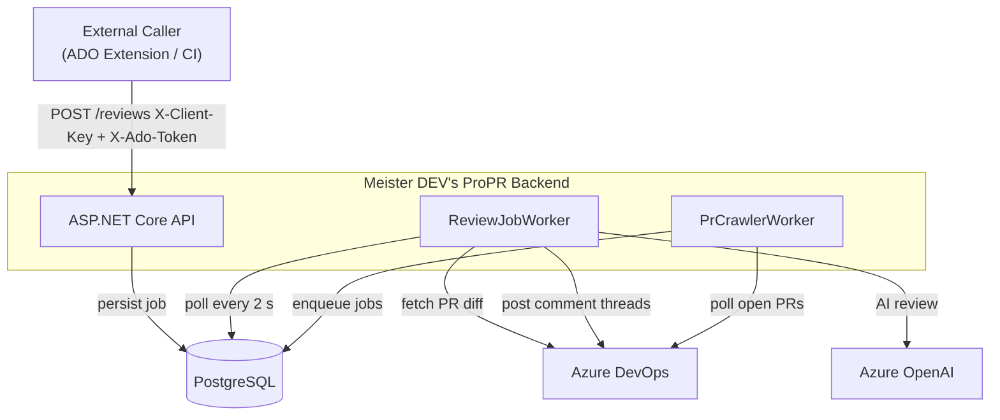

<p align="center">
  
  <br>
  <em>AI-powered code review for Azure DevOps pull requests</em>
</p>

<p align="center">
  <a href="https://github.com/saenridanra/meister-propr/actions/workflows/ci.yml"></a>
  <a href="LICENSE"></a>
  
</p>

---

Meister DEV's ProPR is a self-hosted ASP.NET Core backend that watches Azure DevOps pull requests,
runs an AI review against them using Microsoft Foundry and the Microsoft Agent Framework, and posts the findings
back as threaded comments — anchored to the relevant file and line number.

---

## AI Dev Days Hackathon

The project was built for
the [AI Dev Days Hackathon](https://github.com/Azure/AI-Dev-Days-Hackathon/blob/main/README.md).

The submission state is available with tag `ai-dev-days-submission` commit
`db1683a` [here](https://github.com/saenridanra/meister-propr/releases/tag/ai-dev-days-submission).

## Features

- **AI review on demand** — POST a PR reference, get comments posted directly in ADO
- **Per-file agentic review** — each changed file gets its own AI pass with tool-calling for cross-file investigation
- **Automatic crawling** — background worker polls for PRs assigned to a configured reviewer
- **Per-user authentication** — username/password login with 15-minute JWT + 7-day refresh tokens; no shared secrets
- **Personal access tokens** — users can issue scoped PATs for CI pipelines (`mpr_…` prefix)
- **Per-client Azure credentials** — each API client can use its own service principal or share the global backend identity
- **BCrypt-hardened client keys** — client API keys stored as BCrypt hashes; rotation with 7-day grace period
- **Job persistence + stuck-job recovery** — review jobs survive restarts; stuck processing jobs auto-recovered
- **429 backoff** — transparent exponential retry for AI rate-limit responses
- **Prometheus metrics + OpenTelemetry traces** — production-ready observability out of the box
- **Docker-first** — Linux rootless container, env-var-only config, `docker compose up` to run

---

## How it works



The caller's `X-Ado-Token` is used **only** to verify that the caller has access to the ADO
organisation. All ADO operations (fetching PR content, posting comments) use a
**backend-controlled** Azure credential.

---

## Quick Start

```bash
# 1. Copy the example env file and fill in your values
cp .env.example .env   # or create .env manually (see docs/getting-started.md)

# 2. Start the API + PostgreSQL
docker compose up --build

# 3. Verify
curl http://localhost:8080/healthz
```

See [docs/getting-started.md](docs/getting-started.md) for Azure setup, service principal
configuration, per-client credentials, crawl configuration, and API usage examples.

---

## Admin Authentication

Access to the admin API and admin UI requires a per-user account. On first startup the server
seeds an admin account from the bootstrap env vars:

```bash
MEISTER_BOOTSTRAP_ADMIN_USER=admin
MEISTER_BOOTSTRAP_ADMIN_PASSWORD=<strong-password>
MEISTER_JWT_SECRET=<random-32+-char-string>
```

Log in via `POST /auth/login` to receive a 15-minute JWT access token and a 7-day refresh token.
The admin UI handles token refresh automatically.

### Credential evaluation order

The `AdminKeyMiddleware` evaluates each inbound request in this order:

| Priority | Header / Mechanism | Notes |
|----------|--------------------|-------|
| 1 | `Authorization: Bearer {jwt}` | Locally-issued HS256 token |
| 2 | `X-User-Pat` | BCrypt-verified personal access token |
| 3 | `X-Admin-Key` | Legacy shared key — **deprecated**; logs a warning |

### Personal Access Tokens (PATs)

Authenticated users can generate long-lived PATs (`mpr_`-prefixed) via `POST /users/me/pats`.
PAT hashes are stored with BCrypt; the plaintext is returned exactly once.

---

## Tech Stack

| Layer          | Technology                                                        |
|----------------|-------------------------------------------------------------------|
| Runtime        | .NET 10 / ASP.NET Core MVC                                        |
| AI client      | `Microsoft.Extensions.AI` + Azure OpenAI Responses API           |
| ADO client     | `Microsoft.TeamFoundationServer.Client`                           |
| Auth           | JWT (HS256) + BCrypt PATs; legacy `Azure.Identity` for ADO calls |
| Database       | PostgreSQL 17 via EF Core 10 + Npgsql                            |
| Logging        | Serilog (structured JSON in production)                           |
| Observability  | OpenTelemetry OTLP traces + Prometheus metrics                    |
| Tests          | xUnit + NSubstitute + `WebApplicationFactory`                     |
| Container      | Linux rootless (`mcr.microsoft.com/dotnet/aspnet:10.0`)          |

---

## Key Environment Variables

| Variable                           | Required      | Description                                                                     |
|------------------------------------|---------------|---------------------------------------------------------------------------------|
| `AI_ENDPOINT`                      | Yes           | Azure OpenAI or AI Foundry endpoint URL                                         |
| `AI_DEPLOYMENT`                    | Yes           | Model deployment name, e.g. `gpt-4o`                                            |
| `DB_CONNECTION_STRING`             | No            | PostgreSQL connection string; enables DB mode when set                          |
| `MEISTER_JWT_SECRET`               | Yes (DB mode) | HS256 signing secret — minimum 32 characters                                    |
| `MEISTER_BOOTSTRAP_ADMIN_USER`     | Yes (DB mode) | Username for the initial admin account seeded on first startup                  |
| `MEISTER_BOOTSTRAP_ADMIN_PASSWORD` | Yes (DB mode) | Password for the initial admin account                                          |
| `MEISTER_ADMIN_KEY`                | No            | Legacy shared admin key (`X-Admin-Key`). Deprecated — use JWT login instead     |
| `MEISTER_CLIENT_KEYS`              | Yes*          | Comma-separated client keys (bootstrap seed in DB mode)                         |

\* In DB mode, client keys are managed via the `/clients` admin API and rotated via `POST /admin/clients/{id}/rotate-key`.

Full variable reference: [docs/getting-started.md#environment-variables](docs/getting-started.md#environment-variables)

---

## Documentation

| Document | Description |
|---|---|
| [docs/getting-started.md](docs/getting-started.md) | Full setup guide: Azure, Docker, dotnet, API usage |
| [docs/architecture.md](docs/architecture.md) | Mermaid diagrams: request flow, data model, job states |

---

## Running Tests

```bash
dotnet test   # 478 tests — no Azure credentials or database required
```

Integration tests that require PostgreSQL are in the `PostgresApiIntegration` collection
and are skipped automatically when `DB_CONNECTION_STRING` is not set.

---

## Demo Video

<a href="https://youtu.be/HFaO4oglM2s">
  
</a>

---

## License · Security · Contributing

- [AGPLv3 License](LICENSE) — free for individuals, home labs, and open-source projects; network use of modified
  versions requires source disclosure
- [Commercial License](COMMERCIAL.md) — for businesses that need proprietary modifications, SaaS rights, or professional
  support
- [Security Policy](SECURITY.md) — report vulnerabilities privately


