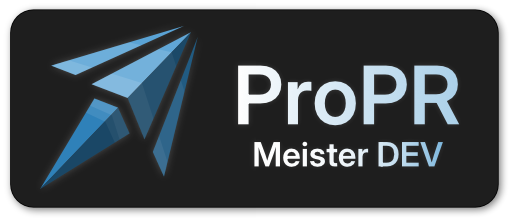

<p align="center">
  
  <br>
  <em>AI-powered code review for Azure DevOps pull requests</em>
</p>

<p align="center">
  <a href="https://github.com/meister-dev-ai/propr/actions/workflows/ci.yml"></a>
  <a href="LICENSE"></a>
  
</p>

---

Meister DEV's ProPR is a self-hosted ASP.NET Core backend that watches Azure DevOps pull requests,
runs an AI review against them using Microsoft Foundry and the Microsoft Agent Framework, and posts the findings
back as threaded comments — anchored to the relevant file and line number.

---

## AI Dev Days Hackathon

The project was built for
the [AI Dev Days Hackathon](https://github.com/Azure/AI-Dev-Days-Hackathon/blob/main/README.md).

The submission state is available with tag `ai-dev-days-submission` commit
`db1683a` [here](https://github.com/meister-dev-ai/propr/releases/tag/ai-dev-days-submission).

## Features

- **AI code reviews in Azure DevOps** - The code reviewer can automatically review changed files in a PR, comment on specific lines, and provide an overall summary of the review findings.
- **Per-file agentic review** — each changed file gets its own AI pass with tool-calling for cross-file investigation
- **Token-optimized reviews** — diff-only input (full file available on demand via tool call), cache-friendly parallel message structure, system prompt pruned from step 2+ of review loops, tool result excerpts capped at 1 000 chars in deep loops
- **File exclusion rules** — generated files (EF Core migrations etc.) are skipped automatically; per-repo custom patterns via `.meister-propr/exclude` on the target branch using gitignore-style globs; excluded files are recorded in the audit trail with zero token cost
- **Automatic crawling** — background worker polls for PRs assigned to a configured reviewer
- **Per-user authentication** — username/password login with 15-minute JWT + 7-day refresh tokens; no shared secrets
- **Personal access tokens** — users can issue scoped PATs for CI pipelines (`mpr_…` prefix)
- **Job persistence + recovery mechanism** — review jobs survive restarts; stuck processing jobs auto-recovered
- **Per-client Azure credentials** — each API client can use its own service principal or share the global backend identity
- **Per-client and per Crawl Config prompt overrides** - Override predefined prompts to improve the AI output towards specific use cases.
- **Per-client dismissals** - Dismiss specific findings for a client, preventing them from appearing in future reviews.
- **Intelligent review summary** - The reviewer generates a concise summary of the review findings, which is posted as a comment and displayed in the admin UI.
- **Beautiful UI** - The UI is tailored towards efficient triage of review comments, with a summary dashboard, file tree sidebar, and token consumption aggregates.

---

## Limitations

- **Azure DevOps only** — no GitHub, GitLab, or Bitbucket support (yet)
- **No auto-fixes** - the reviewer can suggest code changes but cannot apply them directly as PR commits or suggestions; all fixes must be manually applied by the developer (yet)

---

## Quick Start

```bash
# 1. Copy the example env file and fill in your values
cp .env.example .env   # or create .env manually (see docs/getting-started.md)

# 2. Start the API + PostgreSQL
docker compose up --build

# 3. Verify (Docker port)
curl http://localhost:8080/healthz
```

See [docs/getting-started.md](docs/getting-started.md) for Azure setup, service principal
configuration, per-client credentials, crawl configuration, and API usage examples.

---

## Admin Authentication

Access to the admin API and admin UI requires a per-user account. On first startup the server
seeds an admin account from the bootstrap env vars:

```bash
MEISTER_BOOTSTRAP_ADMIN_USER=admin
MEISTER_BOOTSTRAP_ADMIN_PASSWORD=<strong-password>
MEISTER_JWT_SECRET=<random-32+-char-string>
```

Log in via `POST /auth/login` to receive a 15-minute JWT access token and a 7-day refresh token.
The admin UI handles token refresh automatically.

---

## Key Environment Variables

| Variable                           | Required      | Description                                                                     |
|------------------------------------|---------------|---------------------------------------------------------------------------------|
| `AI_ENDPOINT`                      | No            | Azure OpenAI or AI Foundry endpoint URL                                         |
| `AI_DEPLOYMENT`                    | No            | Model deployment name, e.g. `gpt-4o`                                            |
| `DB_CONNECTION_STRING`             | No            | PostgreSQL connection string; enables DB mode when set                          |
| `MEISTER_JWT_SECRET`               | Yes (DB mode) | HS256 signing secret — minimum 32 characters                                    |
| `MEISTER_BOOTSTRAP_ADMIN_USER`     | Yes (DB mode) | Username for the initial admin account seeded on first startup                  |
| `MEISTER_BOOTSTRAP_ADMIN_PASSWORD` | Yes (DB mode) | Password for the initial admin account                                          |
| `MEISTER_ADMIN_KEY`                | No            | Legacy shared admin key (`X-Admin-Key`). Deprecated — use JWT login instead     |
| `MEISTER_CLIENT_KEYS`              | Yes*          | Comma-separated client keys (bootstrap seed in DB mode)                         |

\* In DB mode, client keys are managed via the `/clients` admin API and rotated via `POST /admin/clients/{id}/rotate-key`.

Full variable reference: [docs/getting-started.md#environment-variables](docs/getting-started.md#environment-variables)

---

## Documentation

| Document | Description |
|---|---|
| [docs/getting-started.md](docs/getting-started.md) | Full setup guide: Azure, Docker, dotnet, API usage |
| [docs/architecture.md](docs/architecture.md) | Mermaid diagrams: request flow, data model, job states |

---

## Running Tests

```bash
dotnet test   # 496 tests — no Azure credentials or database required
```

Integration tests that require PostgreSQL are in the `PostgresApiIntegration` collection
and are skipped automatically when `DB_CONNECTION_STRING` is not set.

---

## License · Security · Contributing

- [AGPLv3 License](LICENSE) — free for individuals, home labs, and open-source projects; network use of modified
  versions requires source disclosure
- [Commercial License](COMMERCIAL.md) — for businesses that need proprietary modifications, SaaS rights, or professional
  support
- [Security Policy](SECURITY.md) — report vulnerabilities privately


