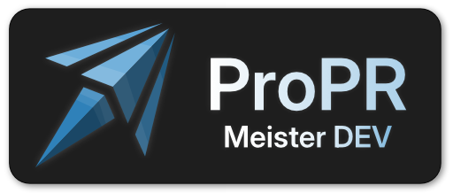

<p align="center">
  
  <br>
  <em>AI code review for Azure DevOps, GitHub, GitLab, and Forgejo</em>
</p>

<p align="center">
  <a href="https://github.com/meister-dev-ai/propr/actions/workflows/ci.yml"></a>
  <a href="LICENSE"></a>
  
  <a href="https://techcommunity.microsoft.com/blog/azure-events/announcing-the-ai-dev-days-hackathon-winners/4513528"></a>
</p>

---

ProPR reviews your pull and merge requests with AI, right where your code already lives. It reads
the changed files, comments on specific lines, and posts a summary - either automatically as PRs
come in, or on demand from CI.

## What we care about

- **Your code stays where it is.** Reviews run against Azure DevOps, GitHub, GitLab, and
  Forgejo-family hosts. No mirroring your repos somewhere else.
- **Your AI, your keys.** Bring your own model: Azure OpenAI / AI Foundry, OpenAI, Anthropic, AWS
  Bedrock, Google Gemini and Vertex AI, a LiteLLM gateway, or any OpenAI-compatible endpoint you point
  it at - including ones you host yourself. ProPR doesn't ship a model or route your code through ours.
- **Self-hostable and sovereign.** Run the whole stack yourself. Provider and AI credentials are
  scoped per client and protected at rest.
- **Every decision is on the record.** Reviews, AI calls, tool calls, filter decisions, and timing
  are all stored and inspectable from the management UI - no log spelunking.
- **Built to stay out of the way.** Token-aware reviews, per-file passes, and relevance filtering
  keep the signal high and the cost down.
- **Anonymous usage statistics, documented field by field.** An installation sends one anonymous snapshot of
  itself a day, carrying a random installation id, the version, the edition, and counters reported as ranges.
  Every field is listed in [usage statistics](docs/reference/usage-statistics.md), the admin UI shows the
  request body before it is sent, and it can be switched off.

## Get started

The fastest path is the example Docker Compose stack, which lives in this repository. Clone it, copy the
example environment file, and fill in the four required values the [quickstart](docs/quickstart.md) lists.

```bash
git clone https://github.com/meister-dev-ai/propr.git
cd propr
cp example/docker-compose/.env.example example/docker-compose/.env
# edit example/docker-compose/.env
cd example/docker-compose
docker compose up --build
```

That builds the three ProPR images from the checkout. To run the published release images instead, see
[Running published images](docs/operate/deploy.md#running-published-images).

This is the short version. The [quickstart](docs/quickstart.md) takes it from there: the requirements,
where to sign in, connecting your first provider and AI model, and getting a first review posted. The
[deployment guide](docs/operate/deploy.md) covers what to change once you keep the installation. The
compose stack is for evaluation; `example/azure/.azure/` deploys the same stack to Azure Container Apps.

## Documentation

Everything is under [docs/](docs/index.md), which maps every page and gives a reading order. The
entry points:

| Document | Reach for it when |
|---|---|
| [Quickstart](docs/quickstart.md) | You want ProPR running on one machine, with one review posted on a real pull request |
| [How it works](docs/concepts/how-it-works.md) | You want to know what you deployed and how a review gets triggered |
| [Reviews](docs/concepts/reviews.md) | You want what happens inside a review, or why a finding was not posted |
| [SCM platforms](docs/platforms/index.md) | You are connecting Azure DevOps, GitHub, GitLab or Forgejo, on-prem included |
| [AI providers](docs/ai/index.md) | You are choosing a model provider, or deciding between a native family and a gateway |
| [Deploying](docs/operate/deploy.md) | You are past evaluation and need ingress, images, workers and persistence right |
| [API reference](docs/reference/api.md) | You are scripting setup, or triggering reviews from CI |
| [Security](docs/reference/security.md) | You are reviewing where code goes, secrets, sessions, and tenant isolation |
| [Editions](docs/reference/editions.md) | Something is refused and you suspect it needs a commercial license |
| [Usage statistics](docs/reference/usage-statistics.md) | You need the field-by-field payload of the daily anonymous snapshot, and how to switch it off |

## License

ProPR is distributed under the Elastic License 2.0. Some features in the tree are commercial-only and
require a license to use, even when self-hosted.

- [LICENSE](LICENSE) - repository-wide source license
- [LICENSING.md](LICENSING.md) - path-by-path capability classification
- [COMMERCIAL.md](COMMERCIAL.md) - when a commercial license is required
- [SECURITY.md](SECURITY.md) - reporting vulnerabilities
- [CONTRIBUTING.md](CONTRIBUTING.md) - how to contribute
