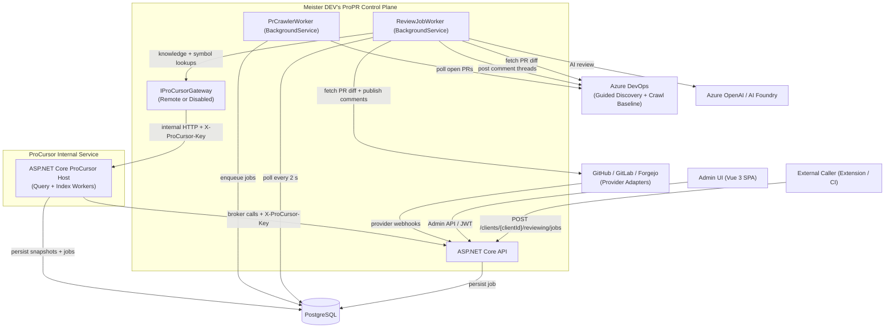

# Architecture - Meister DEV's ProPR

This page is the landing page for the system architecture. It shows the top-level runtime shape and
links to focused documents under `docs/architecture/` so the architecture can be read by concern
instead of as a single long page.

## Document Map

| Document | Focus |
|----------|-------|
| [docs/architecture/licensing-and-feature-flags.md](architecture/licensing-and-feature-flags.md) | Installation edition persistence, premium capability resolution, feature-management integration, and onboarding steps for new licensed features |
| [docs/architecture/reviewing-workflows.md](architecture/reviewing-workflows.md) | Review intake, per-file filtering, verification, synthesis, deterministic final finding gate, job lifecycle, and token optimization |
| [docs/architecture/configuration-and-crawling.md](architecture/configuration-and-crawling.md) | Provider connection onboarding, mixed-provider webhook activation, Azure DevOps crawl compatibility, and operational audit |
| [docs/architecture/security-and-access.md](architecture/security-and-access.md) | Login, PATs, request auth evaluation, and Azure credential resolution |
| [docs/architecture/procursor.md](architecture/procursor.md) | ProCursor runtime boundary, verification-time evidence retrieval, refresh flow, and token reporting |
| [docs/architecture/data-model.md](architecture/data-model.md) | Guided configuration, ProCursor persistence, verification audit shape, and core operational ER diagrams |
| [docs/vertical-slice-modules.md](vertical-slice-modules.md) | Durable module ownership map for the modular-monolith composition |

## System Context

The API is the public control plane, the ProCursor host is an internal execution service,
background workers perform review and crawl execution, PostgreSQL stores durable state, and Azure
OpenAI or AI Foundry provides model execution. Azure DevOps provides guided discovery, crawl
materialization, and ProCursor source validation. GitHub, GitLab, and Forgejo-family hosts integrate
through shared provider-neutral review, webhook, publication, and observability seams without
forking lifecycle, mention, or audit logic. The reviewing flow includes structured verification
before publication: local contradiction checks precede per-file persistence, PR-level evidence
retrieval and bounded AI micro-verification precede the deterministic final gate, summary
reconciliation aligns the final summary with surviving outcomes, and a client-owned publication
policy can suppress outbound SCM comments without skipping internal review result persistence or
diagnostics.

## Provider-Neutral SCM Model

- The shared review engine, crawl convergence, mention handling, and ProCursor boundary follow one
    application flow; provider families attach through capability interfaces rather than separate
    workflow implementations.
- Provider-specific behavior is implemented behind adapters for connection verification, discovery,
    review query and publication, reviewer identity resolution, and webhook ingress.
- Reviewer-trigger identity is a configuration-only filter used for automatic PR selection. The
    authenticated provider connection identity is the author for provider write operations and
    reviewer-owned thread detection.
- Thread re-evaluation stays provider-neutral at the application layer: AI-owned closures require an
    explicit explanation before resolve in reply-enabled mode, while provider adapters only handle
    the concrete reply/status operations exposed through capability interfaces.
- Azure DevOps display rendering uses a provider-local safe formatter for summaries, inline
    comments, and thread replies so readable code-like text is preserved without reusing that output
    as the duplicate-suppression normalization key.
- Azure DevOps provides guided discovery and crawl materialization. GitHub, GitLab, and
    Forgejo-family adapters use the same normalized review, webhook, and thread-memory flows, while
    provider publication keeps host-specific anchor semantics behind the shared
    `ICodeReviewPublicationService` seam.
- Provider connections, scopes, repositories, reviews, revisions, threads, comments, and webhook
    deliveries form the normalized vocabulary for mixed-provider operation and reporting.

## Runtime Composition

The backend startup path separates shared support from feature-owned module registration. `Program.cs`
composes the application through one shared support entry point plus explicit module entry points so
feature ownership stays visible at the composition root.

| Entry Point | Responsibility |
|-------------|----------------|
| `AddInfrastructureSupport()` | Shared EF Core setup, Azure credential resolution, ADO transport, AI client plumbing, options binding, and secret protection |
| `AddReviewingModule()` | Review intake, per-file comment relevance filtering, orchestration, diagnostics, and thread-memory infrastructure |
| `AddCrawlingModule()` | Crawl configuration, discovery, and PR scan execution infrastructure |
| `AddClientsModule()` | Client administration and AI connection persistence |
| `AddIdentityAndAccessModule()` | User auth, PATs, refresh tokens, password hashing, and bootstrap services |
| `AddMentionsModule()` | Mention scan, reply, and AI answer composition |
| `AddPromptCustomizationModule()` | Prompt override persistence and application services |
| `AddUsageReportingModule()` | Client and ProCursor usage reporting services |
| `AddLicensingModule()` | Installation edition persistence, premium capability resolution, admin/auth licensing contracts, and feature-management integration |
| `AddProCursorModule()` | ProCursor-owned execution, query, indexing, and operational-persistence composition used by the extracted ProCursor host |

This composition model keeps feature-owned registrations in module roots while shared support stays
cross-cutting and feature-agnostic. DB-backed registrations are enabled whenever
`DB_CONNECTION_STRING` is configured, including in `Testing`.

When `PROCURSOR_REMOTE_MODE=proprManagedRemote`, the API host binds `IProCursorGateway` to the remote
HTTP transport, registers the `procursor-remote` dependency health check, and leaves ProCursor worker
ownership to the ProCursor host. When `PROCURSOR_REMOTE_MODE=disabled`, ProPR binds the disabled
gateway so tool-aware review omits ProCursor cleanly instead of exposing a broken dependency.

Both hosts emit OTLP traces and Prometheus metrics for inbound ASP.NET Core requests and outbound
`HttpClient` calls across the ProPR <-> ProCursor boundary. Structured logs redact shared-key
configuration and request logging records only whether the service-auth header was present, never its
value. OTLP resource identity is emitted separately for `MeisterProPR.Api` and
`MeisterProPR.ProCursor.Service` so cross-service traces are attributable.

ProPR is the durable owner of client, provider, AI, and ProCursor source configuration. The ProCursor
host keeps runtime configuration in memory only,
refreshes it from ProPR over the shared-key-authenticated internal boundary, and persists only
ProCursor-owned operational tables through `PROCURSOR_DB_CONNECTION_STRING`.
ProPR does not require `PROCURSOR_DB_CONNECTION_STRING` and reaches
ProCursor-owned reporting and maintenance data only through authenticated internal ProCursor APIs.

Compile-time ownership is enforced through the dedicated `MeisterProPR.ProCursor.Contracts`
assembly for shared wire contracts and broker abstractions, plus the focused
`MeisterProPR.ProCursor.slnx` solution that contains only ProCursor-owned projects, the shared
contracts boundary, and the ProCursor service tests.

## Reading Order

If you are new to the codebase, read these documents in this order:

1. This page for the runtime shape and composition root.
2. [docs/architecture/security-and-access.md](architecture/security-and-access.md) for caller identity and Azure credential resolution.
3. [docs/architecture/licensing-and-feature-flags.md](architecture/licensing-and-feature-flags.md) for installation licensing, premium capability resolution, and feature gating.
4. [docs/architecture/reviewing-workflows.md](architecture/reviewing-workflows.md) for the main review execution path.
5. [docs/architecture/configuration-and-crawling.md](architecture/configuration-and-crawling.md) for admin onboarding and scheduled review generation.
6. [docs/architecture/procursor.md](architecture/procursor.md) and [docs/architecture/data-model.md](architecture/data-model.md) for the deeper persistence and knowledge-indexing model.
