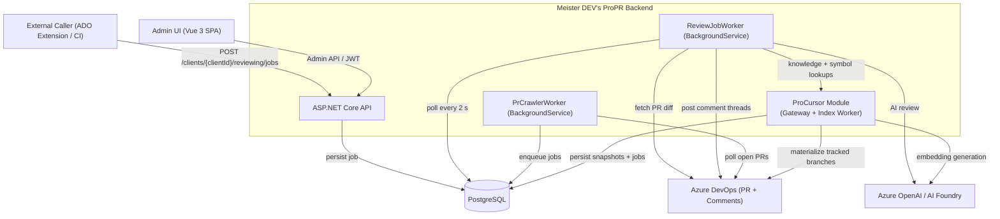

# Architecture - Meister DEV's ProPR

This page is the landing page for the system architecture. It shows the top-level runtime shape and
links to focused documents under `docs/architecture/` so the architecture can be read by concern
instead of as a single long page.

## Document Map

| Document | Focus |
|----------|-------|
| [docs/architecture/reviewing-workflows.md](architecture/reviewing-workflows.md) | Review intake, worker execution, dedup, job lifecycle, and token optimization |
| [docs/architecture/configuration-and-crawling.md](architecture/configuration-and-crawling.md) | Guided Azure DevOps onboarding, crawl configuration, crawler behavior, and source-scope snapshotting |
| [docs/architecture/security-and-access.md](architecture/security-and-access.md) | Login, PATs, request auth evaluation, and Azure credential resolution |
| [docs/architecture/procursor.md](architecture/procursor.md) | ProCursor runtime boundary, refresh flow, and token reporting |
| [docs/architecture/data-model.md](architecture/data-model.md) | Guided configuration, ProCursor persistence, and core operational ER diagrams |
| [docs/vertical-slice-modules.md](vertical-slice-modules.md) | Durable module ownership map for the modular-monolith composition |

## System Context

The top-level runtime boundary is unchanged: the API is the main entry point, background workers
perform review and crawl execution, PostgreSQL stores durable state, Azure DevOps is the source of
pull-request and repository data, and Azure OpenAI / AI Foundry provides model execution.

## Runtime Composition

The backend startup path separates shared support from feature-owned module registration. `Program.cs`
composes the application through one shared support entry point plus explicit module entry points so
feature ownership stays visible at the composition root.

| Entry Point | Responsibility |
|-------------|----------------|
| `AddInfrastructureSupport()` | Shared EF Core setup, Azure credential resolution, ADO transport, AI client plumbing, options binding, and secret protection |
| `AddReviewingModule()` | Review intake, orchestration, diagnostics, and thread-memory infrastructure |
| `AddCrawlingModule()` | Crawl configuration, discovery, and PR scan execution infrastructure |
| `AddClientsModule()` | Client administration and AI connection persistence |
| `AddIdentityAndAccessModule()` | User auth, PATs, refresh tokens, password hashing, and bootstrap services |
| `AddMentionsModule()` | Mention scan, reply, and AI answer composition |
| `AddPromptCustomizationModule()` | Prompt override persistence and application services |
| `AddUsageReportingModule()` | Client and ProCursor usage reporting services |
| `AddProCursorModule()` | ProCursor indexing, graph extraction, and query composition |

This composition model is the enforcement point for the vertical-slice migration: feature-owned
registrations should live in their module roots while shared support stays cross-cutting and
feature-agnostic. DB-backed registrations are enabled whenever `DB_CONNECTION_STRING` is configured,
including in `Testing`.

## Reading Order

If you are new to the codebase, read these documents in this order:

1. This page for the runtime shape and composition root.
2. [docs/architecture/security-and-access.md](architecture/security-and-access.md) for caller identity and Azure credential resolution.
3. [docs/architecture/reviewing-workflows.md](architecture/reviewing-workflows.md) for the main review execution path.
4. [docs/architecture/configuration-and-crawling.md](architecture/configuration-and-crawling.md) for admin onboarding and scheduled review generation.
5. [docs/architecture/procursor.md](architecture/procursor.md) and [docs/architecture/data-model.md](architecture/data-model.md) for the deeper persistence and knowledge-indexing model.
