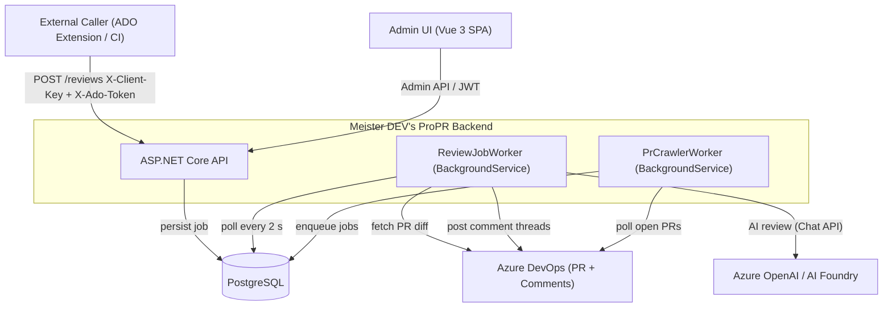
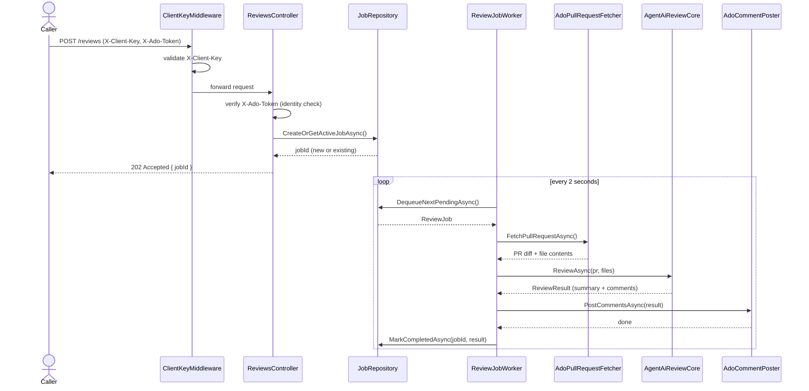
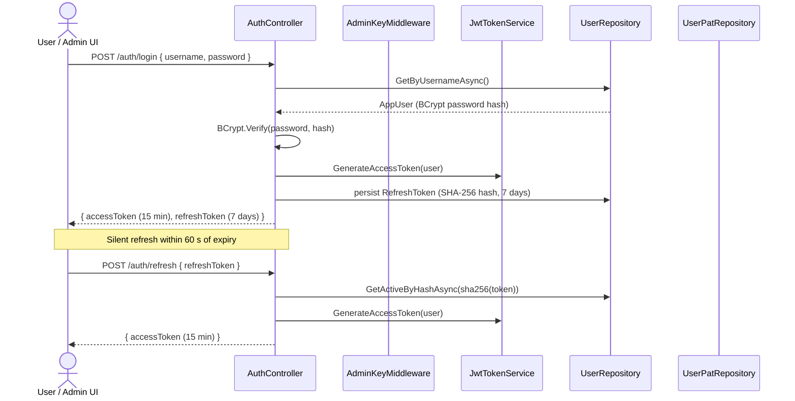
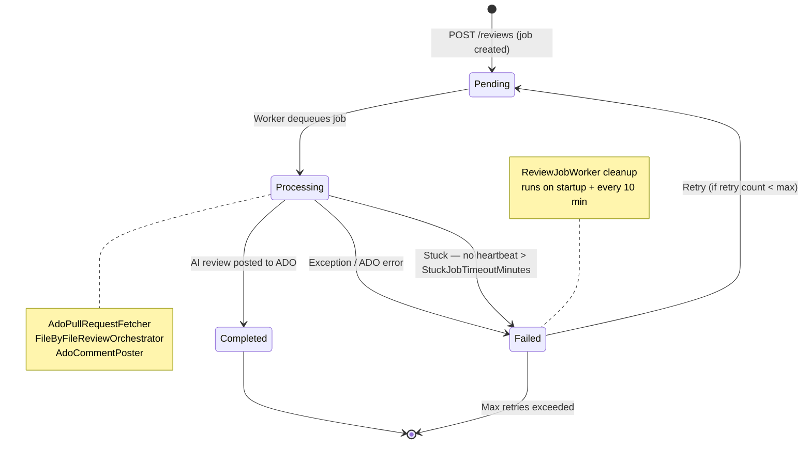
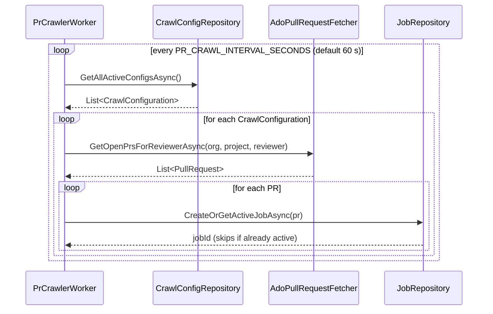

# Architecture — Meister DEV's ProPR

## Table of Contents

- [System Context](#system-context)
- [Request Flow: POST /reviews](#request-flow-post-reviews)
- [Authentication Flow](#authentication-flow)
- [Job State Machine](#job-state-machine)
- [Credential Resolution](#credential-resolution)
- [PR Crawler Flow](#pr-crawler-flow)
- [Token Optimization Pipeline](#token-optimization-pipeline)
- [Data Model](#data-model)

---

## System Context

Who communicates with whom at the boundary level.



> **Authentication note:** Review-trigger authentication (`X-Client-Key` + `X-Ado-Token`) is
> separate from admin/user authentication (JWT via `POST /auth/login` or PAT via `X-User-Pat`).
> See the [Authentication Flow](#authentication-flow) section for the admin credential sequence.

---

## Request Flow: POST /reviews

The full lifecycle of a review request — from HTTP call to ADO comment.



---

## Authentication Flow

How Admin UI and API callers obtain and renew credentials.



### AdminKeyMiddleware — evaluation order

```mermaid
flowchart TD
    REQ([Inbound Request]) --> B1

    B1{"Authorization: Bearer JWT?"}-- valid JWT --> SET_JWT["Set UserId + IsAdmin from claims"]
    B1 -- no/invalid --> B2

    B2{"X-User-Pat header?"}-- PAT found & BCrypt match --> SET_PAT["Set UserId + IsAdmin from user record"]
    B2 -- no/invalid --> B3

    B3{"X-Admin-Key header?\n(legacy — deprecated)"}-- matches MEISTER_ADMIN_KEY --> WARN["Log deprecation warning\nSet IsAdmin = true"]
    B3 -- no --> DEFAULT["IsAdmin = false"]

    SET_JWT --> NEXT([next()])
    SET_PAT --> NEXT
    WARN --> NEXT
    DEFAULT --> NEXT
```

---

## Job State Machine

All possible states of a `ReviewJob` and their transitions.



---

## Credential Resolution

How the backend picks the Azure credential for each ADO operation.


---

## PR Crawler Flow

The background crawler finds new PRs automatically — no external trigger needed.



---

## Token Optimization Pipeline

Several techniques work together to minimise AI token consumption per review.

### 1 — File exclusion

Before any AI calls are made, `FileByFileReviewOrchestrator` applies `ReviewExclusionRules`
to every changed file:


Exclusion patterns are read from `.meister-propr/exclude` on the target branch. If the file
is absent, the built-in defaults apply (`**/Migrations/*.Designer.cs`,
`**/Migrations/*ModelSnapshot.cs`). An empty file disables all exclusions.

### 2 — Diff-only review messages

The per-file review input contains only the unified diff for that file. Full file content is
omitted; the AI is instructed to call the existing `get_file_content` tool if it needs more
context. This is the single biggest token saving for large files.

### 3 — System prompt pruning in review loops

`ToolAwareAiReviewCore` structures each file's multi-step review as:

- **Step 1**: Global system prompt (S1) + per-file context prompt (S2) + user message
- **Step 2+**: Per-file context prompt (S2) only + accumulated conversation

S1 (reviewer persona, tool guidance) is a fixed prefix — sending it only once lets the AI
infrastructure cache it across parallel file slots for the same PR.

### 4 — Tool result excerpt cap

When a review loop exceeds 3 steps, tool result text stored in the protocol is truncated to
1 000 characters and marked `[TRUNCATED]`. This prevents very deep loops from accumulating
unbounded amounts of raw file content in the conversation history.

---

## Data Model

PostgreSQL entities and their relationships.

```mermaid
erDiagram
    Client {
        uuid Id PK
        string Key "legacy plaintext (deprecated)"
        string KeyHash "BCrypt hash of active key"
        string PreviousKeyHash "BCrypt hash (7-day grace period after rotation)"
        datetime KeyExpiresAt
        datetime PreviousKeyExpiresAt
        datetime KeyRotatedAt
        int AllowedScopes
        string DisplayName
        bool IsActive
        datetime CreatedAt
    }

    ClientAdoCredential {
        uuid Id PK
        uuid ClientId FK
        string TenantId
        string AzureClientId
        string Secret "encrypted via ASP.NET Data Protection"
    }

    CrawlConfiguration {
        uuid Id PK
        uuid ClientId FK
        string OrganizationUrl
        string ProjectId
        int CrawlIntervalSeconds
        bool IsActive
    }

    ReviewJob {
        uuid Id PK
        uuid ClientId FK
        string OrganizationUrl
        string ProjectId
        string RepositoryId
        int PullRequestId
        int IterationId
        string Status
        datetime SubmittedAt
        datetime CompletedAt
        jsonb Result
        int RetryCount
        long TotalInputTokensAggregated
        long TotalOutputTokensAggregated
    }

    ReviewJobProtocol {
        uuid Id PK
        uuid JobId FK
        uuid FileResultId FK
        int PassNumber
        int InputTokens
        int OutputTokens
    }

    ReviewFileResult {
        uuid Id PK
        uuid JobId FK
        string FilePath
        bool IsComplete
        bool IsFailed
        bool IsExcluded "true when skipped by exclusion rules"
        string ExclusionReason "pattern that matched, e.g. **/Migrations/*.Designer.cs"
    }

    AppUser {
        uuid Id PK
        string Username "unique, case-insensitive"
        string PasswordHash "BCrypt"
        string GlobalRole "Admin / User"
        bool IsActive
        datetime CreatedAt
    }

    UserClientRole {
        uuid Id PK
        uuid UserId FK
        uuid ClientId FK
        string Role "ClientAdministrator / ClientUser"
        datetime AssignedAt
    }

    UserPat {
        uuid Id PK
        uuid UserId FK
        string TokenHash "BCrypt (mpr_ prefix)"
        string Label
        datetime ExpiresAt
        datetime CreatedAt
        datetime LastUsedAt
        bool IsRevoked
    }

    RefreshToken {
        uuid Id PK
        uuid UserId FK
        string TokenHash "SHA-256"
        datetime ExpiresAt
        datetime CreatedAt
        datetime RevokedAt
    }

    AiConnection {
        uuid Id PK
        uuid ClientId FK
        string DisplayName
        string EndpointUrl
        jsonb Models "array of model names"
        bool IsActive
        string ActiveModel
        string ApiKey "encrypted; null when using DefaultAzureCredential"
        datetime CreatedAt
        string ModelCategory "Standard / Reasoning"
    }

    PromptOverride {
        uuid Id PK
        uuid ClientId FK
        uuid CrawlConfigId FK "null for client-scope overrides"
        string Scope "ClientScope / CrawlConfigScope"
        string PromptKey "SystemPrompt | AgenticLoopGuidance | SynthesisSystemPrompt | QualityFilterSystemPrompt | PerFileContextPrompt"
        string OverrideText
        datetime CreatedAt
    }

    FindingDismissal {
        uuid Id PK
        uuid ClientId FK
        string PatternText "normalised, lowercase, max 200 chars"
        string Label "optional admin-provided note"
        string OriginalMessage "original AI finding message"
        datetime CreatedAt
    }

    ReviewPrScan {
        uuid Id PK
        uuid ClientId FK
        string RepositoryId
        int PullRequestId
        string LastProcessedCommitId
    }

    ReviewPrScanThread {
        uuid ReviewPrScanId FK
        int ThreadId
        int LastSeenReplyCount
    }

    Client ||--o| ClientAdoCredential : "has (optional)"
    Client ||--o{ CrawlConfiguration : "has"
    Client ||--o{ ReviewJob : "owns"
    Client ||--o{ UserClientRole : "scoped to"
    Client ||--o{ AiConnection : "has"
    Client ||--o{ PromptOverride : "has"
    Client ||--o{ FindingDismissal : "has"
    Client ||--o{ ReviewPrScan : "has"
    ReviewJob ||--o{ ReviewJobProtocol : "has passes"
    ReviewJob ||--o{ ReviewFileResult : "has file results"
    ReviewJobProtocol }o--|| ReviewFileResult : "linked to"
    AppUser ||--o{ UserClientRole : "has"
    AppUser ||--o{ UserPat : "has"
    AppUser ||--o{ RefreshToken : "has"
    ReviewPrScan ||--o{ ReviewPrScanThread : "has"
    CrawlConfiguration ||--o{ PromptOverride : "can have (crawl-config scope)"
```


