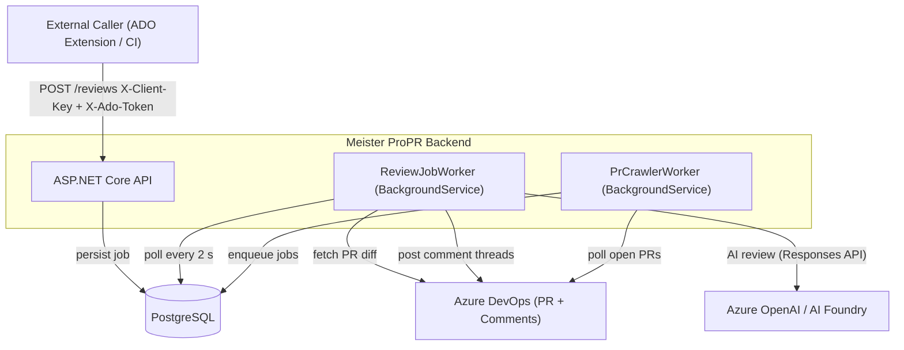
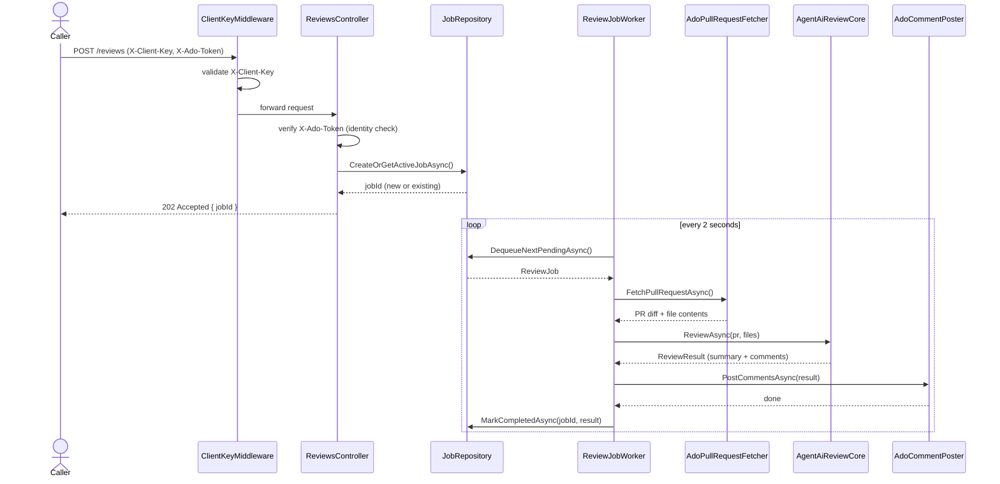
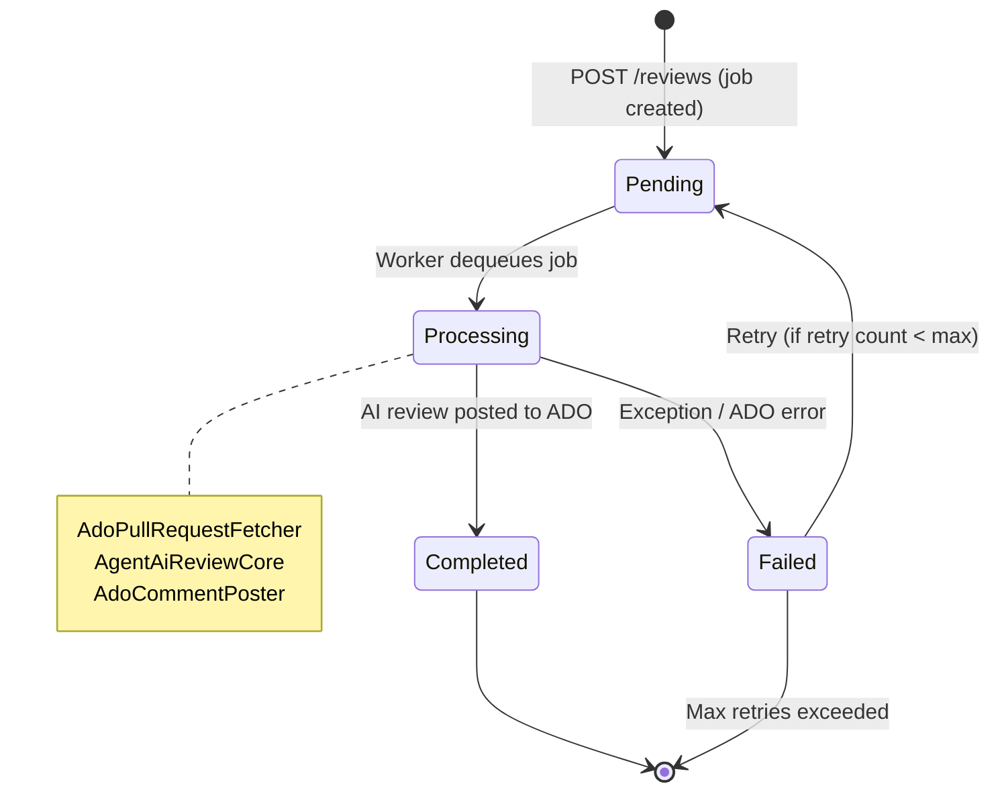
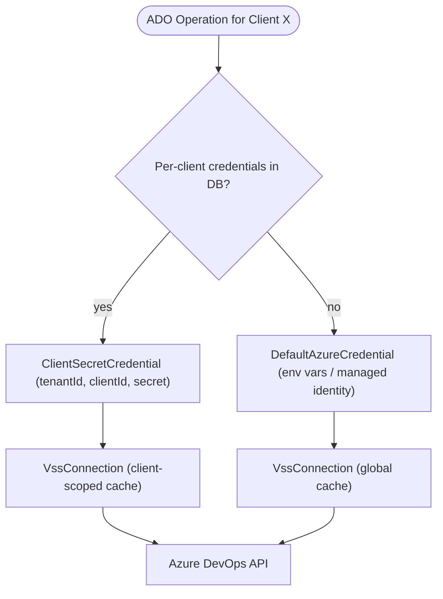
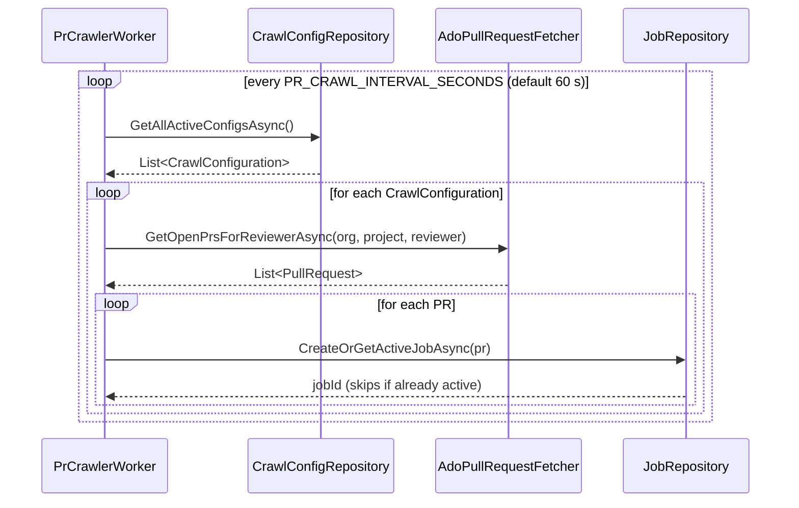
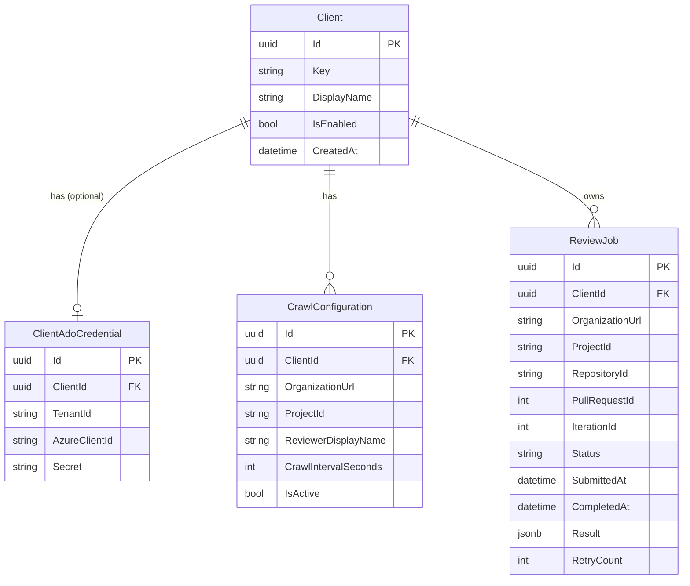

# Architecture — Meister ProPR

## Table of Contents

- [System Context](#system-context)
- [Request Flow: POST /reviews](#request-flow-post-reviews)
- [Clean Architecture Layers](#clean-architecture-layers)
- [Job State Machine](#job-state-machine)
- [Credential Resolution](#credential-resolution)
- [PR Crawler Flow](#pr-crawler-flow)
- [Data Model](#data-model)

---

## System Context

Who communicates with whom at the boundary level.

---

## Request Flow: POST /reviews

The full lifecycle of a review request — from HTTP call to ADO comment.

---

## Job State Machine

All possible states of a `ReviewJob` and their transitions.

---

## Credential Resolution

How the backend picks the Azure credential for each ADO operation.

---

## PR Crawler Flow

The background crawler finds new PRs automatically — no external trigger needed.

---

## Data Model

PostgreSQL entities and their relationships.

