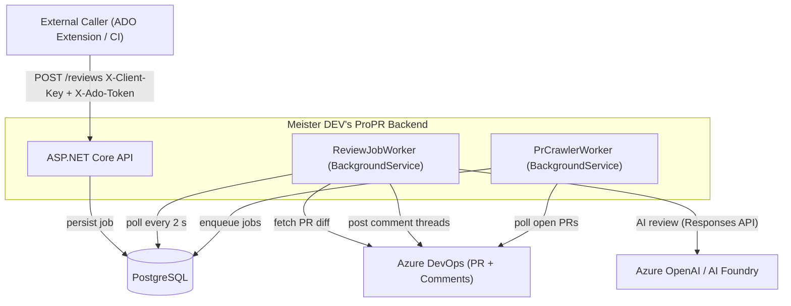
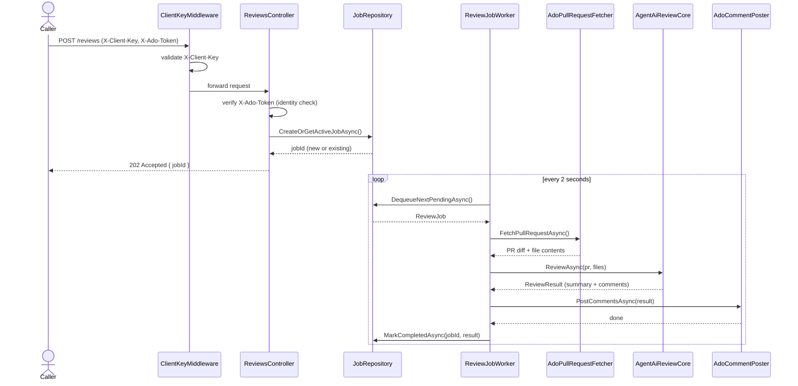
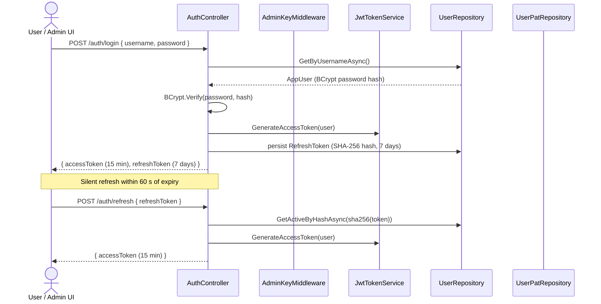
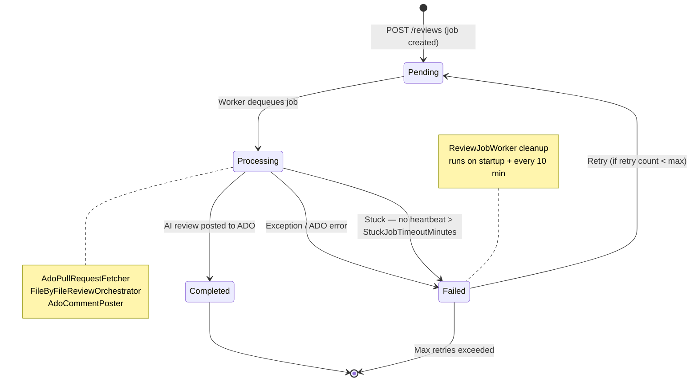
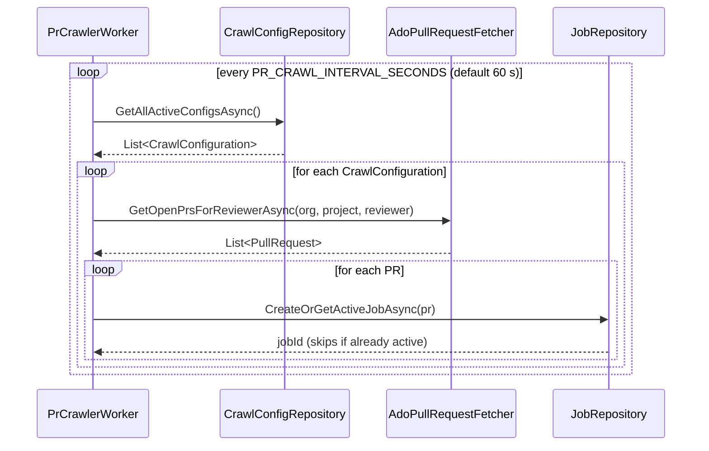
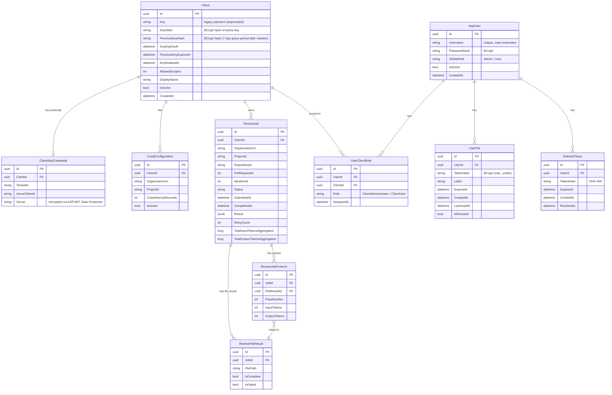

# Architecture — Meister DEV's ProPR

## Table of Contents

- [System Context](#system-context)
- [Request Flow: POST /reviews](#request-flow-post-reviews)
- [Authentication Flow](#authentication-flow)
- [Job State Machine](#job-state-machine)
- [Credential Resolution](#credential-resolution)
- [PR Crawler Flow](#pr-crawler-flow)
- [Data Model](#data-model)

---

## System Context

Who communicates with whom at the boundary level.



---

## Request Flow: POST /reviews

The full lifecycle of a review request — from HTTP call to ADO comment.



---

## Authentication Flow

How Admin UI and API callers obtain and renew credentials.



### AdminKeyMiddleware — evaluation order

```mermaid
flowchart TD
    REQ([Inbound Request]) --> B1

    B1{"Authorization: Bearer JWT?"}-- valid JWT --> SET_JWT["Set UserId + IsAdmin from claims"]
    B1 -- no/invalid --> B2

    B2{"X-User-Pat header?"}-- PAT found & BCrypt match --> SET_PAT["Set UserId + IsAdmin from user record"]
    B2 -- no/invalid --> B3

    B3{"X-Admin-Key header?\n(legacy — deprecated)"}-- matches MEISTER_ADMIN_KEY --> WARN["Log deprecation warning\nSet IsAdmin = true"]
    B3 -- no --> DEFAULT["IsAdmin = false"]

    SET_JWT --> NEXT([next()])
    SET_PAT --> NEXT
    WARN --> NEXT
    DEFAULT --> NEXT
```

---

## Job State Machine

All possible states of a `ReviewJob` and their transitions.



---

## Credential Resolution

How the backend picks the Azure credential for each ADO operation.


---

## PR Crawler Flow

The background crawler finds new PRs automatically — no external trigger needed.



---

## Data Model

PostgreSQL entities and their relationships.


