# Architecture — Meister DEV's ProPR

## Table of Contents

- [System Context](#system-context)
- [Vertical Slice Composition](#vertical-slice-composition)
- [Review Trigger Flow](#review-trigger-flow)
- [Review Dedup Flow](#review-dedup-flow)
- [Authentication Flow](#authentication-flow)
- [Job State Machine](#job-state-machine)
- [Credential Resolution](#credential-resolution)
- [Guided ADO Configuration](#guided-ado-configuration)
- [PR Crawler Flow](#pr-crawler-flow)
- [Crawl Source Scope Snapshotting](#crawl-source-scope-snapshotting)
- [Token Optimization Pipeline](#token-optimization-pipeline)
- [ProCursor Boundary](#procursor-boundary)
- [ProCursor Refresh Flow](#procursor-refresh-flow)
- [ProCursor Token Reporting](#procursor-token-reporting)
- [Data Model](#data-model)

---

## System Context

Who communicates with whom at the boundary level.

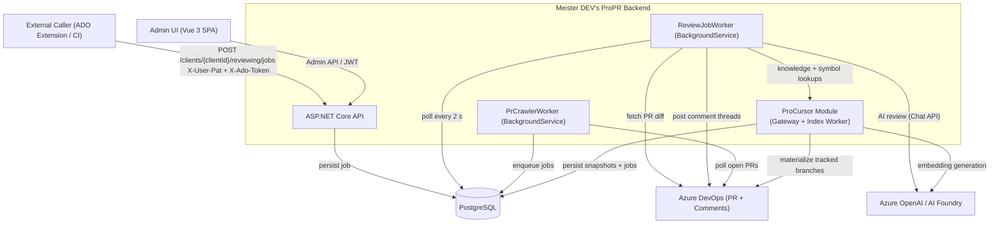

> **Authentication note:** Review submission uses a user credential (`Authorization: Bearer ...`
> or `X-User-Pat`) plus `X-Ado-Token`; status polling on `/reviewing/jobs/{jobId}/status` uses `X-Ado-Token`.
> See the [Authentication Flow](#authentication-flow) section for how JWTs and PATs are resolved.

## Vertical Slice Composition

The backend startup path now separates shared support from feature-owned module registration. `Program.cs` composes the application through one shared support entry point plus explicit module entry points so feature ownership is visible at the composition root.

| Entry Point | Responsibility |
|-------------|----------------|
| `AddInfrastructureSupport()` | Shared EF Core setup, Azure credential resolution, ADO transport, AI client plumbing, options binding, and secret protection |
| `AddReviewingModule()` | Review intake, orchestration, diagnostics, and thread-memory infrastructure |
| `AddCrawlingModule()` | Crawl configuration, discovery, and PR scan execution infrastructure |
| `AddClientsModule()` | Client administration and AI connection persistence |
| `AddIdentityAndAccessModule()` | User auth, PATs, refresh tokens, password hashing, and bootstrap services |
| `AddMentionsModule()` | Mention scan, reply, and AI answer composition |
| `AddPromptCustomizationModule()` | Prompt override persistence and application services |
| `AddUsageReportingModule()` | Client and ProCursor usage reporting services |
| `AddProCursorModule()` | ProCursor indexing, graph extraction, and query composition |

This composition model is the enforcement point for the vertical-slice migration: feature-owned registrations should move into their module roots while shared support stays cross-cutting and feature-agnostic.

DB-backed registrations are enabled only when the effective DB mode is on. In `Testing`, that requires `TEST_ENABLE_DB_MODE=true` even if `DB_CONNECTION_STRING` is present, which keeps in-memory test hosts from accidentally pulling in PostgreSQL-only services.

---

## Review Trigger Flow

The full lifecycle of a review request — from HTTP call to ADO comment.

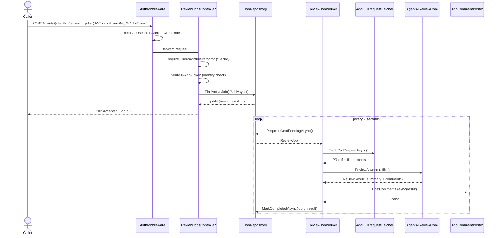

---

## Review Dedup Flow

Incremental review publication uses a two-stage duplicate-suppression path before any new PR thread is created.

1. `ReviewOrchestrationService.BuildReviewContextAsync(...)` carries forward completed per-file results from the previous reviewed iteration for unchanged files.
2. `FileByFileReviewOrchestrator.SynthesizeResultsAsync(...)` excludes `IsCarriedForward` file results from synthesis summaries, cross-file deduplication, and quality-filter input, while preserving `CarriedForwardFilePaths` and a carried-forward skip count on the final `ReviewResult`.
3. `ReviewOrchestrationService.PublishReviewResultAsync(...)` opens a dedicated `ReviewJobProtocol` pass labeled `posting`, calls `IAdoCommentPoster.PostAsync(...)`, persists the posted `ReviewResult`, and records aggregate duplicate-suppression diagnostics.
4. `AdoCommentPoster` evaluates each candidate finding against existing bot-authored PR threads using:
    - normalized file-path and anchor matching for equivalent locations,
    - resolved-thread reuse for previously raised concerns,
    - exact normalized-text matching,
    - thread-memory similarity scoped to the current pull request,
    - deterministic text-similarity fallback when historical memory signals are degraded.
5. The posting protocol emits `dedup_summary` on every posting pass and `dedup_degraded_mode` only when historical duplicate protection had to fall back to reduced checks.

This keeps incremental reviews additive: unchanged findings remain visible in the stored result and summary context, but only genuinely fresh findings are allowed to create new ADO threads.

---

## Authentication Flow

How Admin UI and API callers obtain and renew credentials.

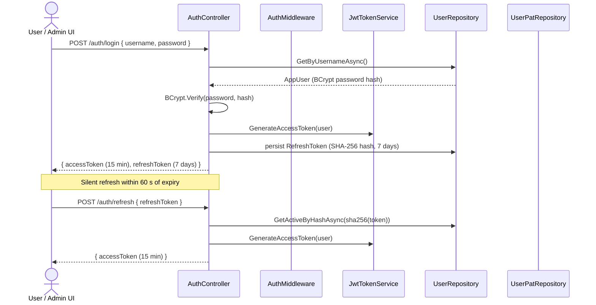

### AuthMiddleware — evaluation order

```mermaid
flowchart TD
    REQ([Inbound Request]) --> B1

    B1{"Authorization: Bearer JWT?"}-- valid JWT --> SET_JWT["Set UserId + IsAdmin from claims\nLoad ClientRoles from DB"]
    B1 -- no/invalid --> B2

    B2{"X-User-Pat header?"}-- PAT found & BCrypt match --> SET_PAT["Set UserId + IsAdmin from user record\nLoad ClientRoles from DB"]
    B2 -- no/invalid --> DEFAULT["Anonymous request\nIsAdmin = false"]

    SET_JWT --> NEXT([next()])
    SET_PAT --> NEXT
    DEFAULT --> NEXT
```

---

## Job State Machine

All possible states of a `ReviewJob` and their transitions.

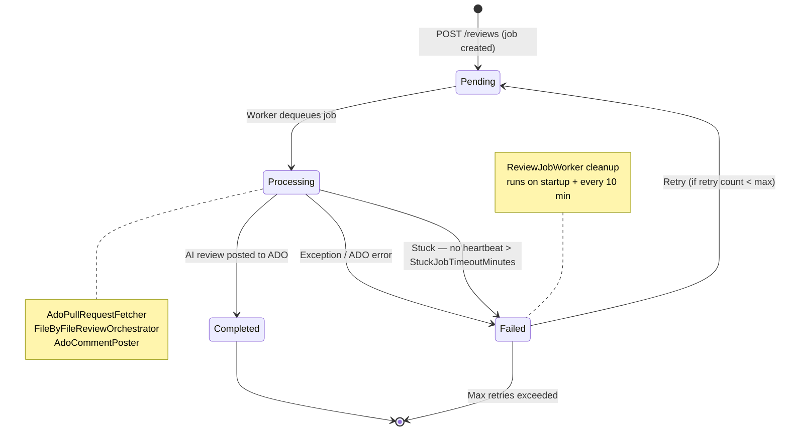

---

## Credential Resolution

How the backend picks the Azure credential for each ADO operation.


---

## Guided ADO Configuration

Guided Azure DevOps onboarding separates credential ownership from admin selections. Client
credentials authorize the backend to talk to Azure DevOps. Client-scoped organization-scope
records define which Azure DevOps organizations administrators may choose in guided ProCursor and
crawl-config flows. All downstream project, repository, wiki, branch, and crawl-filter choices are
resolved through discovery endpoints and revalidated again at save time.

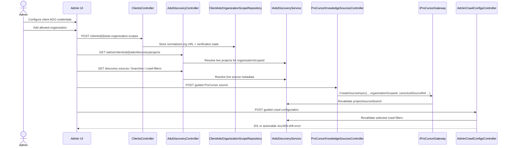

Compatibility remains in place for legacy callers that still send raw `organizationUrl` and
repository identifiers, but the guided path is now the primary architecture boundary.

---

## PR Crawler Flow

The background crawler finds new PRs automatically — no external trigger needed.

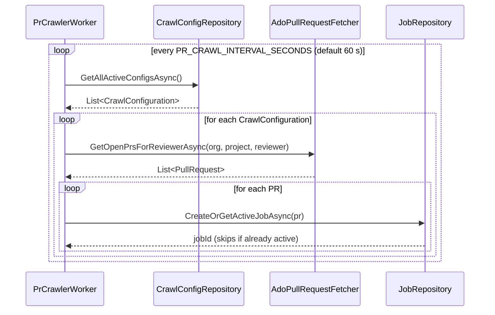

The crawler now operates against crawl configurations that can either reference all client
ProCursor sources or a selected subset. That selection is durable and does not rely on reading the
latest admin configuration during review execution.

---

## Crawl Source Scope Snapshotting

When a crawl configuration uses `selectedSources`, `PrCrawlService` copies that source list onto
the queued `ReviewJob`. `ReviewOrchestrationService` later consumes the saved snapshot so an admin
change made after queue time cannot silently alter the knowledge scope of in-flight work.

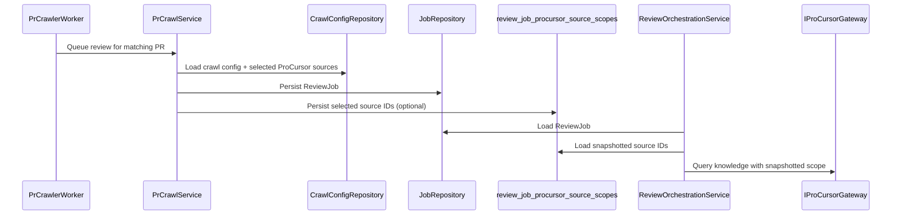

---

## Token Optimization Pipeline

Several techniques work together to minimise AI token consumption per review.

### 1 — File exclusion

Before any AI calls are made, `FileByFileReviewOrchestrator` applies `ReviewExclusionRules`
to every changed file:

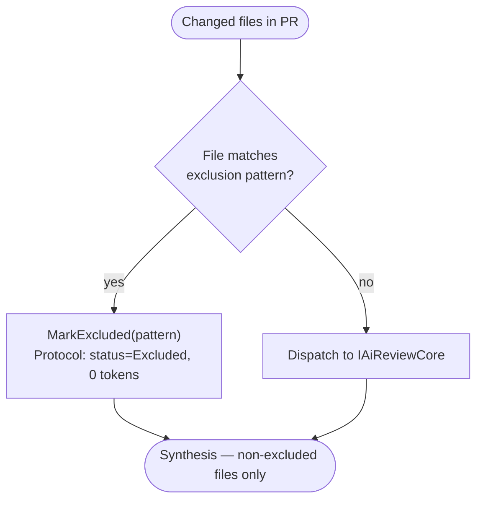

Exclusion patterns are read from `.meister-propr/exclude` on the target branch. If the file
is absent, the built-in defaults apply (`**/Migrations/*.Designer.cs`,
`**/Migrations/*ModelSnapshot.cs`). An empty file disables all exclusions.

### 2 — Diff-only review messages

The per-file review input contains only the unified diff for that file. Full file content is
omitted; the AI is instructed to call the existing `get_file_content` tool if it needs more
context. This is the single biggest token saving for large files.

### 3 — System prompt pruning in review loops

`ToolAwareAiReviewCore` structures each file's multi-step review as:

- **Step 1**: Global system prompt (S1) + per-file context prompt (S2) + user message
- **Step 2+**: Per-file context prompt (S2) only + accumulated conversation

S1 (reviewer persona, tool guidance) is a fixed prefix — sending it only once lets the AI
infrastructure cache it across parallel file slots for the same PR.

### 4 — Tool result excerpt cap

When a review loop exceeds 3 steps, tool result text stored in the protocol is truncated to
1 000 characters and marked `[TRUNCATED]`. This prevents very deep loops from accumulating
unbounded amounts of raw file content in the conversation history.

---

## ProCursor Boundary

ProCursor runs inside the same deployment today, but it is treated as a bounded slice with its own
facade and options surface. Review orchestration reaches it only through `IProCursorGateway` and
`PROCURSOR_*` settings; it does not talk directly to ProCursor repositories, ADO materializers, or
snapshot tables.

For guided admin flows, the same gateway boundary also owns save-time validation of
`organizationScopeId`, canonical source references, and default or tracked branch selections. That
keeps Azure DevOps drift detection at the admin boundary instead of surfacing first during a later
refresh or review run.

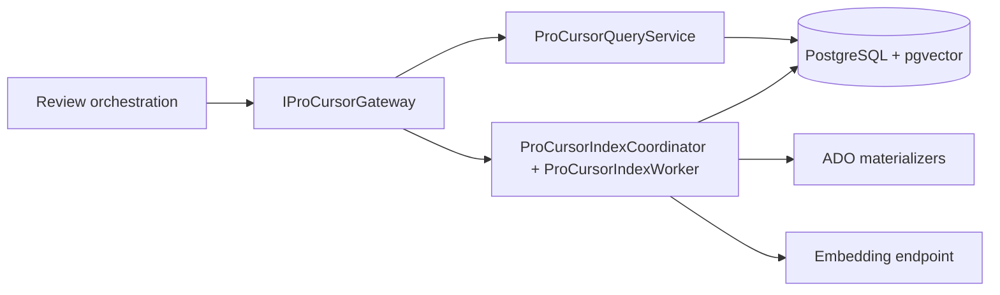

## ProCursor Refresh Flow

Tracked branches refresh independently from the pull request worker. The scheduler polls branch
heads, queues durable jobs, and the dedicated worker drains those jobs with per-source isolation so
one slow or failing source does not block unrelated repositories and wikis.

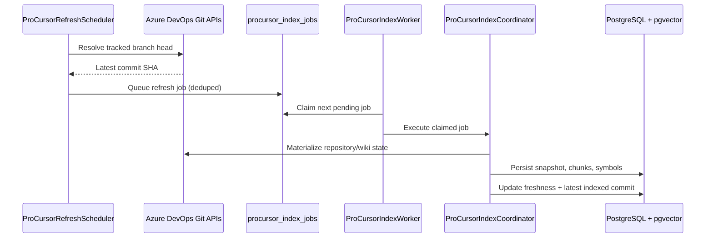

## ProCursor Token Reporting

ProCursor token reporting runs alongside the indexing flow. The capture boundary prefers provider
usage metadata returned by the AI client, falls back to tokenizer-based estimates when needed, and
stores one idempotent event row per physical ProCursor AI call. A dedicated rollup worker refreshes
daily and monthly aggregates so the admin UI can read stable totals while still gap-filling the
newest uncaptured window from raw events.

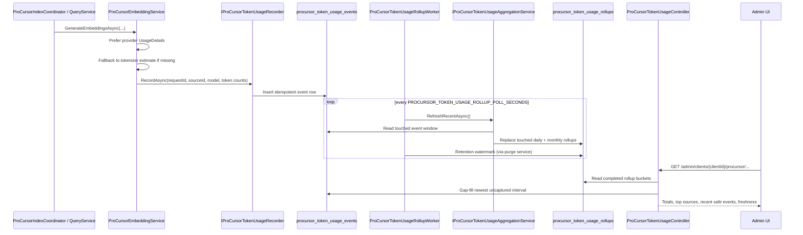

---

## Data Model

PostgreSQL entities and their relationships.

### Guided Configuration Slice

The guided admin surface adds durable organization-scope state, canonical crawl filters, optional
selected-source associations, and review-job snapshots beneath the existing client boundary.

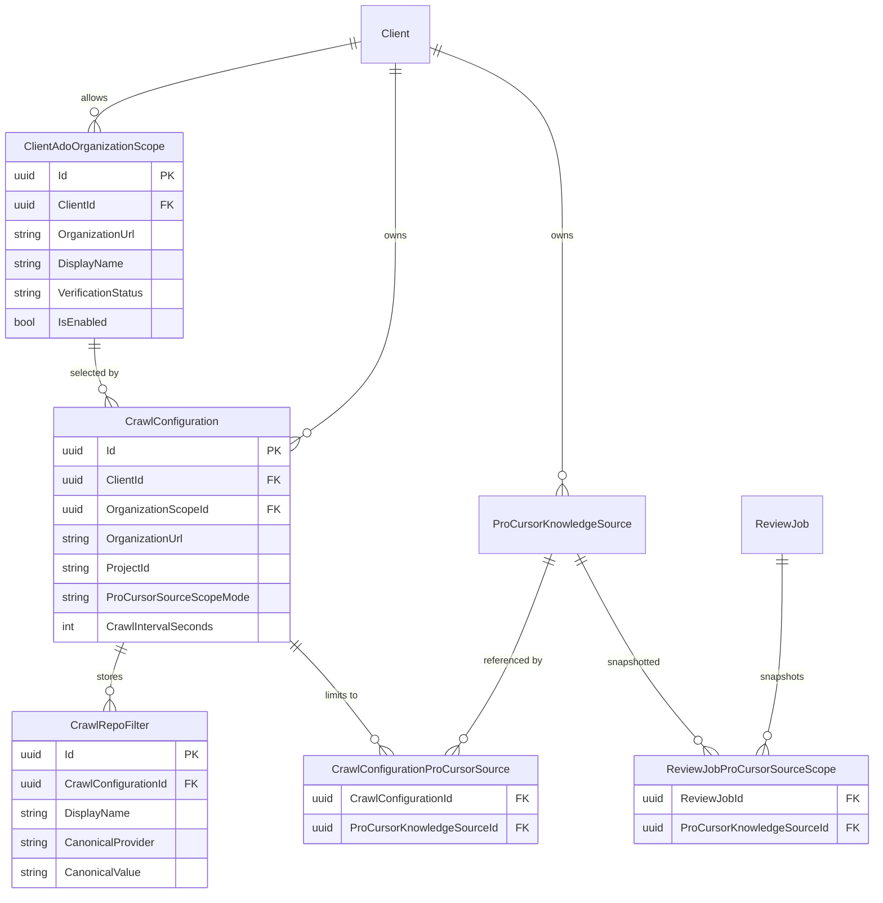

Read models surface invalid associations as `invalidProCursorSourceIds` instead of dropping them
silently, so administrators can repair stale selections from the guided UI.

### ProCursor Persistence Slice

The ProCursor tables hang off the existing client boundary and add their own durable job queue,
versioned snapshots, searchable chunks, and symbol graph rows.

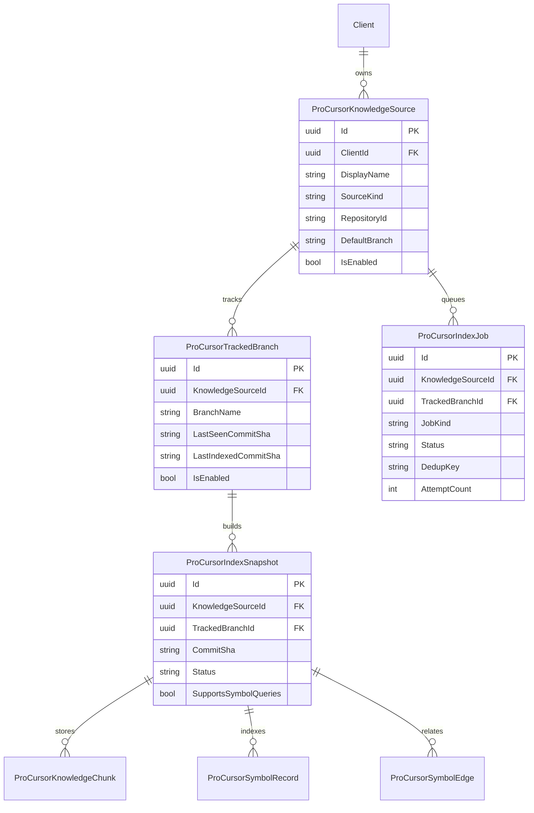


