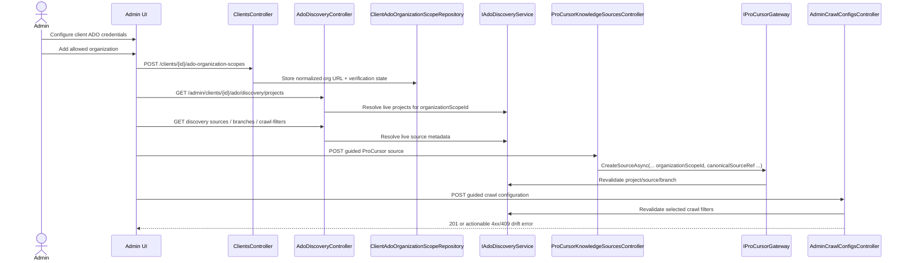
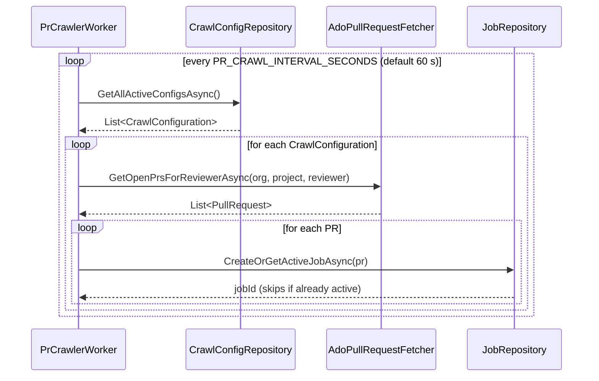
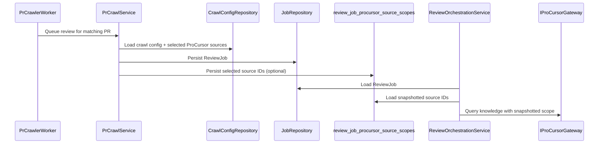

# Configuration And Crawling

This page covers the admin configuration workflow that defines what the system may review, and the
background crawler workflow that turns saved configuration into queued review jobs.

## Guided Azure DevOps Configuration

Guided Azure DevOps onboarding separates credential ownership from admin selections. Client
credentials authorize the backend to talk to Azure DevOps. Client-scoped organization-scope
records define which Azure DevOps organizations administrators may choose in guided ProCursor and
crawl-config flows.

All downstream project, repository, wiki, branch, and crawl-filter choices are resolved through
discovery endpoints and then revalidated again at save time. Compatibility remains for legacy
callers that still send raw `organizationUrl` and repository identifiers, but the guided path is
the primary admin boundary.

## PR Crawler Flow

The crawler finds new pull requests automatically. It periodically scans active crawl
configurations, resolves matching PRs for the configured reviewer, and queues review jobs only when
no active job already exists for the same PR state.

The crawler operates against crawl configurations that may reference all client ProCursor sources
or a selected subset. That selection is durable and does not depend on reading the latest admin
configuration during review execution.

## Crawl Source Scope Snapshotting

When a crawl configuration uses `selectedSources`, the crawler snapshots the chosen source list
onto the queued `ReviewJob`. Review execution later consumes the snapshot so an admin edit made
after queue time cannot silently change the knowledge scope of in-flight work.

This preserves queue-time intent and avoids hidden behavior changes between admin saves and worker
execution.
