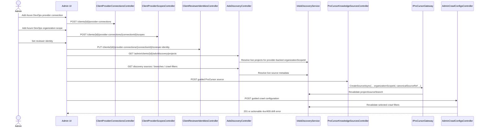
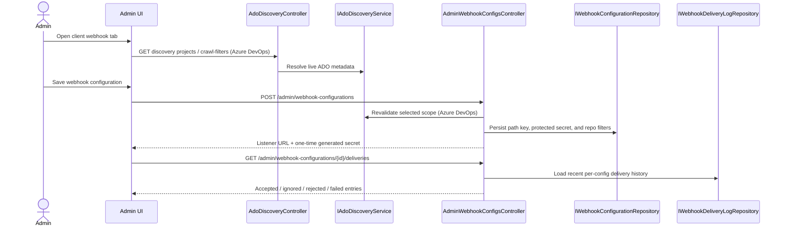
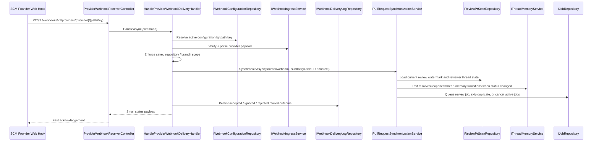
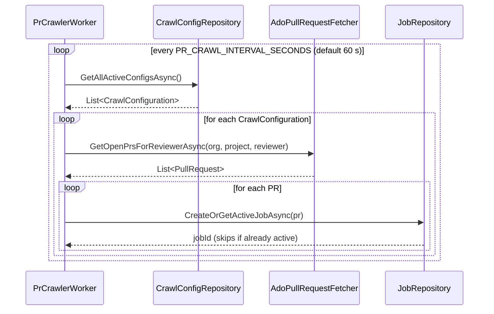
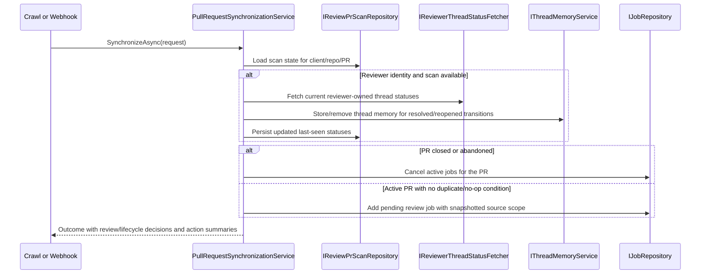
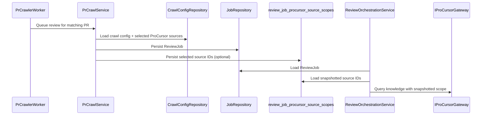

# Configuration And Crawling

This page describes the admin configuration workflow that defines reviewable scope and the
background crawler workflow that turns saved configuration into queued review jobs. Azure DevOps,
GitHub, GitLab, and Forgejo-family hosts use shared provider-neutral connection, scope,
repository, review, revision, and webhook concepts for manual review, webhook activation, and
operational visibility. Guided Azure DevOps discovery is available through the same provider model.

## Provider-Neutral Runtime Guardrails

- Provider onboarding, manual review intake, webhook ingress, and provider-scoped observability run
    through one shared provider-neutral model instead of branching the application workflow per
    provider family.
- Azure DevOps provides guided discovery for project, source, and branch selection. Credentials,
    organization scopes, and reviewer setup are resolved from the same provider connections and
    provider scopes used by the other supported SCM families.
- Provider connections own secrets and host configuration; provider scopes define the usable
    administrative boundary inside each connection.
- Repository, review, revision, thread, comment, and webhook concepts are normalized so downstream
    deduplication, thread memory, observability, and audit paths stay shared across provider families.
- Provider readiness is evaluated as a separate read model. Verification answers whether onboarding
    checks passed; readiness answers whether the connection is configured, onboarding-ready,
    degraded, or workflow-complete for the selected provider family and host variant.

## Guided Azure DevOps Configuration Through Provider Connections

Azure DevOps is administered through the shared provider-management flow. Administrators create or
update an Azure DevOps provider connection in the Providers tab, add one or more organization
scopes to that connection, and then use the same provider-scoped reviewer identity and discovery
surfaces as the other supported SCM families.

The provider-connection model does not use client-level System Azure DevOps settings. Configure
Azure DevOps in this order:

1. Add the Azure DevOps provider connection.
2. Add the organization scope on that connection.
3. Confirm or update the reviewer identity for that connection.
4. Re-save crawl, ProCursor, or webhook configuration against the recreated provider-backed scope.

All downstream project, repository, wiki, branch, and crawl-filter choices are resolved through
discovery endpoints and revalidated at save time. The durable admin boundary is the provider
connection and its scopes, not a client-level System Azure DevOps record.

## Webhook Configuration And Delivery History

Webhook configuration management is a sibling flow to crawl configuration management. Each webhook
configuration belongs to one client, stores a protected secret, owns a unique public listener path,
and persists repository and branch scope on the server. Azure DevOps configurations use the same
provider-backed organization selection and listener route shape as the other supported providers:
`/webhooks/v1/providers/{provider}/{pathKey}`. Those saved rules remain authoritative even when a
provider also applies its own upstream filters.

Delivery-history entries are durable per configuration and deliberately sanitized. They capture the
received timestamp, normalized event type, response status, final outcome, provider-specific failure
category, PR context when present, and downstream action summaries without storing auth material or
raw secrets.

## Public Webhook Intake

The public provider receiver sits beside the crawler rather than replacing it. GitHub, GitLab,
Forgejo-family, and Azure DevOps deliveries arrive through
`/webhooks/v1/providers/{provider}/{pathKey}`. Deliveries are matched by opaque path key,
verified with the provider-specific ingress service, checked against the saved repository and
branch scope, and handed to the shared pull-request synchronization service so lifecycle handling,
review-intake deduplication, scan updates, and reviewer-thread memory transitions are decided from
one downstream path.

The crawler and webhook listener can target the same client or repository. Webhooks reduce the time
to first action, while the crawler provides periodic discovery and fallback coverage for
provider-backed configurations. Both sources feed the same downstream synchronization path before
durable action is taken, which prevents provider-specific shortcuts from diverging from shared
lifecycle, thread-memory, audit, or retention behavior.

## PR Crawler Flow

The crawler finds new pull requests automatically. It periodically scans active crawl
configurations, resolves matching PRs for the configured reviewer, and queues review jobs only when
no active job already exists for the same PR state.

The crawler operates against crawl configurations that may reference all client ProCursor sources
or a selected subset. That selection is durable and does not depend on reading the latest admin
configuration during review execution.

Each crawl or webhook activation path can also snapshot an optional review temperature. Review
execution uses the job-scoped value, so later admin edits do not retroactively change in-flight
work.

## Shared Pull-Request Synchronization

`IPullRequestSynchronizationService` is the convergence point between webhook-triggered and
crawler-triggered activity. It receives source-neutral PR activation context, resolves the latest
iteration when necessary, runs the reviewer-thread memory state machine against the current
`ReviewPrScan`, then decides whether to enqueue review intake, suppress duplicate work, or cancel
active jobs for closed PRs.

This shared seam is also where synchronization-level telemetry is emitted. Observability tracks
activation source, PR status, review decision, and lifecycle decision for each pass, which makes it
possible to compare webhook- and crawler-driven behavior using the same tracing and metric series.

## Crawl Source Scope Snapshotting

When a crawl configuration uses `selectedSources`, the crawler snapshots the chosen source list
onto the queued `ReviewJob`. Review execution later consumes the snapshot so an admin edit made
after queue time cannot silently change the knowledge scope of in-flight work.

This preserves queue-time intent and avoids hidden behavior changes between admin saves and worker
execution.
