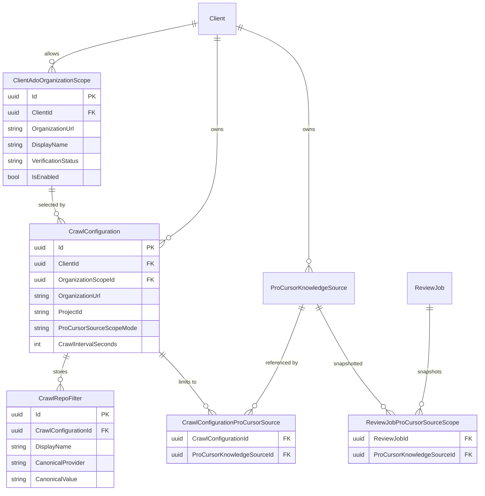

# Data Model

This page groups the main persistence slices instead of keeping every entity in one long ER diagram.
The goal is to make the architecture easier to read by separating configuration state, ProCursor
state, and the core review and access model.

## Guided Configuration Slice

The guided admin surface adds durable organization-scope state, canonical crawl filters, optional
selected-source associations, and review-job snapshots beneath the existing client boundary.

Read models surface invalid associations as `invalidProCursorSourceIds` instead of dropping them
silently, so administrators can repair stale selections from the guided UI.

## ProCursor Persistence Slice

The ProCursor tables hang off the existing client boundary and add their own durable job queue,
versioned snapshots, searchable chunks, and symbol graph rows.

```mermaid
erDiagram
    Client ||--o{ ProCursorKnowledgeSource : "owns"
    ProCursorKnowledgeSource ||--o{ ProCursorTrackedBranch : "tracks"
    ProCursorKnowledgeSource ||--o{ ProCursorIndexJob : "queues"
    ProCursorTrackedBranch ||--o{ ProCursorIndexSnapshot : "builds"
    ProCursorIndexSnapshot ||--o{ ProCursorKnowledgeChunk : "stores"
    ProCursorIndexSnapshot ||--o{ ProCursorSymbolRecord : "indexes"
    ProCursorIndexSnapshot ||--o{ ProCursorSymbolEdge : "relates"

    ProCursorKnowledgeSource {
        uuid Id PK
        uuid ClientId FK
        string DisplayName
        string SourceKind
        string RepositoryId
        string DefaultBranch
        bool IsEnabled
    }

    ProCursorTrackedBranch {
        uuid Id PK
        uuid KnowledgeSourceId FK
        string BranchName
        string LastSeenCommitSha
        string LastIndexedCommitSha
        bool IsEnabled
    }

    ProCursorIndexJob {
        uuid Id PK
        uuid KnowledgeSourceId FK
        uuid TrackedBranchId FK
        string JobKind
        string Status
        string DedupKey
        int AttemptCount
    }

    ProCursorIndexSnapshot {
        uuid Id PK
        uuid KnowledgeSourceId FK
        uuid TrackedBranchId FK
        string CommitSha
        string Status
        bool SupportsSymbolQueries
    }
```

## Core Review And Access Slice

The operational core still centers on clients, review jobs, protocols, identity, and client-owned
configuration such as AI connections, prompt overrides, and dismissals.

```mermaid
erDiagram
    Client {
        uuid Id PK
        string Key "legacy plaintext (deprecated)"
        string KeyHash "BCrypt hash of active key"
        string PreviousKeyHash "BCrypt hash (7-day grace period after rotation)"
        datetime KeyExpiresAt
        datetime PreviousKeyExpiresAt
        datetime KeyRotatedAt
        int AllowedScopes
        string DisplayName
        bool IsActive
        datetime CreatedAt
    }

    ClientAdoCredential {
        uuid Id PK
        uuid ClientId FK
        string TenantId
        string AzureClientId
        string Secret "encrypted via ASP.NET Data Protection"
    }

    CrawlConfiguration {
        uuid Id PK
        uuid ClientId FK
        string OrganizationUrl
        string ProjectId
        int CrawlIntervalSeconds
        bool IsActive
    }

    ReviewJob {
        uuid Id PK
        uuid ClientId FK
        string OrganizationUrl
        string ProjectId
        string RepositoryId
        int PullRequestId
        int IterationId
        string Status
        datetime SubmittedAt
        datetime CompletedAt
        jsonb Result
        int RetryCount
        long TotalInputTokensAggregated
        long TotalOutputTokensAggregated
    }

    ReviewJobProtocol {
        uuid Id PK
        uuid JobId FK
        uuid FileResultId FK
        int PassNumber
        int InputTokens
        int OutputTokens
    }

    ReviewFileResult {
        uuid Id PK
        uuid JobId FK
        string FilePath
        bool IsComplete
        bool IsFailed
        bool IsExcluded "true when skipped by exclusion rules"
        string ExclusionReason "pattern that matched, e.g. **/Migrations/*.Designer.cs"
    }

    AppUser {
        uuid Id PK
        string Username "unique, case-insensitive"
        string PasswordHash "BCrypt"
        string GlobalRole "Admin / User"
        bool IsActive
        datetime CreatedAt
    }

    UserClientRole {
        uuid Id PK
        uuid UserId FK
        uuid ClientId FK
        string Role "ClientAdministrator / ClientUser"
        datetime AssignedAt
    }

    UserPat {
        uuid Id PK
        uuid UserId FK
        string TokenHash "BCrypt (mpr_ prefix)"
        string Label
        datetime ExpiresAt
        datetime CreatedAt
        datetime LastUsedAt
        bool IsRevoked
    }

    RefreshToken {
        uuid Id PK
        uuid UserId FK
        string TokenHash "SHA-256"
        datetime ExpiresAt
        datetime CreatedAt
        datetime RevokedAt
    }

    AiConnection {
        uuid Id PK
        uuid ClientId FK
        string DisplayName
        string EndpointUrl
        jsonb Models "array of model names"
        bool IsActive
        string ActiveModel
        string ApiKey "encrypted; null when using DefaultAzureCredential"
        datetime CreatedAt
        string ModelCategory "Standard / Reasoning"
    }

    PromptOverride {
        uuid Id PK
        uuid ClientId FK
        uuid CrawlConfigId FK "null for client-scope overrides"
        string Scope "ClientScope / CrawlConfigScope"
        string PromptKey "SystemPrompt | AgenticLoopGuidance | SynthesisSystemPrompt | QualityFilterSystemPrompt | PerFileContextPrompt"
        string OverrideText
        datetime CreatedAt
    }

    FindingDismissal {
        uuid Id PK
        uuid ClientId FK
        string PatternText "normalised, lowercase, max 200 chars"
        string Label "optional admin-provided note"
        string OriginalMessage "original AI finding message"
        datetime CreatedAt
    }

    ReviewPrScan {
        uuid Id PK
        uuid ClientId FK
        string RepositoryId
        int PullRequestId
        string LastProcessedCommitId
    }

    ReviewPrScanThread {
        uuid ReviewPrScanId FK
        int ThreadId
        int LastSeenReplyCount
    }

    Client ||--o| ClientAdoCredential : "has (optional)"
    Client ||--o{ CrawlConfiguration : "has"
    Client ||--o{ ReviewJob : "owns"
    Client ||--o{ UserClientRole : "scoped to"
    Client ||--o{ AiConnection : "has"
    Client ||--o{ PromptOverride : "has"
    Client ||--o{ FindingDismissal : "has"
    Client ||--o{ ReviewPrScan : "has"
    ReviewJob ||--o{ ReviewJobProtocol : "has passes"
    ReviewJob ||--o{ ReviewFileResult : "has file results"
    ReviewJobProtocol }o--|| ReviewFileResult : "linked to"
    AppUser ||--o{ UserClientRole : "has"
    AppUser ||--o{ UserPat : "has"
    AppUser ||--o{ RefreshToken : "has"
    ReviewPrScan ||--o{ ReviewPrScanThread : "has"
    CrawlConfiguration ||--o{ PromptOverride : "can have (crawl-config scope)"
```

