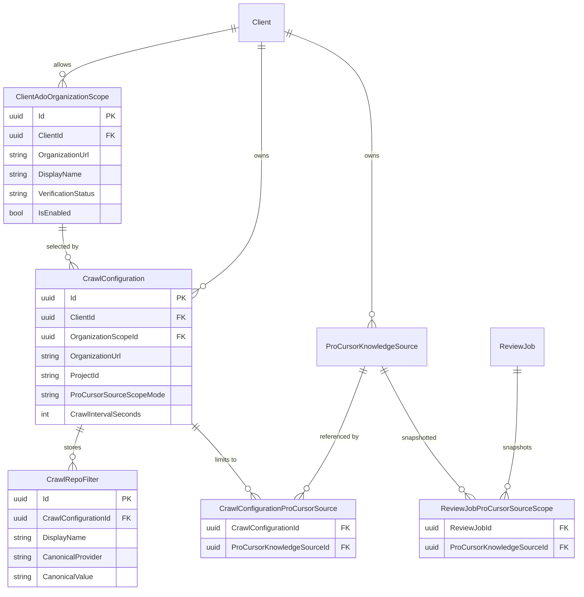
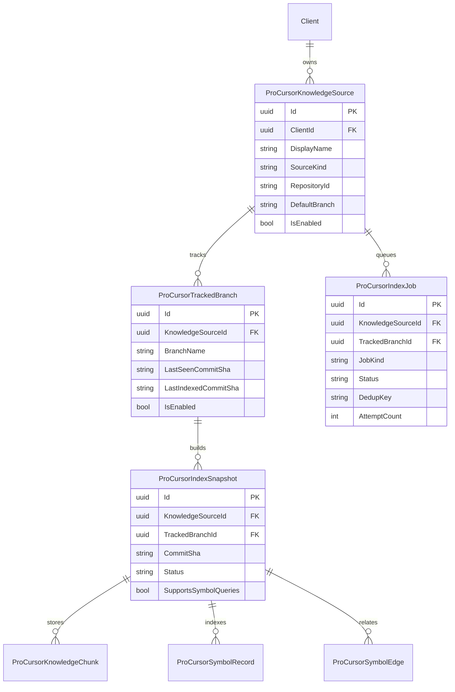
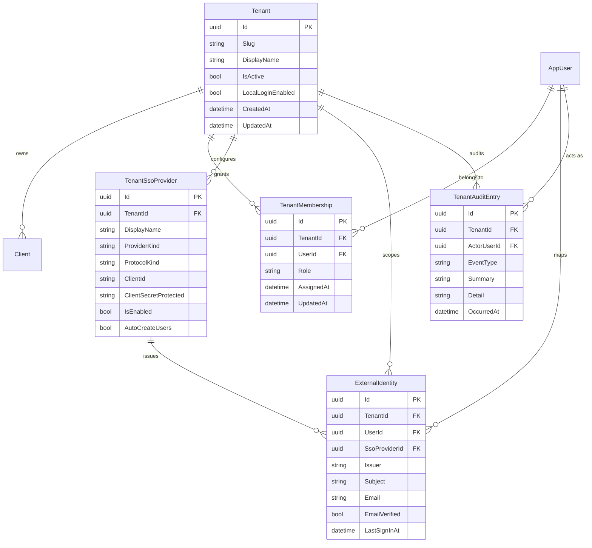

# Data Model

This document describes the main persistence slices for ProPR. The diagrams separate guided
configuration, ProCursor persistence, the core review and access model, and tenancy and identity.

## Guided Configuration Slice

The guided configuration slice persists provider-scoped configuration, canonical crawl filters,
optional selected-source associations, and review-job source snapshots beneath the client boundary.

Read models expose invalid associations through `invalidProCursorSourceIds`. This preserves stale
references for administrative repair instead of discarding them during projection.

## ProCursor Persistence Slice

The ProCursor persistence slice extends the client boundary with a durable index-job queue,
versioned snapshots, searchable knowledge chunks, and symbol graph records.

## Core Review And Access Slice

The core review and access slice centers on clients, review jobs, review protocols, identity, and
client-owned configuration such as AI connections, prompt overrides, and finding dismissals.

Reviewer-trigger identity is persisted separately from provider connection credentials. Review jobs do
not persist requested reviewer-trigger identity as a posting identity; they snapshot normalized review
target and revision context, while authenticated publication identity is resolved at execution time
from provider fetch/verification paths.

Verification metadata is stored in review-domain records and protocol payloads:

- `CandidateReviewFinding` stores structured claim metadata, provenance, evidence references, and
    optional `VerificationOutcome`.
- `EvidenceBundle` stores concrete evidence items, evidence-source attempt records, and aggregate
    ProCursor attempt/result status so operators can distinguish fetched context from proof.
- `ReviewFileResult` stores only the surviving publishable local findings plus a verification-aligned
  per-file summary for newly reviewed files. Carried-forward rows remain outside the verification
  scope of the associated run.
- `ReviewJobProtocol` records claim extraction, local verification, evidence collection, PR-level
    verification, degraded verification states, summary reconciliation, final-gate audit payloads,
    total cached input tokens, and cache observability for each pass.
- `ProtocolEvent` remains the source of truth for searchable execution-trace evidence. Searchable
  metadata stays additive on the existing row through normalized `EventCategory`, while the
  review-local execution traces experience derives best-effort categories for older persisted events
  when that metadata is absent. Existing AI/tool events also capture per-call cache status, cached
  input tokens, cache miss category, prefix eligibility, bounded tool-evidence token estimates, and
  finalization attempt details.
- Final-gate payloads store summary reconciliation metadata, including original and final summary
    text, dropped finding ids, summary-only finding ids, and whether a summary rewrite was required.

Client administrators have manual control over review processing. A review job carries a terminal
`Stopped` status, distinct from `Cancelled` (pull request abandoned) and `Superseded` (a newer push
arrived): it records an operator halting an in-flight or queued review, and its partial results are not
reused as a baseline. `BlockedPullRequest` records the pull requests an administrator has blocked from
processing, keyed by the same identity both intake paths use — `(ClientId, ProviderScopePath,
ProviderProjectKey, RepositoryId, PullRequestId)`. While a block exists, new submissions and
crawl/webhook pushes create no review job; a block never stops a job that is already running.

```mermaid
erDiagram
    Client {
        uuid Id PK
        string Key "inactive plaintext compatibility field"
        string KeyHash "BCrypt hash of active key"
        string PreviousKeyHash "BCrypt hash (7-day grace period after rotation)"
        datetime KeyExpiresAt
        datetime PreviousKeyExpiresAt
        datetime KeyRotatedAt
        int AllowedScopes
        string DisplayName
        bool ScmCommentPostingEnabled "default true; suppresses new outbound SCM comments when false"
        bool IsActive
        datetime CreatedAt
    }

    ClientAdoCredential {
        uuid Id PK
        uuid ClientId FK
        string TenantId
        string AzureClientId
        string Secret "encrypted via ASP.NET Data Protection"
    }

    CrawlConfiguration {
        uuid Id PK
        uuid ClientId FK
        string OrganizationUrl
        string ProjectId
        int CrawlIntervalSeconds
        bool IsActive
    }

    ReviewJob {
        uuid Id PK
        uuid ClientId FK
        string OrganizationUrl
        string ProjectId
        string RepositoryId
        int PullRequestId
        int IterationId
        string Status "Pending / Processing / Completed / Failed / Cancelled / Superseded / Stopped"
        datetime SubmittedAt
        datetime CompletedAt
        jsonb Result
        int RetryCount
        long TotalInputTokensAggregated
        long TotalOutputTokensAggregated
    }

    ReviewJobProtocol {
        uuid Id PK
        uuid JobId FK
        uuid FileResultId FK
        int PassNumber
        int InputTokens
        int CachedInputTokens
        int OutputTokens
        string CacheObservability
    }

    ProtocolEvent {
        uuid Id PK
        uuid ProtocolId FK
        string Kind
        string Name
        string EventCategory
        datetime OccurredAt
    }

    ReviewFileResult {
        uuid Id PK
        uuid JobId FK
        string FilePath
        bool IsComplete
        bool IsFailed
        bool IsExcluded "true when skipped by exclusion rules"
        string ExclusionReason "pattern that matched, e.g. **/Migrations/*.Designer.cs"
    }

    BlockedPullRequest {
        uuid Id PK
        uuid ClientId FK
        string ProviderScopePath
        string ProviderProjectKey
        string RepositoryId
        int PullRequestId
        uuid BlockedByUserId
        string Reason "optional"
        datetime BlockedAt
    }

    AppUser {
        uuid Id PK
        string Username "unique, case-insensitive"
        string PasswordHash "BCrypt"
        string GlobalRole "Admin / User"
        bool IsActive
        datetime CreatedAt
    }

    UserClientRole {
        uuid Id PK
        uuid UserId FK
        uuid ClientId FK
        string Role "ClientAdministrator / ClientUser"
        datetime AssignedAt
    }

    UserPat {
        uuid Id PK
        uuid UserId FK
        string TokenHash "BCrypt (mpr_ prefix)"
        string Label
        datetime ExpiresAt
        datetime CreatedAt
        datetime LastUsedAt
        bool IsRevoked
    }

    RefreshToken {
        uuid Id PK
        uuid UserId FK
        string TokenHash "SHA-256"
        datetime ExpiresAt
        datetime CreatedAt
        datetime RevokedAt
    }

    AiConnection {
        uuid Id PK
        uuid ClientId FK
        string DisplayName
        string EndpointUrl
        jsonb Models "array of model names"
        bool IsActive
        string ActiveModel
        string ApiKey "encrypted; null when using DefaultAzureCredential"
        datetime CreatedAt
        string ModelCategory "Standard / Reasoning"
    }

    PromptOverride {
        uuid Id PK
        uuid ClientId FK
        uuid CrawlConfigId FK "null for client-scope overrides"
        string Scope "ClientScope / CrawlConfigScope"
        string PromptKey "SystemPrompt | AgenticLoopGuidance | SynthesisSystemPrompt | QualityFilterSystemPrompt | PerFileContextPrompt"
        string OverrideText
        datetime CreatedAt
    }

    FindingDismissal {
        uuid Id PK
        uuid ClientId FK
        string PatternText "normalised, lowercase, max 200 chars"
        string Label "optional admin-provided note"
        string OriginalMessage "original AI finding message"
        datetime CreatedAt
    }

    ReviewPrScan {
        uuid Id PK
        uuid ClientId FK
        string RepositoryId
        int PullRequestId
        string LastProcessedCommitId
    }

    ReviewPrScanThread {
        uuid ReviewPrScanId FK
        int ThreadId
        int LastSeenReplyCount
    }

    Client ||--o| ClientAdoCredential : "has (optional)"
    Client ||--o{ CrawlConfiguration : "has"
    Client ||--o{ ReviewJob : "owns"
    Client ||--o{ UserClientRole : "scoped to"
    Client ||--o{ AiConnection : "has"
    Client ||--o{ PromptOverride : "has"
    Client ||--o{ FindingDismissal : "has"
    Client ||--o{ ReviewPrScan : "has"
    ReviewJob ||--o{ ReviewJobProtocol : "has passes"
    ReviewJob ||--o{ ReviewFileResult : "has file results"
    ReviewJobProtocol }o--|| ReviewFileResult : "linked to"
    ReviewJobProtocol ||--o{ ProtocolEvent : "stores"
    AppUser ||--o{ UserClientRole : "has"
    AppUser ||--o{ UserPat : "has"
    AppUser ||--o{ RefreshToken : "has"
    ReviewPrScan ||--o{ ReviewPrScanThread : "has"
    CrawlConfiguration ||--o{ PromptOverride : "can have (crawl-config scope)"
```

Review-local execution trace filtering reads only from the existing `ReviewJob`, `ReviewJobProtocol`,
and `ProtocolEvent` persistence path. It does not maintain a second diagnostics index or shadow trace store.

## Tenancy And Identity Slice

The tenancy and identity slice places `Tenant` above the client boundary. Each user keeps one
global `AppUser` identity, while access and sign-in policy are defined by tenant-scoped membership
and provider records.

`GlobalRole` defines platform-administrator authority and the recovery path. `TenantMembership`
defines tenant-local administration and user access. `UserClientRole` defines client-local
operations. Client-scoped actions also require membership in the tenant that owns the target
client.

Tenant sign-in providers and external identities are tenant-scoped. Enabled providers, allowed
email domains, and returning-login identity matching remain isolated per tenant.
`TenantAuditEntry` stores append-only history for tenant policy, provider, and membership changes.
