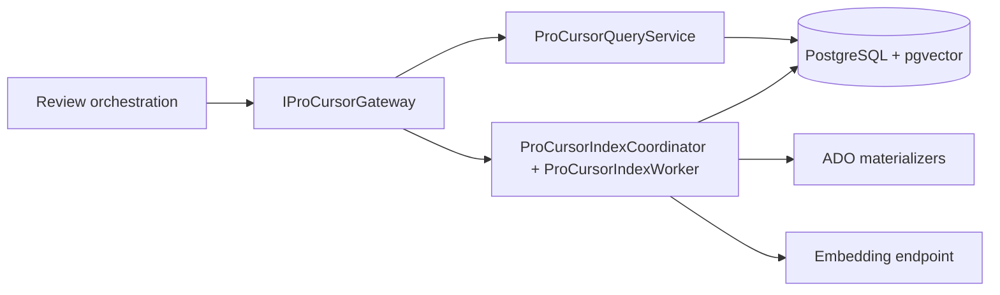
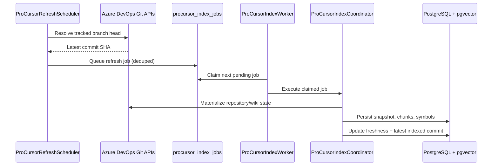
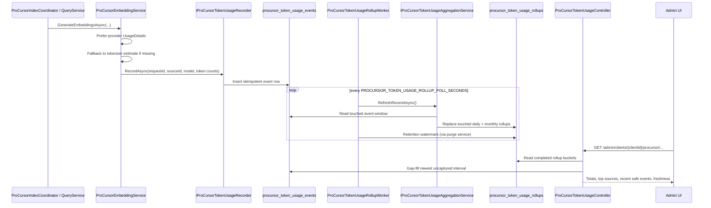

# ProCursor Architecture

This page covers the ProCursor bounded slice: how review orchestration reaches it, how tracked
sources are refreshed, and how ProCursor token usage is captured and rolled up.

## Boundary And Runtime Position

ProCursor runs inside the same deployment today, but it is treated as a bounded slice with its own
facade and options surface. Review orchestration reaches it only through `IProCursorGateway` and
`PROCURSOR_*` settings; it does not talk directly to ProCursor repositories, Azure DevOps
materializers, or snapshot tables.

For guided admin flows, the same gateway boundary owns save-time validation of
`organizationScopeId`, canonical source references, and default or tracked branch selections. That
keeps Azure DevOps drift detection at the admin boundary instead of surfacing first during a later
refresh or review run.

## Refresh Flow

Tracked branches refresh independently from the pull-request worker. The scheduler polls branch
heads, queues durable jobs, and the dedicated worker drains those jobs with per-source isolation so
one slow or failing source does not block unrelated repositories and wikis.

## Token Reporting

ProCursor token reporting runs alongside the indexing flow. The capture boundary prefers
provider-reported usage metadata returned by the AI client, falls back to tokenizer-based estimates
when needed, and stores one idempotent event row per physical ProCursor AI call.

A dedicated rollup worker refreshes daily and monthly aggregates so the admin UI can read stable
totals while still gap-filling the newest uncaptured window from raw events.
