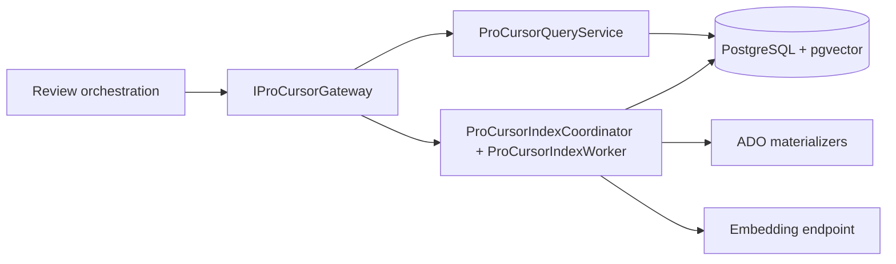
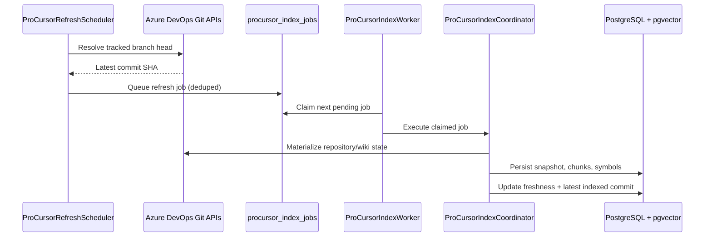
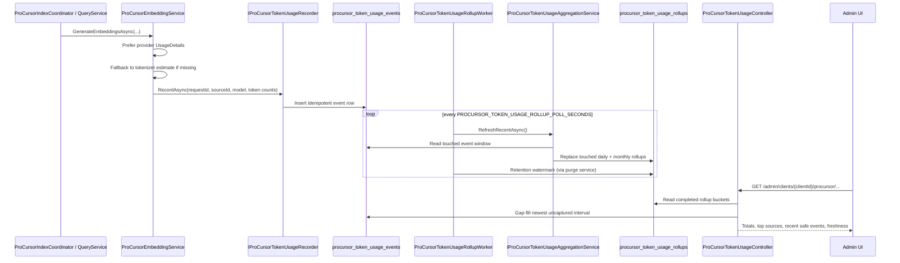

# ProCursor Architecture

This page covers the ProCursor bounded slice: how review orchestration reaches the ProCursor host,
how tracked sources are refreshed, and how ProCursor token usage is captured and rolled up.

## Boundary And Runtime Position

ProCursor runs as a separate internal ASP.NET Core service with its own health endpoint, worker
lifecycle, and extracted-host settings. Review orchestration reaches it only through
`IProCursorGateway` and `PROCURSOR_*` settings; it does not talk directly to ProCursor repositories,
Azure DevOps materializers, or snapshot tables.

ProPR is the only public control plane. Browser traffic, admin UI calls, and public auth are
anchored to ProPR. The ProCursor host is internal-only and authenticates both directions
with `X-ProCursor-Key` using one shared `PROCURSOR_SHARED_KEY`.

ProPR is also the durable source of truth for ProCursor-capable source definitions and execution-time
runtime configuration. The ProCursor host keeps that runtime configuration in memory only, warms it on
startup, refreshes it on cache miss or staleness, and persists only operational data such as jobs,
snapshots, chunks, symbol graphs, and token-usage records through `PROCURSOR_DB_CONNECTION_STRING`.

In managed remote mode, ProPR does not register `ProCursorOperationalDbContext` and does not need
`PROCURSOR_DB_CONNECTION_STRING`. ProPR reaches ProCursor-owned reporting and maintenance data through
shared-key-authenticated internal ProCursor HTTP endpoints, while the public admin surface remains on
ProPR.

Both services emit distinct OTLP service identities, `MeisterProPR.Api` and
`MeisterProPR.ProCursor.Service`, so distributed traces can distinguish the public control plane from
the internal ProCursor execution host.

For guided admin flows, the same gateway boundary owns save-time validation of
`organizationScopeId`, canonical source references, and default or tracked branch selections. That
keeps Azure DevOps drift detection at the admin boundary instead of surfacing first during a later
refresh or review run.



## Review-Time Retrieval Path

Per-file review loops and the verification layer both reach ProCursor through the review-tools
boundary. The final finding gate does not call ProCursor directly; targeted evidence retrieval
executes upstream through the `IReviewContextTools` seam.

```mermaid
sequenceDiagram
    participant ORCH as ReviewOrchestrationService
    participant FACT as ProviderReviewContextToolsFactory
    participant LOOP as ToolAwareAiReviewCore
    participant VER as ReviewContextEvidenceCollector
    participant TOOLS as ProviderReviewContextToolsBase
    participant GW as IProCursorGateway
    participant HTTP as HttpProCursorGateway
    participant QUERY as ProCursorQueryService

    ORCH->>FACT: Create(ReviewContextToolsRequest)
    FACT-->>ORCH: IReviewContextTools
    ORCH->>LOOP: ReviewAsync(..., ReviewSystemContext)
    LOOP->>TOOLS: ask_procursor_knowledge / get_procursor_symbol_info
    TOOLS->>GW: AskKnowledgeAsync(...) / GetSymbolInsightAsync(...)
    GW->>HTTP: ProPR -> ProCursor internal call
    HTTP->>QUERY: Query repository-scoped chunks and symbols
    QUERY-->>HTTP: Answer or symbol insight
    HTTP-->>GW: DTO
    GW-->>TOOLS: DTO
    TOOLS-->>LOOP: Tool result
    ORCH->>VER: CollectEvidenceAsync(work item, tools, modelId)
    VER->>TOOLS: get_changed_files / get_file_content / ask_procursor_knowledge / get_procursor_symbol_info
    TOOLS->>GW: Forward bounded repository-aware lookups
    GW->>HTTP: ProPR -> ProCursor internal call
    HTTP->>QUERY: Query repository-scoped chunks and symbols
    QUERY-->>HTTP: Evidence DTOs
    HTTP-->>GW: DTOs
    GW-->>TOOLS: DTOs
    TOOLS-->>VER: Evidence items
```

1. `ReviewOrchestrationService.BuildReviewContextAsync(...)` snapshots PR identity, source branch,
   iteration, client id, and optional scoped ProCursor source ids into `ReviewContextToolsRequest`.
2. `ProviderReviewContextToolsFactory` selects the provider-specific implementation. Azure DevOps
   uses `AdoReviewContextToolsFactory`, and the same `IReviewContextTools` contract is preserved for
   the other providers.
3. `ToolAwareAiReviewCore` exposes `ask_procursor_knowledge` and `get_procursor_symbol_info`
   alongside file and tree lookup tools during each per-file review loop.
4. `ReviewContextEvidenceCollector` reuses the same `IReviewContextTools` boundary during PR-level
   verification to gather bounded evidence for synthesized or unresolved claims. Each ProCursor
   knowledge or symbol lookup records an explicit attempt status (`Succeeded`, `Empty`, or
   `Unavailable`) in the verification evidence bundle.
5. `ProviderReviewContextToolsBase` forwards review-time ProCursor calls through
   `IProCursorGateway` with repository or review-target context instead of querying ProCursor tables
   directly.
6. When ProPR runs with `PROCURSOR_REMOTE_MODE=disabled`, tool-aware review omits the ProCursor tools
   entirely. When ProCursor is configured but unavailable, the same boundary returns explicit
   `Unavailable` results so review and verification continue without aborting the wider job.
7. This keeps ProCursor as a bounded evidence dependency: verification can use repository-aware
   knowledge and symbol lookups without adding direct reviewing-to-ProCursor persistence coupling.
8. `DeterministicReviewFindingGate` is retrieval-free. It consumes `VerificationOutcome`
   produced upstream rather than issuing its own ProCursor queries.

## Refresh Flow

Tracked branches refresh independently from the pull-request worker. The scheduler polls branch
heads, queues durable jobs, and the dedicated worker drains those jobs with per-source isolation so
one slow or failing source does not block unrelated repositories and wikis. The durable index worker
and token rollup worker run in the ProCursor host rather than the public API host.



## Token Reporting

ProCursor token reporting runs alongside the indexing flow. The capture boundary prefers
provider-reported usage metadata returned by the AI client, falls back to tokenizer-based estimates
when needed, and stores one idempotent event row per physical ProCursor AI call.



A dedicated rollup worker refreshes daily and monthly aggregates so the admin UI can read stable
totals and gap-fill the newest uncaptured window from raw events.

## Operational Expectations

1. ProPR health includes a `procursor-remote` dependency entry only when remote ProCursor mode is configured.
2. The ProCursor host exposes its own `/healthz` endpoint for worker readiness and host health.
3. ProPR and ProCursor may share a Data Protection key ring for deployment convenience, but the architecture does not require a shared key ring or shared secret-protection store.
4. Missing or mismatched `X-ProCursor-Key` values return `401 Unauthorized` in both directions without a differentiated response body.
5. OTLP and Prometheus instrumentation cover inbound requests and outbound broker/gateway `HttpClient` traffic on both sides of the service boundary.
6. Structured logging redacts shared-key values, and request logging records only whether
   `X-ProCursor-Key` was present for service-boundary requests.
