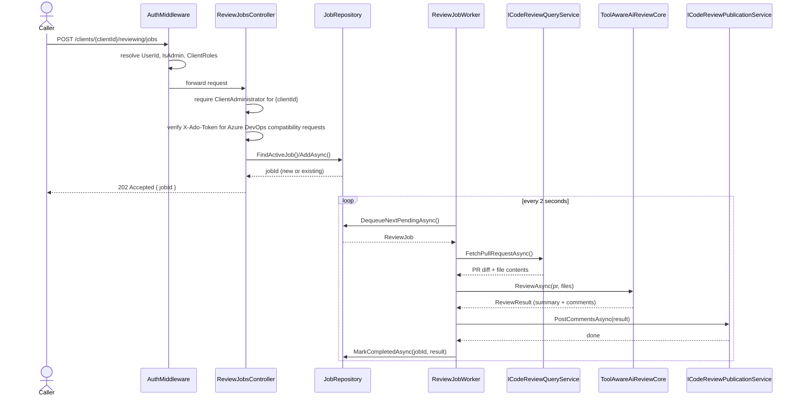
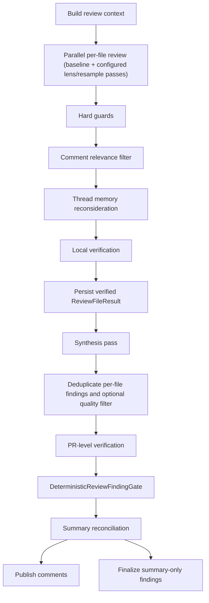
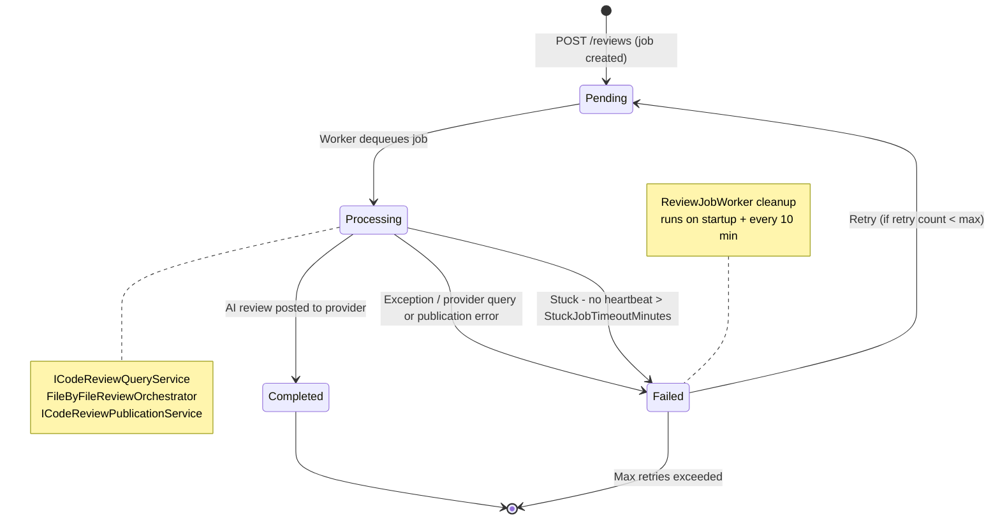

# Reviewing Workflows

This page covers the runtime path from provider-neutral review submission to posted provider-native
comments, plus ProRV-focused guidance, filtering, verification, synthesis, final-gate, dedup, and
token-control mechanics that keep the review loop safe and efficient.

## Review Strategies

The Reviewing module currently allows new review jobs to select only `FileByFile`, the baseline
per-file review path.

Historical persisted jobs may still report `AgenticFileByFile` or `PrWideAgentic` in diagnostics,
but those strategies are disabled for new selection and for runtime execution.

## Review Submission And Execution

Review submission depends on the caller identity resolved in [security-and-access.md](security-and-access.md)
plus optional `X-Ado-Token` validation for Azure DevOps identity checks. The intake controller
accepts provider-neutral repository, review, and revision identities for Azure DevOps, GitHub,
GitLab, and Forgejo-family reviews. The worker claims the job, resolves the provider-specific query
and publication adapters through the shared provider registry, runs the AI review, and posts
comment threads back to the originating provider.

Production execution enters through `ReviewOrchestrationService`, and offline evaluation enters through `ReviewWorkflowRunner`. Both flows resolve strategy and profile routing through `IReviewStrategyDispatcher`, which now permits only `FileByFile` execution.

For `FileByFile`, the shared pipeline-profile catalog now publishes the legacy
`file-by-file-baseline` plus `file-by-file-calm`, `file-by-file-balanced`, and
`file-by-file-assertive`. `file-by-file-balanced` is the baseline profile. All four currently share
the same dispatch-stage family ordering for recall-uplift groundwork: context prefetch, then
risk-marker scan.

## Offline Prompt Experiment Harness

The offline harness can replay one fixture as a batch of baseline and named prompt variants without
changing production review behavior. This path stays behind `ReviewWorkflowRunner` and
`PromptExperimentBatchRunner`; production orchestration does not accept or persist prompt experiment
configuration.

1. `PromptExperimentBatchRunner` validates one `PromptExperimentBatch`, resolves the offline chat
   runtime once for the batch, clones the target `ReviewJob` per run, and attaches a
   `PromptExperimentContext` only for that offline execution.
2. Shared prompt construction remains centralized in `ReviewPrompts`. Offline variants target a
   neutral prompt-stage catalog keyed by stage ids such as `per_file_user`, `synthesis_system`, and
   `pr_verification_user`.
3. Each stage variant declares one prompt role (`system` or `user`) plus one composition mode:
   `replace`, `prepend`, or `append`. Unconfigured stages keep their default prompt construction.
4. Prompt-stage evidence is recorded explicitly at the prompt-driven execution sites rather than
   inferred only from protocol labels. The recorder stores stage key, variant name, composition
   mode, default-vs-variant usage, and the actual system and user prompt text used.
5. Offline artifact assembly projects that evidence into `EvaluationArtifact` stage records so one
   artifact can show both stage execution and the exact prompt content that produced it.
6. When explicit prompt-stage evidence is absent, offline projection keeps a fallback inference path
   for older protocol data so previously captured artifacts remain readable.

This boundary lets reviewers compare baseline and variant runs by stage and prompt text while
preserving the default production prompt path when no offline experiment context is present.

Provider operational readiness is evaluated separately from onboarding verification. A provider
connection can be verified and ready for onboarding while lacking workflow-complete proof, such as
enabled scope or full host-variant support evidence. Reviewer-trigger identity is surfaced as an
optional narrowing filter, not as an authentication requirement. The admin provider-operations view
and the health surface consume these readiness states rather than relying on
`verificationStatus == verified` alone.

## Per-File Comment Relevance Filter

The Reviewing module includes a code-selected comment relevance filter stage between deterministic
hard guards and the downstream thread-memory, persistence, synthesis, and publication flow.
Startup selects `hybrid-v1` through `Program.GetSelectedCommentRelevanceFilterId()`.

1. `IAiReviewCore` produces the initial per-file `ReviewResult`, and deterministic hard guards
   normalize low-confidence or malformed comments before any filter runs.
2. When a named filter implementation is selected in code, `FileByFileReviewOrchestrator` builds a
   `CommentRelevanceFilterRequest` and runs either `pass-through-v1`, `heuristic-v1`, or
   `hybrid-v1` for that file. The configured path selects `hybrid-v1`.
3. Every implementation emits the same `RecordedFilterOutput` shape with implementation identity,
   counts, reason buckets, decision-source totals, discarded-comment details, degraded markers, and
   optional `aiTokenUsage`.
4. `hybrid-v1` reuses deterministic screening first, then asks `AiCommentRelevanceAmbiguityEvaluator`
   to adjudicate only ambiguous survivors on the client default review runtime carried in
   `ReviewSystemContext.DefaultReviewChatClient` and `DefaultReviewModelId`. Evaluator outages,
   parse failures, incomplete decision sets, and other failures fail open by keeping the affected
   comments and recording machine-readable `degradedComponents` plus `fallbackChecks`.
5. Only kept comments move into thread memory reconsideration, `ReviewFileResult` persistence,
   synthesis, and provider publication.

The filter uses the review protocol transport instead of introducing a separate storage path.
`comment_relevance_filter_output`, `comment_relevance_filter_degraded`,
`comment_relevance_evaluator_degraded`, `comment_relevance_filter_selection_fallback`, and
`ai_call_comment_relevance_evaluator` are stored on `ReviewJobProtocol` so the Job Protocol UI can
explain why a comment was discarded or retained.

## Session-Aware File Review Loop

The default `FileByFile` workflow now runs the shared multi-turn review loop with internal
session-aware continuation. This remains an internal execution concern; no public HTTP contract or
admin API shape changes are required for the slice.

1. `ToolAwareAiReviewCore` selects one session mode per file review pass from runtime capability and
   workflow context:
   `provider_managed_session` when the active chat runtime supports provider-managed continuation,
   `local_managed_session` for the per-file default path when provider-managed continuation is not
   available, and `stateless_replay` for paths that cannot safely retain session state.
2. In provider-managed mode, later turns send only the newest turn input while the runtime carries
   forward the earlier transcript through `ConversationId`, response-chain identifiers, and any
   provider continuation token retained in `ReviewLoopState`.
3. In local-managed mode, the loop keeps durable system framing plus the latest live turn while
   compacting earlier bulky tool payloads into working-memory summaries. Later turns therefore reuse
   bounded summaries instead of replaying every earlier large file read or search result in full.
4. When provider-managed continuation fails after an earlier successful turn, the loop downgrades to
   local-managed continuation, preserves the durable prompts and latest turn transcript, and
   continues the review instead of failing the entire file pass solely because the preferred
   continuation mode became unavailable.
5. `FileReviewer` owns the per-file protocol lifecycle around that shared loop. It carries the
   session and loop metrics into the file-scoped `ReviewSystemContext`, completes the protocol with
   final token and iteration totals, and preserves the existing retry boundary for failed file
   attempts.

The protocol surface remains event-driven. Each reviewed file pass can emit:

- `review_agent_session_binding` with the file-owned local session identifier, binding method,
  binding outcome, prompt mode, and remote conversation identifier when managed remote conversation
  binding succeeds
- `review_agent_session_turn` with turn number, selected session mode, context strategy,
  prompt mode, replay-summary metadata, compacted-payload summary, remote-vs-local continuation
  markers, and any provider session or response-chain identifiers
- `review_agent_session_fallback` with the downgraded-from mode, downgraded-to mode, fallback
  reason, turn number, and preserved-state description

Operators should interpret those events together with the normal AI call and tool call events:

- `sessionMode` identifies whether the pass used stateless replay, local managed continuation, or
  provider-managed continuation.
- `promptMode` identifies whether the turn established the remote conversation binding, continued it
  with only the current prompt, or fell back to explicit replay.
- `contextStrategy` distinguishes full-context submission from delta-context continuation on each AI
  turn.
- `replayedPayloadSummary` and `compactedPayloadSummary` provide the evidence that later tiny or
  empty follow-up results did not force the earlier bulky payloads to be retransmitted in full.
- `remoteConversationId` and `providerResponseId` are present only when the runtime exposes them.

For Agent Framework-backed managed remote conversations, the first successful managed turn creates a
session and binds it to the remote conversation. Later turns continue through that same session using
only the current prompt and do not re-pass the remote conversation identifier on each turn.

## Multi-Pass Review Union

When a client enables multi-pass review union, Medium- and High-tier files are reviewed by more than
one independent pass and the passes' locally-verified comments are unioned before synthesis
deduplication, so the synthesis inlet sees the combined set rather than a single pass. Low-tier files,
and clients with the flag disabled, run a single pass with byte-identical behavior.

The passes are configured as an ordered per-client review-pass list. Pass 1 is the tier-model baseline
and is implicit — it is not a list entry. Each list entry adds one further pass bound to a specific
configured model (the connection is implied by the model), so the effective pass count is one plus the
list length. Distinct models across entries are the point: additional passes exist so a different
sampler can surface disjoint findings, not to resample the tier model.

Resolution and skip-safety:

- Each additional pass resolves its own chat runtime from its configured model. An entry whose model
  cannot be resolved is skipped for that pass alone (recorded as `multi_pass_union_pass_skipped`) while
  the remaining passes still run. A pass never falls back to the tier model, because a same-model
  resample is the ineffective case the mechanism exists to avoid.
- The flag enabled with an empty pass list degrades to a single baseline pass and records
  `multi_pass_union_skipped`.
- A completed union records `multi_pass_union_completed` with per-pass catch counts and the actual
  model used per pass. Each additional pass surfaces in the trace as `Pass N` (the baseline is the
  initial review), and resample-pass comments are stamped with the multi-pass union origin.

## Diagnostics Trace Search

The diagnostics surface keeps trace investigation inside one opened review's execution traces tab.

1. `JobsController` exposes the existing job protocol endpoints and applies the same client-role
   boundary used by the rest of the diagnostics endpoints.
2. `IReviewDiagnosticsReader.GetJobProtocolAsync(...)` and `GetJobProtocolPassAsync(...)` read existing
   `ReviewJob`, `ReviewJobProtocol`, and `ProtocolEvent` records without duplicating protocol payloads
   into a second store.
3. `ProtocolEvent.EventCategory` is stored as additive metadata on the existing trace rows and derived
   best-effort for legacy rows when the persisted category is absent.
4. The frontend execution traces tab loads all passes for the current review, derives suggestion-backed
   filters from that review-local data, and filters rows in place without navigating to a separate
   diagnostics route.

This keeps Job Protocol as the authoritative investigation experience while making stored execution
traces searchable across all traces in one review.

## ProRV Knowledge Lens

ProRV is a bounded review-knowledge library (CodeQL-derived per-language checks plus GitHub-Actions
attack classes, severity-graded) that ranks the most relevant review checks for one changed file
from its path, diff, and language. It is exposed as a review-pass **lens** (`prorv`) on the
per-client ordered review-pass list, alongside `security` — one entry, its configured model runs
the pass. The ranked items become focused guidance for that pass rather than standalone findings.

1. A `prorv` lens entry runs inside the existing multi-pass fan-out on any complexity tier. A file is
   eligible when it is a text file with a diff (binary, deleted, and empty-diff files are skipped
   deterministically, with no model call).
2. For an eligible file, `ProRVFocusedReviewGuidanceResolver.TryResolveAsync(...)` calls
   `IProRVPrefilter` on the pass entry's own configured model to rank the applicable checks against
   the embedded catalog for the file's language. This single ranking call both gates the pass and
   produces the guidance; guidance is cached per (file path, catalog version) within a job.
3. When no check applies (or the ranking is unusable), the pass is skipped for that file with a
   reason-coded trace and no review model call — exactly like an unresolvable pass model.
4. When checks apply, the ranked items are injected into the shared per-file review prompt as
   `focusedReviewGuidanceSection`, and the pass reviews the file on its model. Findings carry the
   lens on their provenance ("Pass N · ProRV"); `prorv_prefilter_*` and
   `prorv_focused_guidance_applied` protocol events record the screen and its outcome.
5. ProRV narrows reviewer attention on the files it applies to, but verification, synthesis,
   deduplication, and the final finding gate stay authoritative for publication decisions.

## Synthesis And Final Finding Gate

1. `ReviewOrchestrationService.BuildReviewContextAsync(...)` creates `ReviewSystemContext` with
    repository instructions, exclusion rules, `IReviewContextTools`, and the client default review
    runtime (`DefaultReviewChatClient` and `DefaultReviewModelId`).
2. Before the file-review loop begins, the Reviewing module attempts to prepare a provider-neutral
   local git workspace pinned to the job's captured `ReviewRevision`. The workspace manager fetches
   provider pull-request refs into a shared local mirror and creates isolated per-review base/head
   worktrees so repository-content tools can read local source instead of repeating provider content
   calls.
3. When a client configures a `prorv` lens pass, that pass ranks a small set of focused review
    guidance items from the changed diff on the pass entry's own configured model, then reviews the
    file with that guidance injected (see the ProRV Knowledge Lens section).
4. `ToolAwareAiReviewCore` reviews each file against diff-only prompts and can call
     `get_changed_files`, `get_file_tree`, `get_file_content`, the legacy scoped regex tools
    (`search_source_repo`, `search_source_changed_files`, `search_target_repo`,
    `search_target_changed_files`), the structured discovery tools (`search_code`,
    `search_paths`, `get_repository_overview`, `get_file_neighborhood`),
    `ask_procursor_knowledge`, and `get_procursor_symbol_info` while investigating a finding.
    Code and path search return structured result objects that distinguish success, no-match,
    partial, invalid-request, and bounded-tool blocked outcomes, and they reuse shared branch/scope
    resolution for exact identifier, exact phrase, regex, related-code, path-name, filter,
    deterministic ordering, truncation, and limitation reporting across live providers and offline fixtures. The per-file prompt carries a bounded changed-file manifest; full PR file lists remain available through `get_changed_files` when needed.
5. `FileByFileReviewOrchestrator` applies the confidence floor, speculative-language removal,
    `INFO` stripping, vague-suggestion removal, the selected comment relevance filter, and optional
    thread-memory reconsideration before extracting structured claims and running local verification.
    Deterministic contradiction checks use curated invariant facts, while evidence-needing local
    generic claims are withheld conservatively until a bounded verifier can support them.

When the local workspace path succeeds, the review status and Job Protocol surfaces record
`local_workspace_prepared` metadata including the prepared workspace key. When preparation fails,
the Reviewing flow records `local_workspace_failed` followed by `local_workspace_fallback_applied`
and continues with the existing provider-backed `IReviewContextTools` path instead of failing the
job solely because local source hydration was unavailable.
5. Only publishable verified local findings are persisted through `ReviewFileResult.MarkCompleted(...)`.
   Contradicted claims are dropped, local claims that remain `SummaryOnly` are withheld from the
   stored comment set, and the per-file summary is rewritten from the surviving verified findings so
   synthesis input does not repeat unsupported local assertions.
6. `SynthesizeResultsAsync(...)` excludes carried-forward rows, resolves the high-effort review
runtime, and asks the model for both a PR narrative summary and structured synthesized
cross-cutting findings.
7. Synthesized cross-cutting findings carry `EvidenceReference` metadata from the synthesis payload:
   `supportingFindingIds`, `supportingFiles`, `evidenceResolutionState`, and `evidenceSource`.
   These fields are retrieval hints only; fetched files or support metadata do not prove a claim.
8. Deduplicated per-file comments and synthesized findings are merged into `CandidateReviewFinding`
instances. PR-level findings then route through targeted verification work items, evidence
retrieval through `IReviewContextTools`, and bounded AI micro-verification for unresolved claims.
Evidence collection records source attempts and ProCursor empty, unavailable, or successful result
states in the evidence bundle.
9. Eligible unresolved deeper-follow-up findings may enter one repeated-judgment pass. That pass
     reuses the same bounded evidence set and claim identity from the prior PR-level verification path;
     it does not widen search, re-run Stage B planning, or fetch broader repository context.
10. `DeterministicReviewFindingGate` consumes invariant facts plus any attached `VerificationOutcome`
     and decides `Publish`, `SummaryOnly`, or `Drop` deterministically.
11. Summary reconciliation rewrites or preserves the synthesis summary so the final summary matches
     surviving `Publish` and `SummaryOnly` outcomes rather than repeating dropped claims.
12. The protocol records machine-readable ProRV, verification, final-gate, and token-optimization events, including
      `prorv_prefilter_started`, `prorv_prefilter_skipped`, `prorv_prefilter_completed`,

## Protocol Timing Observability

The job protocol diagnostics surface preserves tool timing on the existing pass and event records rather
than sending timing to a separate telemetry store.

1. Each timing-enabled tool call records `startedAt`, `completedAt`, `durationMs`, optional
   `waitDurationMs`, optional `activeDurationMs`, `timingAvailability`, `toolOutcome`, and ordered
   `phaseTimings` directly on the protocol event.
1. Repository-search-related tools can record nested phases such as request preparation,
   provider/API work, SCM file tree or content fetches, repository search, retry backoff, result
   shaping, summarization, and payload bounding.
1. `timingAvailability` is explicit. `captured` means the displayed timing was measured,
   `not_captured` means the historical or legacy execution path never emitted that timing,
   `unavailable` means the path could not measure that dimension reliably, and `incomplete` means
   execution started but no trustworthy terminal timing was observed.
1. Operators should interpret `waitDurationMs` and `activeDurationMs` as optional refinements of
   `durationMs`, not independent totals. When those split values are absent, the UI should keep the
   whole-tool duration visible without implying zero wait or zero active time.
1. Phase lists are sparse by design. Missing phases mean the execution path did not capture them, not
   that the phase consumed zero time.
1. Large or sensitive tool arguments and results remain bounded summaries. Timing fidelity survives
   bounded payload replay so operators can compare slow calls without requiring raw large payload
   storage.
1. The traces experience keeps timing attributable to the pass and file context that already exists in
   `ReviewJobProtocol`. The sidebar can show each visible pass's slowest captured tool call, and the
   active pass can rank the slowest visible tool calls across loaded passes without leaving the job
   protocol page.
     `prorv_prefilter_failed`, `prorv_focused_guidance_applied`,
     `verification_claims_extracted`, `verification_local_decision`,
    `verification_evidence_collected`, `verification_pr_decision`, `verification_degraded`,
    `repeated_judgment_decision`, `summary_reconciliation`, `review_finding_gate_summary`, and
    `review_finding_gate_decision`, plus per-call cache status, cached input tokens, prefix eligibility,
    bounded tool-evidence metadata, and finalization attempt reason/outcome on the existing AI/tool events.

Repository discovery stays bounded by the same review-tool policy surface as the existing file tools.
When a search, overview, or neighborhood tool is not allowed or the tool budget is exhausted,
`BoundedReviewContextTools` returns a structured blocked result instead of throwing.
Changed-files-only target searches skip paths missing on the target branch and report those paths
as limitations rather than failing the whole request. Repository overview and file neighborhood
results are branch-specific, structured, and cacheable within one review-context instance; missing
neighborhood files produce explicit not-found limitations.

For the file-based strategies, the common per-file post-processing shape is explicit through Reviewing-owned pipeline profiles and a shared pipeline runner. The `FileByFile` catalog now uses ordered stage composition to express `Calm`, `Balanced`, and `Assertive` behavior without introducing a new top-level orchestrator. `Balanced` keeps the confidence floor and info stripping, while `Assertive` keeps only info stripping plus importance ranking. Ahead of those per-file stages, the shared dispatch path always runs bounded context prefetch and deterministic risk-marker scanning. Extra scrutiny on risky files is opt-in through the per-client review-pass list: a `security` or `prorv` lens pass (or a plain resample pass) runs alongside the baseline pass and its findings are unioned before synthesis finalizes the review.

**Windowed prefetch (R-1, 2026-06-10):** For files larger than `MaxPrefetchRegionChars`, the context-prefetch stage no longer injects the head of the file. Instead it computes new-file line ranges from each diff hunk (via `ReviewDiffProcessor.ExtractChangedNewLineRanges`), expands each range by `PrefetchWindowLinesBefore` (default 40) and `PrefetchWindowLinesAfter` (default 15), snaps the window start upward to the nearest structural boundary line (column-0 non-whitespace or line following a blank — a language-agnostic heuristic), merges overlapping windows, and renders only those windows with `[lines {start}-{end} of {total}]` markers. The budget cap `MaxPrefetchRegionChars` is enforced across the merged set. The `context_prefetch_applied` trace event now carries `windowCount`, `firstWindowStartLine`, and `windowedInjection` to distinguish the windowed path from whole-file injection.

**Structural boundary resolution (feature 070, R-6, 2026-06-19):** For supported non-C# languages (TypeScript, TSX, JavaScript, Python, Go, Java, Ruby), the heuristic boundary snap above is replaced by an exact structural window. When the file exceeds `MaxPrefetchRegionChars` and the structural feature is enabled, the prefetch stage parses the file via the internal `MeisterProPR.CodeAnalysis.TreeSitter` analyzer (an `IStructuralCodeAnalyzer` adapter over the pinned `TreeSitter.DotNet` grammars), resolves the **enclosing definition** for each changed line range (ancestor walk over per-language `tags.scm` definition captures, innermost-scope filtered, overlapping windows merged), and renders those definition spans with the same `[lines {start}-{end} of {total}]` markers and `MaxPrefetchRegionChars` budget. The analyzer never throws to the stage: a pre-parse size guard (`MaxStructuralParseBytes`), a per-parse wall-clock timeout (`StructuralParseTimeoutMs`), an unsupported language/extension, a parse fault, a startup native-probe failure, or no enclosing definition each return empty so the stage falls back to the heuristic window. The kill-switch `EnableStructuralBoundaryResolution` (default true) forces the heuristic everywhere when off.

The `context_prefetch_applied` trace event is extended (additive, no schema migration) with `boundaryResolver` (`"tree-sitter"` | `"heuristic"`), `enclosingSymbol`, `enclosingKind`, and `fallbackReason` (`analyzer_disabled` | `native_unavailable` | `unsupported_language` | `parse_fault` | `parse_timeout` | `file_too_large` | `no_enclosing_definition`), so an administrator opening a review's execution-protocol trace can read per file whether the injected context was boundary-resolved (and which symbol) or fell back to the heuristic (and why). The same outcome is exported as the `reviewing.prefetch.boundary_outcomes` counter (tagged by `outcome` and `language`).

**LLM self-reflection re-ranking (R-2, 2026-06-10):** `Balanced` and `Assertive` profiles replace `FileByFileImportanceRankingStage` with `FileByFileSelfReflectionRankingStage` (`file-by-file.self-reflection-ranking`). The new stage sends all candidate comments to a compact LLM call with their severity, deterministic score (0–10), and hedging flag, then filters by `ImportanceRankingMinScore` and retains the top `ImportanceRankingKeepTopN`. Any LLM or parse failure falls back to the existing deterministic scorer. The `importance_ranking_applied` trace event records `{candidateCount, keptCount, usedLlm}` for each file.

**Profile-scoped quality-filter threshold (R-2 supplement):** The synthesis quality-filter threshold is now resolved per-profile: `Assertive` uses 1 (always-on), `Balanced` uses 10, and `Calm`/baseline fall back to the global `QualityFilterThreshold` option.

**Profile-conditional certainty gate (R-3, 2026-06-10):** The CERTAINTY GATE block in `agentic-loop-guidance.hbs` is now conditional on the `ReviewAggressiveness` of the active profile. For `Assertive`, the gate instructs the model to emit uncertain findings with a stated confidence score and let the downstream LLM ranker decide survival, replacing the hard-discard behavior. `Calm` and `Balanced` render the original discard text unchanged. In parallel, `quality-filter-system.hbs` relaxes rules 1 and 3 from DISCARD to DEMOTE for `Assertive`, preventing the synthesis filter from re-suppressing findings that R-3 allowed through.

The job protocol trace records those profile and risk-pass choices explicitly through `review_profile_selected`, `review_pipeline_profile_applied`, `context_prefetch_applied`, `security_specialist_pass_ran`, `high_risk_escalation_ran`, `zero_candidate_high_risk`, and `importance_ranking_applied` events.

## Final Finding Gate Rules

- `cross_cutting` findings publish only when an explicit bounded `VerificationOutcome` recommends
   `Publish`; raw resolved multi-file evidence is treated as a hint and is demoted to `SummaryOnly`
   when no verified claim support exists.
- Findings with explicit contradiction-backed local verification outcomes are dropped by the gate.
- Evidence-needing local generic findings that do not gain bounded support are withheld before
  persistence, so they do not re-enter the publish path through synthesis or final gating.
- Repeated-judgment findings publish only when the repeated pass recorded agreement on the same
  evidence set. Disagreement without explicit support is dropped.
- Findings with degraded or unresolved verification outcomes are treated conservatively by
   preferring `SummaryOnly` over `Publish`.
- Broad weak categories (`architecture`, `documentation`, `test`, `ui`, `configuration`, and
   `robustness`) are demoted to `SummaryOnly`.
- `non_actionable` findings and `consider ...` style comments are dropped.
- All remaining findings default to `Publish`.
- Curated invariant facts come from `DomainReviewInvariantFactProvider` and
  `PersistenceReviewInvariantFactProvider`.
- The gate is the last policy authority. Evidence collection and AI micro-verification execute
   upstream and surface their outcome through `VerificationOutcome` rather than bypassing the
   deterministic final decision path.

## Incremental Dedup And Publication

1. `ReviewOrchestrationService.BuildReviewContextAsync(...)` carries forward completed per-file
   results from the previous reviewed iteration for files with no new diff.
2. `FileByFileReviewOrchestrator.SynthesizeResultsAsync(...)` excludes `IsCarriedForward` file
   results from synthesis summaries, cross-file deduplication, and quality-filter input, while
   preserving `CarriedForwardFilePaths` and a carried-forward skip count on the final `ReviewResult`.
3. `ReviewOrchestrationService.PublishReviewResultAsync(...)` opens a dedicated
     `ReviewJobProtocol` pass labeled `posting`, reads the client-level
     `ScmCommentPostingEnabled` policy, conditionally calls the provider-specific
     `ICodeReviewPublicationService`, persists the final `ReviewResult`, and records aggregate
     duplicate-suppression diagnostics even when outbound SCM publication is skipped.
4. Publication identity is derived from authenticated provider connection metadata fetched with the
    PR, not from the configured reviewer-trigger identity. Optional reviewer assignment uses
     the configured trigger identity when present.
5. Azure DevOps publication receives provider-local publication context from orchestration so it can
   use the fetched thread list and the reviewed diff comparison baseline. Inline ADO anchors publish
   only when the finding has a positive line number and the diff exposes a matching
   `ChangeTrackingId` for the reviewed compare iteration. When that mapping is not trustworthy,
   publication falls back to a file-level thread when the file path is known, or to a PR-level
   thread when no trustworthy file anchor remains.
6. On incremental Azure DevOps reviews, the same publication context carries the effective
   publication identity used for bot-authorship checks. Summary suppression uses that identity to
   recognize a prior bot-authored summary even when the live connection cannot rehydrate the same
   author GUID, while fresh actionable findings in the reviewed run continue to publish normally.
7. GitHub, GitLab, and Forgejo publication normalize inline file paths by trimming whitespace and
   removing any leading slash before sending provider-native review payloads. Comments without a
   positive line number remain overview or summary content instead of claiming a false inline anchor.
8. The publication service evaluates each candidate finding against bot-authored PR threads using
   normalized file-path and anchor matching, resolved-thread reuse, exact normalized-text matching,
   pull-request-scoped thread memory similarity, and a deterministic text-similarity fallback when
   historical signals are degraded.
9. The posting protocol emits `dedup_summary` on every posting pass and `dedup_degraded_mode` when
   duplicate protection falls back to reduced checks.
10. AI-owned thread auto-resolution stays mode-aware behind the shared orchestration seam. In
    `CommentResolutionBehavior.WithReply`, a resolved thread must have a non-empty AI explanation,
    that reply is posted first, and only then is the provider-native thread status moved to
    `fixed`. In `Silent`, the same resolved outcome skips the reply and only updates status, while
    human-owned or already-resolved threads remain untouched.
11. Azure DevOps review-body rendering separates display formatting from duplicate normalization.
    Summaries, inline comments, and AI-authored thread replies preserve readable quotes and command
    syntax while neutralizing HTML-like markup by breaking tag parsing instead of blanket-encoding
    every quote character.

This keeps incremental reviews additive: carried-forward findings remain visible in stored review
history, but only genuinely fresh findings are allowed to create new provider-native threads, and
clients with SCM publication disabled retain internal review history plus posting-pass
diagnostics without creating new provider-native comments.

## Verification Responsibilities

| Concern | Runtime handling |
|---------|------------------|
| Candidate generation | Parallel per-file review plus one synthesis pass |
| Local truth checks | Structured claim extraction plus deterministic contradiction verification before persistence |
| Cross-file evidence gathering | Review tools and ProCursor are reused through targeted verification work items |
| Publication decision | `DeterministicReviewFindingGate` decides `Publish`, `SummaryOnly`, or `Drop` |
| Summary behavior | Post-gate summary reconciliation keeps final text aligned with surviving findings |

The runtime uses targeted verification that attaches evidence collection to specific claims and
retrieved context instead of running one PR-wide verification session.

## Job State Machine

The cleanup path runs at startup and on a periodic sweep so interrupted jobs can be recovered
without manual intervention.

## Token Optimization Pipeline

Several techniques work together to keep AI token consumption bounded per review.

### 1 - File Exclusion

Exclusion patterns are read from `.meister-propr/exclude` on the target branch. If the file is
absent, the built-in defaults apply (`**/Migrations/*.Designer.cs` and
`**/Migrations/*ModelSnapshot.cs`). An empty file disables all exclusions.

### 2 - Diff-Only Review Messages

The per-file review input contains only the unified diff for that file. Full file content is
omitted, and the AI is instructed to call the existing `get_file_content` tool if it needs more
context. This is the biggest token-saving measure for large files.

### 3 - Cache-Aware Stable Prefixes

`ToolAwareAiReviewCore` structures each file review as:

- Step 1: global system prompt (S1) + per-file context prompt (S2) + user message
- Step 2+: per-file context prompt (S2) only + accumulated conversation

S1 and the tool schema are kept stable ahead of volatile diff and tool-result content so providers
that support automatic prefix caching can reuse the prefix across parallel file slots for the same
pull request. Runtime capabilities record whether prompt caching and cache routing are expected, and
protocol events read `CachedInputTokenCount` when the provider exposes it. Operators compare raw input,
cached input, and effective input (`raw - cached`) per AI call; unobservable providers are reported as
unobservable rather than as cache misses.

### 4 - Bounded Tool Replay And Evidence Visibility

Large tool results are bounded before they are replayed into later loop turns. The replayed message
keeps a compact summary and tells the model when it can refresh the precise evidence through the same
tool. The protocol records the source tool, original payload token estimate, bounded replay token
estimate, action, and refreshability only when a tool result was actually bounded or summarized.

### 5 - Tier-Sized Output And Finalization Visibility

File complexity controls review output budget selection so low-risk files do not receive the same
worst-case output allowance as high-complexity files. Remaining forced-final and schema-repair calls
are recorded with attempt kind, reason, and outcome so full-context finalization costs are explicit in
the job protocol and in offline evaluation artifacts.

### 6 - Full Protocol Text Capture

Protocol diagnostics persist the full captured AI prompt, AI response, and tool call text for each
event. Recorder sanitization strips embedded null bytes so PostgreSQL can safely store the
content, but the persisted samples are no longer truncated before they reach the diagnostics API or
admin UI.

## Unified Code Analysis And Cross-file References

Review-time code analysis is served by a single abstraction in the `MeisterProPR.CodeAnalysis` project:
the `IStructuralCodeAnalyzer` port, the generic value types (parse request, definition, enclosing
definition, reference site, language, fallback reason), and a `CompositeStructuralCodeAnalyzer` router.
The composite dispatches each call to the first backend whose `CanAnalyze(path)` is true:

- **Tree-sitter backend** (`MeisterProPR.CodeAnalysis.TreeSitter`) — TS/TSX/JS/Py/Go/Java/Ruby, syntactic.
- **Roslyn-syntax backend** (`MeisterProPR.CodeAnalysis.Roslyn`) — C#, via `CSharpSyntaxTree.ParseText`
  (per-file, no compilation, no ProCursor index). Name-based floor; semantic resolution is deferred.

Every review-time consumer resolves the composite as `IStructuralCodeAnalyzer`: the file-by-file
within-file context prefetch, the new AI-callable tools, and the `search_code` `related_symbol` path.
Results carry a `ResolutionMode` (`NameBased` / `Semantic`) label.

### Cross-file reference tools

Two AI-callable tools are registered for **all** languages (outside the ProCursor gate, so they coexist
with the C#-only `get_procursor_symbol_info`), gated by the `EnableStructuralReferenceTools` kill-switch:

- `find_references(symbol, branchSide?)` — confirmed cross-file usage sites (file + line), with comment
  and string occurrences excluded by the language backend.
- `get_definition(symbol, branchSide?)` — definition site(s) (kind, name, file, line range).

Both scan candidate files in-process via `RepositoryCodeSearchExecutor`, confirm each through
the backend's `ConfirmReferenceLinesAsync` / `GetDefinitionsAsync`, and return bounded results
(`MaxReferenceCandidateFiles`, `MaxReferenceResults`, `MaxReferenceResultChars`,
`ReferenceResolutionTimeoutMs`) with a truncation flag. They never throw to the review (fail-soft to an
unavailable/empty result). The `search_code` `related_symbol` mode post-filters its substring matches
through the same confirmation so it stops returning comment/string noise; with the kill-switch off it keeps
its prior substring behavior.

### Deterministic caller-evidence feed

Independent of whether the model calls a tool, the file-by-file prefetch stage derives the **changed
definitions** in a changed file (the composite's `ResolveEnclosingDefinitionsAsync` over the diff's changed
ranges) and injects a bounded set of confirmed cross-file caller sites (`supported_caller_site` evidence,
capped by `MaxPrefetchCallerSites`) for those symbols. This re-enables the contract-change check across all
languages without depending on tool adoption. New tool invocations and their bounded results are recorded as
protocol events and surface in the existing diagnostics trace tab.

All options are environment-bound via `AI_*` variables, mirroring the feature-070 binding pattern.
