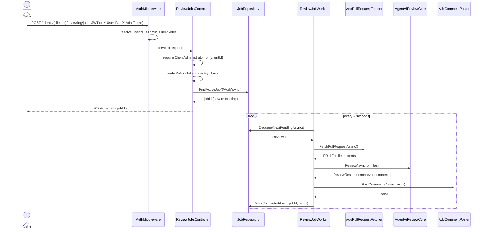
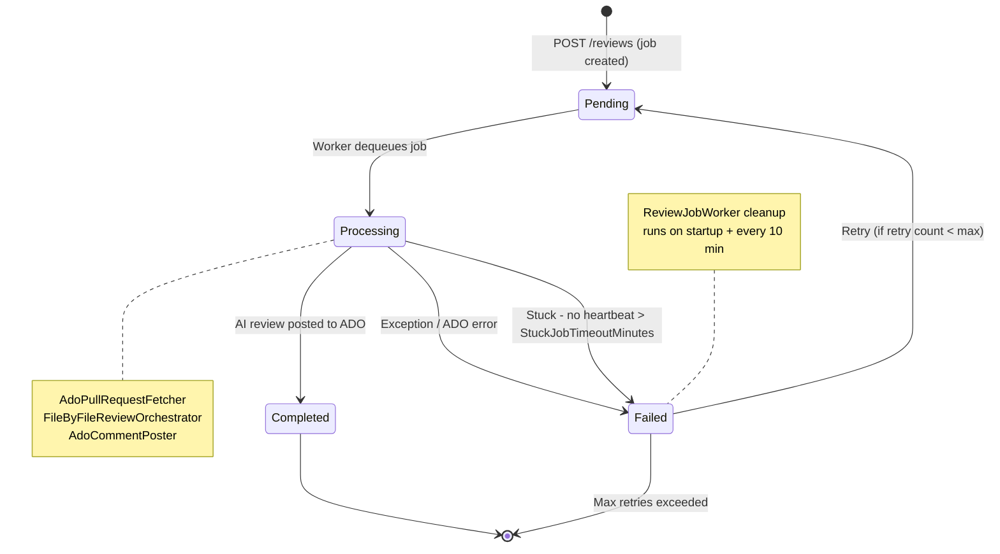

# Reviewing Workflows

This page covers the runtime path from review submission to posted Azure DevOps comments, plus the
dedup and token-control mechanics that keep the review loop safe and efficient.

## Review Submission And Execution

Review submission depends on the caller identity resolved in [security-and-access.md](security-and-access.md)
plus `X-Ado-Token` validation for Azure DevOps identity checks. The intake controller persists a
job, the worker claims it, the orchestrator fetches the PR state, runs the AI review, and posts
comment threads back to Azure DevOps.

## Incremental Dedup And Publication

1. `ReviewOrchestrationService.BuildReviewContextAsync(...)` carries forward completed per-file
   results from the previous reviewed iteration for unchanged files.
2. `FileByFileReviewOrchestrator.SynthesizeResultsAsync(...)` excludes `IsCarriedForward` file
   results from synthesis summaries, cross-file deduplication, and quality-filter input, while
   preserving `CarriedForwardFilePaths` and a carried-forward skip count on the final `ReviewResult`.
3. `ReviewOrchestrationService.PublishReviewResultAsync(...)` opens a dedicated
   `ReviewJobProtocol` pass labeled `posting`, calls `IAdoCommentPoster.PostAsync(...)`, persists
   the posted `ReviewResult`, and records aggregate duplicate-suppression diagnostics.
4. `AdoCommentPoster` evaluates each candidate finding against existing bot-authored PR threads
   using normalized file-path and anchor matching, resolved-thread reuse, exact normalized-text
   matching, pull-request-scoped thread memory similarity, and a deterministic text-similarity
   fallback when historical signals are degraded.
5. The posting protocol emits `dedup_summary` on every posting pass and `dedup_degraded_mode`
   only when historical duplicate protection had to fall back to reduced checks.

This keeps incremental reviews additive: unchanged findings remain visible in stored review history,
but only genuinely fresh findings are allowed to create new Azure DevOps threads.

## Job State Machine

The cleanup path runs at startup and on a periodic sweep so interrupted jobs can be recovered
without manual intervention.

## Token Optimization Pipeline

Several techniques work together to keep AI token consumption bounded per review.

### 1 - File Exclusion

Exclusion patterns are read from `.meister-propr/exclude` on the target branch. If the file is
absent, the built-in defaults apply (`**/Migrations/*.Designer.cs` and
`**/Migrations/*ModelSnapshot.cs`). An empty file disables all exclusions.

### 2 - Diff-Only Review Messages

The per-file review input contains only the unified diff for that file. Full file content is
omitted, and the AI is instructed to call the existing `get_file_content` tool if it needs more
context. This is the biggest token-saving measure for large files.

### 3 - System Prompt Pruning In Review Loops

`ToolAwareAiReviewCore` structures each file review as:

- Step 1: global system prompt (S1) + per-file context prompt (S2) + user message
- Step 2+: per-file context prompt (S2) only + accumulated conversation

S1 is a fixed prefix, so sending it once lets the model infrastructure cache it across parallel file
slots for the same pull request.

### 4 - Tool Result Excerpt Cap

When a review loop exceeds 3 steps, tool result text stored in the protocol is truncated to 1,000
characters and marked `[TRUNCATED]`. This prevents deep loops from accumulating unbounded raw file
content in conversation history.
