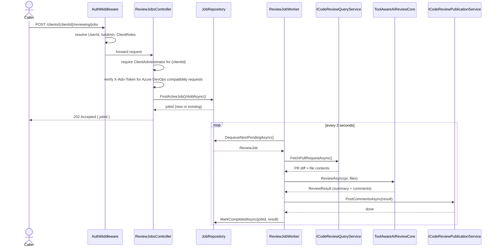
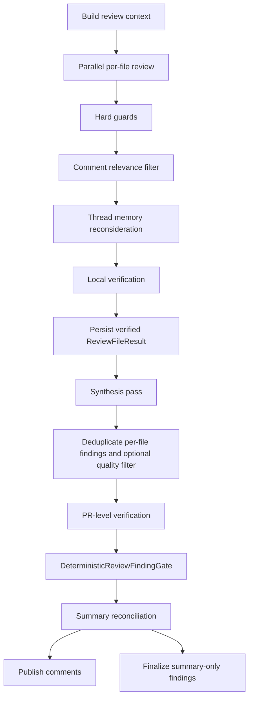
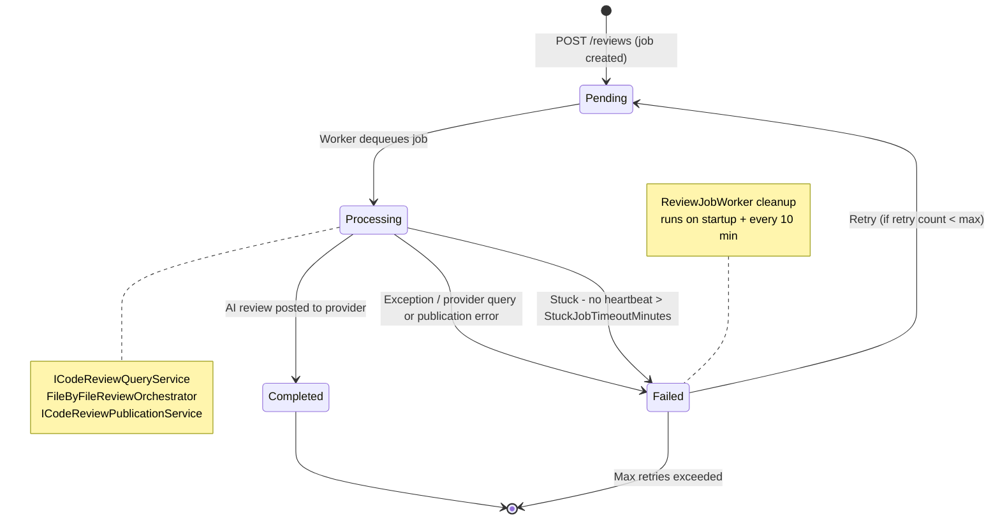
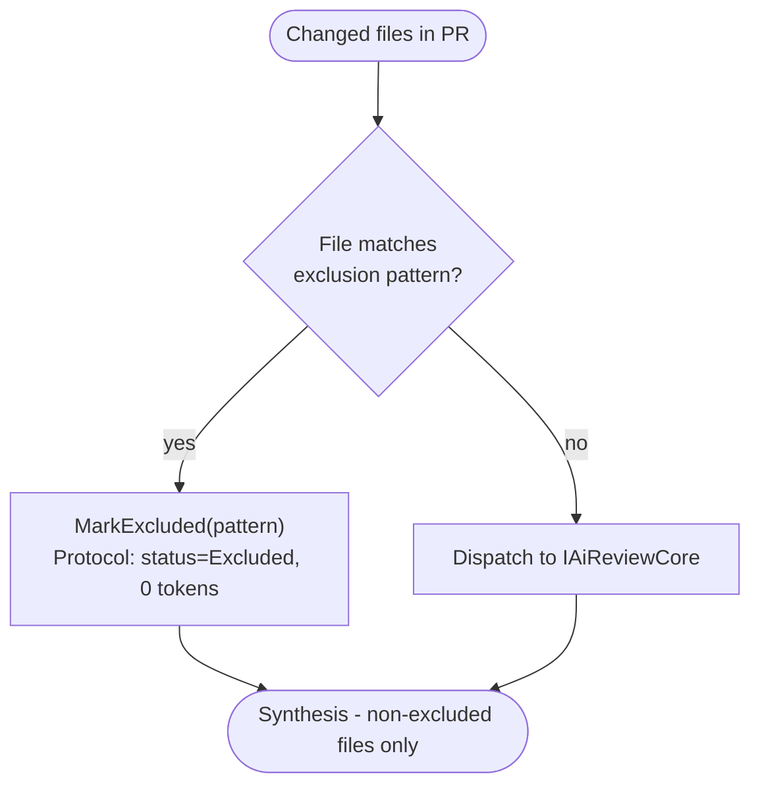

# Reviewing Workflows

This page covers the runtime path from provider-neutral review submission to posted provider-native
comments, plus the filtering, verification, synthesis, final-gate, dedup, and token-control
mechanics that keep the review loop safe and efficient.

## Review Submission And Execution

Review submission depends on the caller identity resolved in [security-and-access.md](security-and-access.md)
plus optional `X-Ado-Token` validation for Azure DevOps identity checks. The intake controller
accepts provider-neutral repository, review, and revision identities for Azure DevOps, GitHub,
GitLab, and Forgejo-family reviews. The worker claims the job, resolves the provider-specific query
and publication adapters through the shared provider registry, runs the AI review, and posts
comment threads back to the originating provider.

Provider operational readiness is evaluated separately from onboarding verification. A provider
connection can be verified and ready for onboarding while lacking workflow-complete proof, such as
a configured reviewer identity, enabled scope, or full host-variant support evidence. The admin
provider-operations view and the health surface consume these readiness states rather than relying
on `verificationStatus == verified` alone.

## Per-File Comment Relevance Filter

The Reviewing module includes a code-selected comment relevance filter stage between deterministic
hard guards and the downstream thread-memory, persistence, synthesis, and publication flow.
Startup selects `hybrid-v1` through `Program.GetSelectedCommentRelevanceFilterId()`.

1. `IAiReviewCore` produces the initial per-file `ReviewResult`, and deterministic hard guards
   normalize low-confidence or malformed comments before any filter runs.
2. When a named filter implementation is selected in code, `FileByFileReviewOrchestrator` builds a
   `CommentRelevanceFilterRequest` and runs either `pass-through-v1`, `heuristic-v1`, or
   `hybrid-v1` for that file. The configured path selects `hybrid-v1`.
3. Every implementation emits the same `RecordedFilterOutput` shape with implementation identity,
   counts, reason buckets, decision-source totals, discarded-comment details, degraded markers, and
   optional `aiTokenUsage`.
4. `hybrid-v1` reuses deterministic screening first, then asks `AiCommentRelevanceAmbiguityEvaluator`
   to adjudicate only ambiguous survivors on the client default review runtime carried in
   `ReviewSystemContext.DefaultReviewChatClient` and `DefaultReviewModelId`. Evaluator outages,
   parse failures, incomplete decision sets, and other failures fail open by keeping the affected
   comments and recording machine-readable `degradedComponents` plus `fallbackChecks`.
5. Only kept comments move into thread memory reconsideration, `ReviewFileResult` persistence,
   synthesis, and provider publication.

The filter uses the review protocol transport instead of introducing a separate storage path.
`comment_relevance_filter_output`, `comment_relevance_filter_degraded`,
`comment_relevance_evaluator_degraded`, `comment_relevance_filter_selection_fallback`, and
`ai_call_comment_relevance_evaluator` are stored on `ReviewJobProtocol` so the Job Protocol UI can
explain why a comment was discarded or retained.

## Synthesis And Final Finding Gate

1. `ReviewOrchestrationService.BuildReviewContextAsync(...)` creates `ReviewSystemContext` with
   repository instructions, exclusion rules, `IReviewContextTools`, and the client default review
   runtime (`DefaultReviewChatClient` and `DefaultReviewModelId`).
2. `ToolAwareAiReviewCore` reviews each file against diff-only prompts and can call
   `get_changed_files`, `get_file_tree`, `get_file_content`, `ask_procursor_knowledge`, and
   `get_procursor_symbol_info` while investigating a finding.
3. `FileByFileReviewOrchestrator` applies the confidence floor, speculative-language removal,
   `INFO` stripping, vague-suggestion removal, the selected comment relevance filter, and optional
   thread-memory reconsideration before extracting structured claims and running local verification.
   Deterministic contradiction checks still use curated invariant facts, while evidence-needing local
   generic claims are withheld conservatively until a bounded verifier can support them.
4. Only publishable verified local findings are persisted through `ReviewFileResult.MarkCompleted(...)`.
   Contradicted claims are dropped, local claims that remain `SummaryOnly` are withheld from the
   stored comment set, and the per-file summary is rewritten from the surviving verified findings so
   synthesis input does not repeat unsupported local assertions.
5. `SynthesizeResultsAsync(...)` excludes carried-forward rows, resolves the high-effort review
   runtime, and asks the model for both a PR narrative summary and structured synthesized
   cross-cutting findings.
6. Synthesized cross-cutting findings carry `EvidenceReference` metadata from the synthesis payload:
   `supportingFindingIds`, `supportingFiles`, `evidenceResolutionState`, and `evidenceSource`.
   These fields are retrieval hints only; fetched files or support metadata do not prove a claim.
7. Deduplicated per-file comments and synthesized findings are merged into `CandidateReviewFinding`
   instances. PR-level findings then route through targeted verification work items, evidence
   retrieval through `IReviewContextTools`, and bounded AI micro-verification for unresolved claims.
   Evidence collection records source attempts and ProCursor empty, unavailable, or successful result
   states in the evidence bundle.
8. `DeterministicReviewFindingGate` consumes invariant facts plus any attached `VerificationOutcome`
   and decides `Publish`, `SummaryOnly`, or `Drop` deterministically.
9. Summary reconciliation rewrites or preserves the synthesis summary so the final summary matches
   surviving `Publish` and `SummaryOnly` outcomes rather than repeating dropped claims.
10. The protocol records machine-readable verification and final-gate events, including
    `verification_claims_extracted`, `verification_local_decision`,
    `verification_evidence_collected`, `verification_pr_decision`, `verification_degraded`,
    `summary_reconciliation`, `review_finding_gate_summary`, and
    `review_finding_gate_decision`.

## Final Finding Gate Rules

- `cross_cutting` findings publish only when an explicit bounded `VerificationOutcome` recommends
   `Publish`; raw resolved multi-file evidence is treated as a hint and is demoted to `SummaryOnly`
   when no verified claim support exists.
- Findings with explicit contradiction-backed local verification outcomes are dropped by the gate.
- Evidence-needing local generic findings that do not gain bounded support are withheld before
  persistence, so they do not re-enter the publish path through synthesis or final gating.
- Findings with degraded or unresolved verification outcomes are treated conservatively by
   preferring `SummaryOnly` over `Publish`.
- Broad weak categories (`architecture`, `documentation`, `test`, `ui`, `configuration`, and
   `robustness`) are demoted to `SummaryOnly`.
- `non_actionable` findings and `consider ...` style comments are dropped.
- All remaining findings default to `Publish`.
- Curated invariant facts come from `DomainReviewInvariantFactProvider` and
  `PersistenceReviewInvariantFactProvider`.
- The gate is the last policy authority. Evidence collection and AI micro-verification execute
   upstream and surface their outcome through `VerificationOutcome` rather than bypassing the
   deterministic final decision path.

## Incremental Dedup And Publication

1. `ReviewOrchestrationService.BuildReviewContextAsync(...)` carries forward completed per-file
   results from the previous reviewed iteration for files with no new diff.
2. `FileByFileReviewOrchestrator.SynthesizeResultsAsync(...)` excludes `IsCarriedForward` file
   results from synthesis summaries, cross-file deduplication, and quality-filter input, while
   preserving `CarriedForwardFilePaths` and a carried-forward skip count on the final `ReviewResult`.
3. `ReviewOrchestrationService.PublishReviewResultAsync(...)` opens a dedicated
    `ReviewJobProtocol` pass labeled `posting`, reads the client-level
    `ScmCommentPostingEnabled` policy, conditionally calls the provider-specific
    `ICodeReviewPublicationService`, persists the final `ReviewResult`, and records aggregate
    duplicate-suppression diagnostics even when outbound SCM publication is skipped.
4. The publication service evaluates each candidate finding against existing bot-authored PR
    threads
   using normalized file-path and anchor matching, resolved-thread reuse, exact normalized-text
   matching, pull-request-scoped thread memory similarity, and a deterministic text-similarity
   fallback when historical signals are degraded.
5. The posting protocol emits `dedup_summary` on every posting pass and `dedup_degraded_mode`
   only when historical duplicate protection had to fall back to reduced checks.

This keeps incremental reviews additive: carried-forward findings remain visible in stored review
history, but only genuinely fresh findings are allowed to create new provider-native threads, and
clients with SCM publication disabled still retain internal review history plus posting-pass
diagnostics without creating new provider-native comments.

## Verification Responsibilities

| Concern | Runtime handling |
|---------|------------------|
| Candidate generation | Parallel per-file agentic review plus one synthesis pass |
| Local truth checks | Structured claim extraction plus deterministic contradiction verification before persistence |
| Cross-file evidence gathering | Review tools and ProCursor are reused through targeted verification work items |
| Publication decision | `DeterministicReviewFindingGate` decides `Publish`, `SummaryOnly`, or `Drop` |
| Summary behavior | Post-gate summary reconciliation keeps final text aligned with surviving findings |

The runtime uses targeted verification that attaches evidence collection to specific claims and
retrieved context instead of running one PR-wide verification session.

## Job State Machine

The cleanup path runs at startup and on a periodic sweep so interrupted jobs can be recovered
without manual intervention.

## Token Optimization Pipeline

Several techniques work together to keep AI token consumption bounded per review.

### 1 - File Exclusion

Exclusion patterns are read from `.meister-propr/exclude` on the target branch. If the file is
absent, the built-in defaults apply (`**/Migrations/*.Designer.cs` and
`**/Migrations/*ModelSnapshot.cs`). An empty file disables all exclusions.

### 2 - Diff-Only Review Messages

The per-file review input contains only the unified diff for that file. Full file content is
omitted, and the AI is instructed to call the existing `get_file_content` tool if it needs more
context. This is the biggest token-saving measure for large files.

### 3 - System Prompt Pruning In Review Loops

`ToolAwareAiReviewCore` structures each file review as:

- Step 1: global system prompt (S1) + per-file context prompt (S2) + user message
- Step 2+: per-file context prompt (S2) only + accumulated conversation

S1 is a fixed prefix, so sending it once lets the model infrastructure cache it across parallel file
slots for the same pull request.

### 4 - Full Protocol Text Capture

Protocol diagnostics persist the full captured AI prompt, AI response, and tool call text for each
event. Recorder sanitization still strips embedded null bytes so PostgreSQL can safely store the
content, but the persisted samples are no longer truncated before they reach the diagnostics API or
admin UI.
