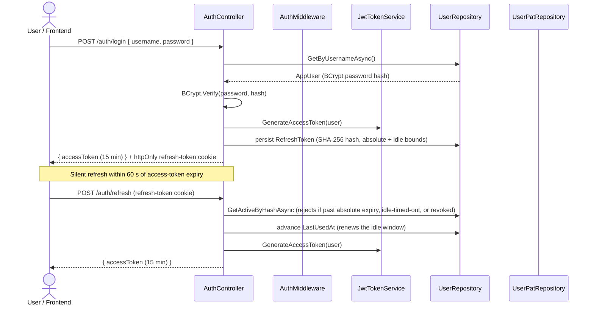
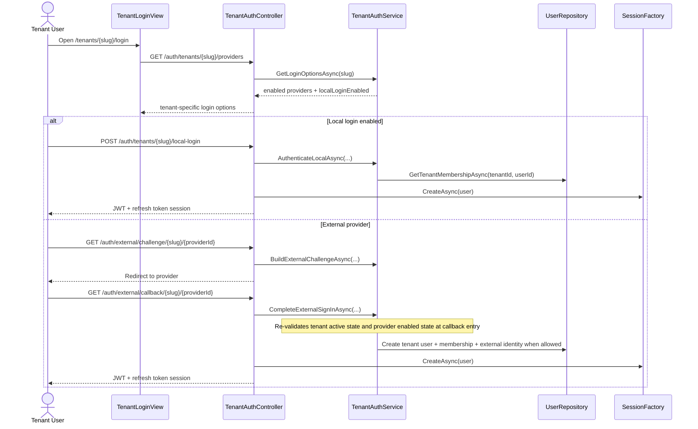
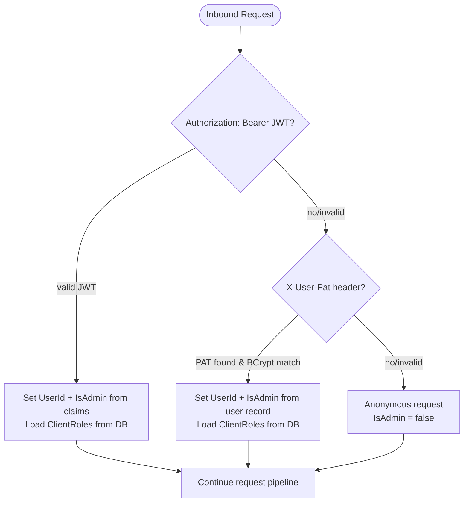

# Security And Access

This page describes how callers authenticate into the admin and review surfaces, how provider
secrets are protected at rest, and how provider and Azure credentials are resolved for downstream
SCM operations.

## Admin Authentication Flow

JWTs and PATs establish the caller identity used by admin endpoints and review-submission role
checks. `X-Ado-Token` is validated separately on review intake and status endpoints so the backend
can verify the caller against Azure DevOps without storing or logging the token.

### Session lifetime

A browser session is bound by two limits, and ends when either is crossed: an **idle timeout** (no
successful `/auth/refresh` within the window) and an **absolute lifetime** (measured from sign-in,
regardless of activity). Each successful refresh advances the token's last-used timestamp to renew
the idle window; the absolute expiry is fixed at issuance and never extended, so a continuously-active
session is still forced to re-authenticate once it elapses. Both bounds are operator-tunable via
`MEISTER_SESSION_IDLE_MINUTES` (default 480 — eight hours) and `MEISTER_SESSION_ABSOLUTE_HOURS`
(default 72 — three days); the httpOnly refresh-token cookie carries the absolute expiry.

## Tenant Authentication Flow

Tenant users authenticate through an explicit tenant context. The tenant slug selects the enabled provider list, allowed email domains, and local-login policy before any tenant-user sign-in path is shown.

First-time external sign-in never auto-links to an existing local account by email alone. A verified and allowed email can create a new `AppUser`, `TenantMembership`, and `ExternalIdentity`, but an existing unlinked account with the same email is rejected until an explicit linking flow exists.

## Protected Provider Secrets

Provider connection secrets, webhook secrets, and any client-owned Azure credential material are
stored through the shared `ISecretProtectionCodec` path backed by ASP.NET Core Data Protection.
Provider operational audit records and webhook delivery history store normalized status, failure
category, summary data, and readiness explanations without persisting raw secrets or authorization
headers. Reviewer-trigger identity is configuration-only state stored separately from connection
secrets; creating, updating, or clearing it does not rotate connection credentials or change the
authenticated identity used for provider publication.

## Request Auth Evaluation Order

`AuthMiddleware` resolves application identity in-process and loads both client roles and tenant roles eagerly so later controllers can enforce authorization without re-deriving user context.

Effective client roles combine explicit per-client assignments with tenant membership. A tenant administrator holds `ClientAdministrator` over every client in their tenant. A regular member of a tenant gains access to a client only through an explicit assignment managed by a tenant administrator — tenant membership alone does not grant client access. The internal System tenant is the exception: its members retain blanket access to System-tenant clients, preserving community/global scope.

Client-specific controller actions must validate the caller against the target client, not just any
client assignment. For those endpoints, use the requested `clientId` in the authorization check so a
user with access to one client cannot act on another client by reusing a broad client-admin role.
Broad client-role checks are only appropriate for collection-level flows that intentionally span
multiple clients.

Tenant-specific controller actions must likewise validate the caller against the requested tenant. Tenant administrators can manage only their own tenant's memberships, member client access, local-login policy, and external providers. Platform administrators remain separate from tenant-local policy and keep the recovery path at `/auth/login`, even if a tenant disables local login or misconfigures all tenant-user external providers.

## Downstream Credential Resolution

Provider-backed SCM calls resolve credentials from the saved provider connection for the target host
and provider family. Azure DevOps also supports Azure credential resolution for compatibility paths
that still require Azure identity material.

Azure DevOps provider connections use `oauthClientCredentials` and store the required tenant,
client, and secret material on the connection itself. Compatibility flows that still use Azure
identity can fall back to deployment-wide `DefaultAzureCredential` when no client-specific Azure
credential is present. GitHub, GitLab, and Forgejo-family calls use the connection-scoped secret
stored on the provider connection record instead of Azure identity resolution. For GitHub App-backed
connections, the stored secret is the private key PEM; installation access tokens are minted just in
time, reused only through a bounded in-memory cache, and never persisted back to the database.
Reviewer-trigger identity never substitutes for these authenticated connection paths.
