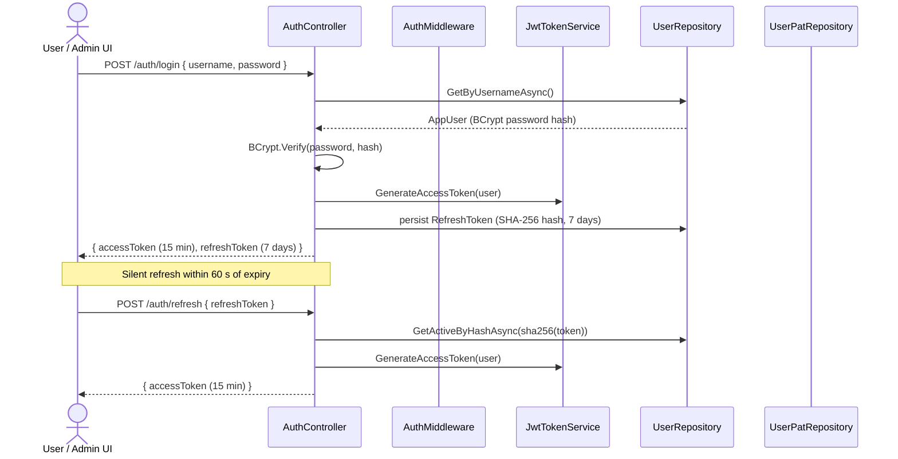
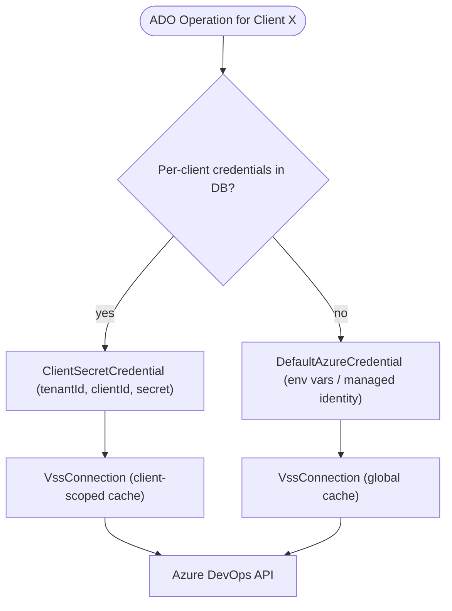

# Security And Access

This page describes how callers authenticate into the admin and review surfaces, how provider
secrets are protected at rest, and how the backend resolves Azure credentials for Azure DevOps
compatibility operations.

## Admin Authentication Flow

JWTs and PATs establish the caller identity used by admin endpoints and review-submission role
checks. `X-Ado-Token` is validated separately on review intake and status endpoints so the backend
can verify the caller against Azure DevOps without storing or logging the token.

## Protected Provider Secrets

Provider connection secrets, webhook secrets, and per-client Azure DevOps credentials are stored
through the shared `ISecretProtectionCodec` path backed by ASP.NET Core Data Protection. Provider
operational audit records and webhook delivery history store normalized status, failure category,
summary data, and readiness explanations without persisting raw secrets or authorization headers.

## Request Auth Evaluation Order

`AuthMiddleware` resolves application identity in-process and loads client roles eagerly so later
controllers can enforce authorization without re-deriving user context.

Client-specific controller actions must validate the caller against the target client, not just any
client assignment. For those endpoints, use the requested `clientId` in the authorization check so a
user with access to one client cannot act on another client by reusing a broad client-admin role.
Broad client-role checks are only appropriate for collection-level flows that intentionally span
multiple clients.

## Azure DevOps Credential Resolution

For Azure DevOps calls, the backend resolves the effective Azure credential per client. A client
may either use its own stored service principal or fall back to the shared
`DefaultAzureCredential` chain.

Per-client ADO credentials are stored in PostgreSQL and protected at rest. If a client has no
dedicated credential, the backend uses the deployment-wide Azure identity configured for the host.
GitHub, GitLab, and Forgejo-family calls use the connection-scoped secret stored on the provider
connection record instead of Azure identity resolution.
