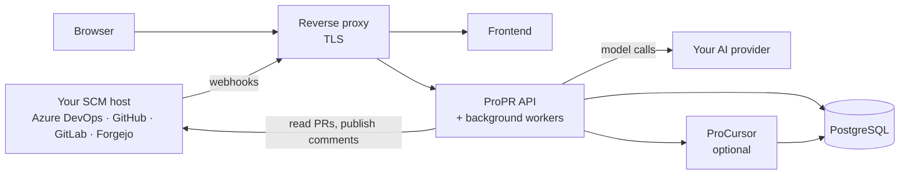

# How ProPR works

What a ProPR deployment is made of, how a review gets started, and what the optional code-knowledge
service adds. What happens inside one review, and why a finding you expected sometimes does not get
posted, is on [reviews](reviews.md).

## What you run

ProPR is self-hosted. A deployment is three ProPR images, a database, and something in front that
terminates TLS:

| Component | What it does | Required |
|---|---|---|
| ProPR API | The control plane: admin API, webhook intake, review job submission | yes |
| ProPR frontend | The management UI | yes |
| ProCursor | Code knowledge and symbol search used during review | optional |
| PostgreSQL | All durable state | yes |
| Reverse proxy | Terminates TLS and routes to the API and the frontend | yes, in the example stack |

The example compose stack uses nginx for the proxy, and bundles Loki and Grafana for log browsing -
conveniences nothing in ProPR depends on. What has to route where, and on which ports, is in
[deployment topology](../operate/deploy.md#deployment-topology).

Background workers run inside the API image: review execution, crawling for open pull requests,
scanning for @-mentions, replying to them, and purging retained pull request data once its retention
window elapses. They start with the API process, and ProPR ships no separate worker image or
deployment unit. How many reviews one instance runs at once, and how to size for it, is in
[review workers](../operate/deploy.md#review-workers).

What travels along the two outbound arrows, and what does not, is in
[where your code goes](../reference/security.md#where-your-code-goes). Keep the three ProPR image tags
aligned; see [running published images](../operate/deploy.md#running-published-images).

## How a review gets triggered

Four ways, and they produce the same review:

1. **Webhook** - your SCM host notifies ProPR when a pull request opens or updates. See [webhooks](../platforms/webhooks.md).
2. **Crawl** - ProPR polls for open pull requests on a schedule you configure. Crawling requires a commercial license; see [editions and licensed features](../reference/editions.md).
3. **On demand** - a call to the review API naming the pull request and the commits to review, from CI. See [trigger a review](../reference/api.md#trigger-a-review).
4. **From coordinates** - a call naming only the client, repository and pull request, for callers such as a browser extension that know which pull request they mean but not which commits it is at. ProPR reads the current commits from your SCM host, so the same call starts a first review or a re-review after a push. The coordinates must be covered by a crawl or webhook configuration. See [trigger a review from coordinates alone](../reference/api.md#trigger-a-review-from-coordinates-alone).

Webhook and crawl are the automatic triggers, and they review a pull request once, at the first
revision they see. A later push does not start another review, and a review already running is left
to finish on the revision it started on rather than being cancelled by the push. The per-client
**Review every pushed update** setting changes that: with it on, every pushed update starts a new
review and cancels any review still running for an older revision. It is off by default and lives on
the client's System tab.

The files may not be reviewed on every push, but the conversation is checked on every one. ProPR's own
comment threads are walked by a separate pass that runs whenever the pull request gains a revision or
one of those threads gains a comment from someone else, whether or not a review ran. So a finding you
fixed and pushed is resolved, and a reply you left is answered, without a review of the files. The pass
is gated only by the client's **Resolving comment threads** setting, on its System tab, and by what your
SCM host supports.
Azure DevOps, GitHub and GitLab all support changing a thread's status and replying into a thread, so
the pass runs in full on those three. Forgejo supports neither: its API exposes no thread to address,
so the pass does not run there and findings stay open until you close them yourself. Mentioning the
reviewer identity in a comment is answered on every host; see
[asking ProPR a question](#asking-propr-a-question).

That setting decides whether ProPR explains itself when it closes one of its own threads, not whether it
talks to you. **Resolve quietly**, the default, closes a fixed finding without a word; **Resolve with an
explanation** posts why first. Either way, a question you ask in one of its threads is answered, because
you asked it. **Leave threads alone** switches the pass off entirely, so nothing is resolved and nothing
is answered.

A comment is anchored to the location where a problem was observed, which is often not the location that
has to change. A finding raised on an interface declaration, stating that the implementation does not
check its arguments, is resolved by a change to the service, in a different file. The pass loads the diff
of the file the thread is anchored to, along with the names of the other files the pull request changed,
and the evaluation may request one of those files when the fix is plausibly there. It requests once, and
only for files this pull request changed. How much it can retrieve is bounded by the context window of
the model you configured, so a thread resolves on the evidence that settles it without the pass reading
the whole pull request.

An on-demand review is not held back by that setting. It reviews the revision the pull request is on
when you ask, which is how you get a fresh review of a branch that has moved.

You do not have to notice that yourself. When an automatic trigger leaves a pushed update unreviewed,
ProPR records it, and the pull request then reports itself as waiting. Its review page says so and
offers **Review current state**; the browser extension enables **Review now** on the same signal. Both
need only the client-user role, matching restart, which also spends money and is deliberately not
administrator-gated. Asking for the review clears the state, because the review writes its own record of
the revision it covered.

Asking twice for the same revision does not start a second review; the job already running is returned
instead. The one case that does replace a running review is a pushed update on a client that reviews
every one, described above: the older revision's review is cancelled because it is reviewing code that
has been superseded.

## Asking ProPR a question

Mention the client's configured reviewer identity in a pull request comment - `@<guid>` on Azure
DevOps, `@login` on GitHub, GitLab and Forgejo - and ProPR answers in that same thread, using the
pull request as context. It is a question-and-answer path, not a re-review: no new findings are
posted and no comments are resolved.

Answering mentions is configured in its own right, on the client's **Mentions** tab. A mention
configuration names one project and the repositories within it this client answers on. Organization,
project and repositories are picked from what the client's credentials can already reach, and each
repository is stored by the provider's own id so a rename does not stop answers. The conversations in a
repository nobody claimed are never read, and a client with no mention configuration answers nothing. The
scan does list the open pull requests of the whole project before narrowing to the claimed repositories,
so it sees that unclaimed ones exist; it never opens their comments. Claiming a repository takes effect
from that moment: questions asked before it are not answered.

Two clients may claim the same repository, and neither is told about the other. What decides who answers is
the identity the comment addresses. If the two clients resolve different reviewer identities, only the one
actually mentioned replies; mention both identities in a single comment and both reply, each billed to its
own client. If they share one identity, the first to reach the comment answers it and is billed for it, and
the other stays quiet, so a question addressed to one identity gets exactly one answer.

Mentions are found by a periodic scan, not by webhook, so a reply is not instant. How often the scan runs
is set by `MENTION_CRAWL_INTERVAL_SECONDS` - see
[background intervals](../operate/configuration.md#background-intervals) - and each configuration can ask
to be visited less often than that. A configuration whose client has no resolvable reviewer identity is
skipped, so answering mentions needs both a reviewer identity and a mention configuration.

## ProCursor

ProCursor is the optional code-knowledge service. It indexes the repositories and wikis you point it
at, and the review loop queries it for symbol definitions, references, and related documentation when
it needs context the diff does not contain.

You can run without it - reviews then see the diff and the files in the pull request, but cannot look
up how a changed function is used elsewhere. Enable it when your reviews need repository-wide
context. For how it is deployed, and how to leave it out, see
[running without ProCursor](../operate/deploy.md#running-without-procursor).

### Configuring a source

A source is one repository or one Azure DevOps wiki, added per client. Per source you set:

| Option | What it decides |
|---|---|
| Source kind | Repository, or Azure DevOps wiki |
| Root path | Index only a subtree, for example `/docs`. Optional |
| Symbol mode | `Auto` extracts symbols for code-aware lookup; `Text only` indexes text and skips symbol extraction, which suits documentation-heavy sources |
| Tracked branch | Which branch is indexed. A source can track more than one |
| Refresh trigger | `On branch update` re-indexes when the branch moves; `Manual only` re-indexes when you ask |
| Mini-index overlay | Whether to build the smaller review-time overlay for a tracked branch |

### What it costs

Indexing and querying spend embedding tokens on the logical model mapped to the client's Embedding
default purpose - see [AI purposes](../ai/purposes.md#ai-purposes). That usage is reported per client, separately
from review token usage, so you can see what indexing costs before you widen it.
