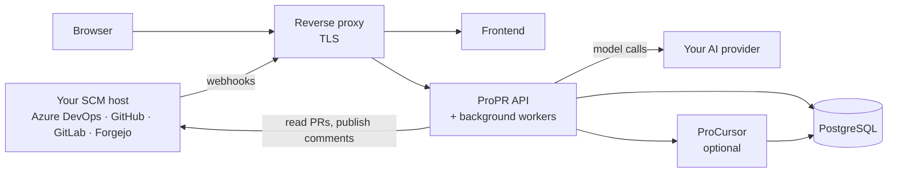

# How ProPR works

What a ProPR deployment is made of, how a review gets started, and what the optional code-knowledge
service adds. What happens inside one review, and why a finding you expected sometimes does not get
posted, is on [reviews](reviews.md).

## What you run

ProPR is self-hosted. A deployment is three ProPR images, a database, and something in front that
terminates TLS:

| Component | What it does | Required |
|---|---|---|
| ProPR API | The control plane: admin API, webhook intake, review job submission | yes |
| ProPR frontend | The management UI | yes |
| ProCursor | Code knowledge and symbol search used during review | optional |
| PostgreSQL | All durable state | yes |
| Reverse proxy | Terminates TLS and routes to the API and the frontend | yes, in the example stack |

The example compose stack uses nginx for the proxy, and bundles Loki and Grafana for log browsing -
conveniences nothing in ProPR depends on. What has to route where, and on which ports, is in
[deployment topology](../operate/deploy.md#deployment-topology).

Background workers run inside the API image: review execution, crawling for open pull requests,
scanning for @-mentions, replying to them, and purging retained pull request data once its retention
window elapses. They start with the API process, and ProPR ships no separate worker image or
deployment unit. How many reviews one instance runs at once, and how to size for it, is in
[review workers](../operate/deploy.md#review-workers).

What travels along the two outbound arrows, and what does not, is in
[where your code goes](../reference/security.md#where-your-code-goes). Keep the three ProPR image tags
aligned; see [running published images](../operate/deploy.md#running-published-images).

## How a review gets triggered

Three ways, and they produce the same review:

1. **Webhook** - your SCM host notifies ProPR when a pull request opens or updates. See [webhooks](../platforms/webhooks.md).
2. **Crawl** - ProPR polls for open pull requests on a schedule you configure. Crawling requires a commercial license; see [editions and licensed features](../reference/editions.md).
3. **On demand** - a call to the review API, from CI or an extension. See [trigger a review](../reference/api.md#trigger-a-review).

A pull request that already has a review running will not start a second one; the existing job is
returned instead.

## Asking ProPR a question

Mention the client's configured reviewer identity in a pull request comment - `@<guid>` on Azure
DevOps, `@login` on GitHub, GitLab and Forgejo - and ProPR answers in that same thread, using the
pull request as context. It is a question-and-answer path, not a re-review: no new findings are
posted and no comments are resolved.

Mentions are found by a periodic scan, not by webhook, so a reply is not instant. The scan interval
is set by `MENTION_CRAWL_INTERVAL_SECONDS` - see
[background intervals](../operate/configuration.md#background-intervals). The scan walks your crawl configurations and skips
any that has no resolvable reviewer identity, so answering mentions needs both a reviewer identity
and at least one crawl configuration - and crawl configurations are a licensed capability.

## ProCursor

ProCursor is the optional code-knowledge service. It indexes the repositories and wikis you point it
at, and the review loop queries it for symbol definitions, references, and related documentation when
it needs context the diff does not contain.

You can run without it - reviews then see the diff and the files in the pull request, but cannot look
up how a changed function is used elsewhere. Enable it when your reviews need repository-wide
context. For how it is deployed, and how to leave it out, see
[running without ProCursor](../operate/deploy.md#running-without-procursor).

### Configuring a source

A source is one repository or one Azure DevOps wiki, added per client. Per source you set:

| Option | What it decides |
|---|---|
| Source kind | Repository, or Azure DevOps wiki |
| Root path | Index only a subtree, for example `/docs`. Optional |
| Symbol mode | `Auto` extracts symbols for code-aware lookup; `Text only` indexes text and skips symbol extraction, which suits documentation-heavy sources |
| Tracked branch | Which branch is indexed. A source can track more than one |
| Refresh trigger | `On branch update` re-indexes when the branch moves; `Manual only` re-indexes when you ask |
| Mini-index overlay | Whether to build the smaller review-time overlay for a tracked branch |

### What it costs

Indexing and querying spend embedding tokens on the logical model mapped to the client's Embedding
default purpose - see [AI purposes](../ai/purposes.md#ai-purposes). That usage is reported per client, separately
from review token usage, so you can see what indexing costs before you widen it.
