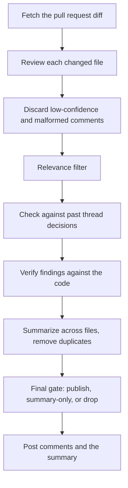

# Reviews

What happens between a pull request arriving and comments appearing on it, why a finding you expected
sometimes does not get posted, and every setting that changes what a review publishes. What a
deployment is made of and how a review gets started is on [how ProPR works](how-it-works.md); the two
settings that live in the repository instead of in ProPR are on
[configuring ProPR from your repository](repository-configuration.md).

## What happens during a review

**Per file.** Files are reviewed one at a time, in parallel, each in its own conversation with the
model. Files matched by the repository's [exclusion patterns](repository-configuration.md) are skipped,
as are files whose estimated input would not fit the model's context budget - both are recorded in the
job protocol.

**Relevance filtering.** Comments the model produced are screened before they reach your pull request.
Deterministic checks run first; anything genuinely ambiguous is adjudicated by a second model call. If
that call fails, the filter keeps the comment rather than silently dropping it, and records that it ran
degraded.

**Thread memory.** ProPR remembers how a comment thread on this pull request was resolved previously,
so a point you already rejected does not come back on the next push.

**Verification.** Findings are checked against the actual code before publication - locally per file,
and then across the whole pull request for anything that spans files.

**Incremental reviews.** On a re-review, files with no new changes carry their previous results forward
instead of being re-reviewed and re-billed.

## Why a finding did not get posted

The last step before publication is a deterministic gate. Every finding ends as **published**,
**summary-only** (mentioned in the summary but not posted inline), or **dropped**. The rules:

| Outcome | Applies to |
|---|---|
| Dropped | Findings the verification step actively contradicted |
| Dropped | Non-actionable findings, and "consider …"-style suggestions |
| Dropped | Repeated-pass findings where the passes disagreed and nothing supported the claim |
| Summary-only | Cross-file findings without verified supporting evidence |
| Summary-only | Broad categories: architecture, documentation, test, UI, configuration, robustness |
| Summary-only | Anything whose verification was degraded or inconclusive - the gate prefers caution |
| Published | Everything else |

Two further per-client filters sit after the gate: a **minimum severity to post**, and whether outbound
SCM commenting is enabled at all - both in [what you can tune](#what-you-can-tune).

Every one of these decisions is recorded in the review's own protocol, which is where a "why did it say
that" question is answered - see
[what to look at when a review misbehaves](../operate/observability.md#what-to-look-at-when-a-review-misbehaves).

If your symptom is not in this section, start from [troubleshooting](../operate/troubleshooting.md).

## What you can tune

Everything below is set in the management UI. Unless noted, the scope is one client.

| Setting | Where | Effect |
|---|---|---|
| Logical model per purpose | Tenant or client | Which model does review generation, triage, verification and embeddings - see [purposes, effort and protocol](../ai/purposes.md) |
| Reasoning effort | Per logical model | How hard the model thinks wherever that logical model is used - see [reasoning effort](../ai/purposes.md#reasoning-effort) |
| Baseline reasoning effort | Per client | Reasoning effort for the baseline review pass. `None` by default, which sends no reasoning effort at all and leaves cost unchanged |
| Review aggressiveness | Per client | `Calm`, `Balanced` or `Assertive`. Calm posts only what survives the strictest screening; Balanced adds design-level observations; Assertive keeps those and lets less certain findings through |
| Review temperature | Crawl and webhook configurations | More deterministic or more creative than the model default, `0.0`–`2.0` |
| Multi-pass union | Per client | Review higher-complexity files across several independent passes and union the findings before deduplication. Costs more per file |
| Review pass list | Per client | Which extra passes run, on which model, and with which lens - see [Review passes](#review-passes) |
| Evidence-backed verification | Per client | Lets the reviewer read the anchor code to confirm findings the deterministic verifier would otherwise withhold - fewer correct findings lost to caution, at the cost of extra model calls |
| Language-robust comment screening | Per client | Screens hedged or vague comments by meaning using multilingual embeddings instead of English phrase lists, folding low-confidence ones into the summary. Off by default |
| Linked work items and issues | Per client | Pulls the work items or issues linked to the pull request into the review context, so the change is judged against its intended direction. On by default |
| Exclusion rules | Per repository | Glob patterns read from the repository - see [configuring ProPR from your repository](repository-configuration.md) |
| Minimum severity to post | Per client | Findings below it stay out of the pull request but remain visible in the ProPR review. Order, high to low: error, warning, suggestion, info |
| Auto-resolve severities | Per client | Comments of the chosen severities are posted and then immediately resolved with a note. Azure DevOps only; on other providers the setting is a no-op |
| SCM comment posting | Per client | Run reviews without publishing anything |
| Budget caps | Per client | Monthly, per-pull-request and per-increment soft and hard USD caps |

**Budget caps in detail.** A job is held at admission when a hard cap has already been reached, or when
the monthly or per-pull-request soft cap has. A held job does not resume by itself - an operator
restarts it once budget is free. The per-increment soft cap is not an admission gate: it stops a
running job from scanning further files and concludes it with a summary. A hard cap cuts further model
calls in all three scopes. The tenant Budget and Spend views are read-only roll-ups over the tenant's
clients - they report and forecast, they never enforce. Budgeting requires a commercial license; see
[editions and licensed features](../reference/editions.md).

### Review passes

Pass 1 is the review each changed file already gets, on the model for its complexity tier. The review
pass list adds independent passes on top of it, and it is the most cost-sensitive setting on this page:
each pass is another set of model calls on every file it runs on. Up to four entries; more are refused.

Per entry you choose:

| Field | What it decides |
|---|---|
| Model | A [logical model](models.md) by name, which brings its own reasoning effort, or a connection and model chosen directly, with a reasoning effort set on the pass |
| Lens | `None`, `Security` or `ProRV` - which prompt the pass runs, and which files it applies to |
| Scope | `Per-file`, or `PR-wide` for one pass over the whole change set |
| Shadow | Whether the pass runs without publishing anything |

The lens decides both the prompt and the files:

- **None** - a plain resample of the ordinary review prompt. Runs only on files triage placed in the
  Medium or High complexity tier.
- **Security** - a security-specialist prompt, on files a security screen flagged by path, by content
  marker, or because triage escalated them. Complexity tier does not matter.
- **ProRV** - the knowledge lens. It screens the file against a catalog embedded in the product -
  per-language checks derived from CodeQL, plus GitHub Actions attack classes - and hands the reviewer
  the checks that actually apply as focused guidance. A file the catalog matches nothing for is skipped
  for that pass. Any complexity tier.

Scope decides where the pass runs. A per-file pass runs alongside the baseline on each file it is in
scope for, and its findings are unioned with the baseline before deduplication; per-file passes only
fan out when **Multi-pass union** is on for the client. A PR-wide pass instead runs once over the whole
change set before the cross-file summary, and runs whether or not multi-pass union is on.

A shadow pass runs in full and its findings are recorded in the job protocol, but they are dropped
before deduplication and the publication gate, so nothing it produces reaches your pull request and it
can never suppress a finding a real pass made. It is how you try a model or a lens on live pull
requests without changing what your team sees - at full token cost.

## Customising the review prompt

The prompts ProPR sends are replaceable per client, under the client's **Prompt Overrides** tab. An
override is a full replacement for one named segment, not an addition to it - whatever you enter is
what the model sees in place of the built-in text.

| Prompt key | Replaces the instructions for |
|---|---|
| `SystemPrompt` | The reviewer's standing brief: what it is looking for and how it must report it |
| `AgenticLoopGuidance` | How the reviewer uses its context-gathering tools before it decides |
| `PerFileContextPrompt` | How one changed file and its surrounding context are framed |
| `QualityFilterSystemPrompt` | The screening call that judges whether a produced comment is worth posting |
| `SynthesisSystemPrompt` | The cross-file pass that summarises findings and removes duplicates |

One override per client per key. Saving a second for the same key is refused. Delete an override to
return that segment to the built-in text.

Two consequences worth knowing before you use these:

- Overriding `SystemPrompt` replaces the whole assembled brief, so the repository instruction files, the
  dismissed-finding patterns and the client's own system message are no longer injected into it. If you
  rely on any of those, restate them in the override.
- Every key except `SynthesisSystemPrompt` is a stage where the client's review-aggressiveness posture is
  expressed. An override is fixed text, so aggressiveness stops affecting the stage you overrode.

This is the heavy instrument, and a poor override degrades every review the client runs. For team
conventions - "we do not use exceptions for control flow", "be strict about migrations" - prefer
[repository instruction files](repository-configuration.md): they live with the code, are versioned with
it, and only apply where they are relevant.
