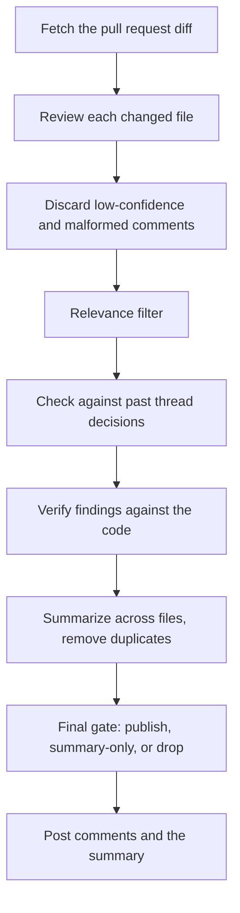

# Reviews

This page covers what happens inside one review, and every setting that changes what it publishes. What a
deployment is made of and how a review gets started is on [how ProPR works](how-it-works.md). The two settings that
live in the repository, not in ProPR, are on
[configuring ProPR from your repository](repository-configuration.md).

## What happens during a review

**Per file.** ProPR reviews each changed file separately, in parallel, each in its own conversation with
the model. It skips files matched by the repository's [exclusion patterns](repository-configuration.md),
and files whose estimated input would not fit the model's context budget. Both skips are recorded in the
job protocol.

**Relevance filtering.** ProPR screens the model's comments before they reach your pull request.
Deterministic checks run first, and a second model call decides the ambiguous ones. If that call fails,
the filter keeps the comment and records that it ran degraded.

**Thread memory.** ProPR remembers how a comment thread on this pull request was resolved, so a point you
already rejected does not come back on a later review. Each memory records the resolution: you rejected
the concern and kept the code, or you marked it fixed. A rejection carries more weight than a fix when the
same point comes up again, and a rejection the discussion never stated plainly carries less. Memories
recorded before ProPR tracked resolutions, and memories an administrator created by dismissing a pattern,
carry no resolution at all.

**Verification.** ProPR checks findings against the code before publication, once per file and again
across the whole pull request for anything that spans files.

**Incremental reviews.** On a re-review, files with no new changes carry their previous results forward
instead of being re-reviewed and re-billed.

## Why a finding did not get posted

A deterministic gate runs last, before publication. Every finding ends as **published**, **summary-only**
(mentioned in the summary but not posted inline), or **dropped**.

| Outcome | Applies to |
|---|---|
| Dropped | Findings the verification step contradicted |
| Dropped | Non-actionable findings, and "consider …"-style suggestions |
| Dropped | Repeated-pass findings where the passes disagreed and nothing supported the claim |
| Summary-only | Cross-file findings without verified supporting evidence |
| Summary-only | Broad categories: architecture, documentation, test, UI, configuration, robustness |
| Summary-only | Anything whose verification was degraded or inconclusive |
| Published | Everything else |

Three per-client filters run after the gate, all of them in [what you can tune](#what-you-can-tune): the
**minimum severity to post**, whether findings outside the changed lines are posted, and whether outbound
SCM commenting is enabled at all. A finding the first two hold back stays in the ProPR review, and the
published summary reports how many were held back and why. The summary links to the review once
`MEISTER_PUBLIC_BASE_URL` gives the installation its address - see
[public URL and browser origins](../operate/configuration.md#public-url-and-browser-origins).

A dropped finding also has to leave the summary. ProPR writes the summary before the gate runs, so the
summary can describe a finding the gate then rules out. Where that happens, ProPR replaces the narrative
with a short note saying how many candidates were dropped.

The review's protocol records every one of these decisions - see
[what to look at when a review misbehaves](../operate/observability.md#what-to-look-at-when-a-review-misbehaves).

If your symptom is not in this section, start from [troubleshooting](../operate/troubleshooting.md).

## What you can tune

Everything below is set in the management UI. Unless noted, the scope is one client.

| Setting | Where | Effect |
|---|---|---|
| Logical model per purpose | Tenant or client | Which model does review generation, triage, verification and embeddings - see [purposes, effort and protocol](../ai/purposes.md) |
| Reasoning effort | Per logical model | How hard the model thinks wherever that logical model is used - see [reasoning effort](../ai/purposes.md#reasoning-effort) |
| Baseline reasoning effort | Per client | Reasoning effort for the baseline review pass. `None` by default, which sends no reasoning effort at all and leaves cost unchanged |
| Review aggressiveness | Per client | `Calm`, `Balanced` or `Assertive`. Calm posts only what survives the strictest screening; Balanced adds design-level observations; Assertive keeps those and lets less certain findings through |
| Review temperature | Crawl and webhook configurations | More deterministic or more creative than the model default, `0.0`–`2.0` |
| Multi-pass union | Per client | Review higher-complexity files across several independent passes and union the findings before deduplication. Costs more per file |
| Review pass list | Per client | Which extra passes run, on which model, and with which lens - see [Review passes](#review-passes) |
| Evidence-backed verification | Per client | Lets the reviewer read the anchor code to confirm findings the deterministic verifier would otherwise withhold - fewer correct findings lost to caution, at the cost of extra model calls |
| Language-robust comment screening | Per client | Screens hedged or vague comments by meaning using multilingual embeddings instead of English phrase lists, folding low-confidence ones into the summary. Off by default |
| Output language | Per client | The language the review writes in - see [Output language](#output-language) |
| Linked work items and issues | Per client | Pulls the work items or issues linked to the pull request into the review context, so the change is judged against its intended direction. On by default |
| Exclusion rules | Per repository | Glob patterns read from the repository - see [configuring ProPR from your repository](repository-configuration.md) |
| Minimum severity to post | Per client | Findings below it stay out of the pull request but remain visible in the ProPR review, and the published summary reports how many were held back. Order, high to low: error, warning, suggestion, info |
| Auto-resolve severities | Per client | Comments of the chosen severities are posted and then immediately resolved with a note. Azure DevOps, GitHub and GitLab; on Forgejo the setting is a no-op |
| Do not post findings outside the changed lines | Per client | Keeps findings in pre-existing code away from the diff out of the pull request. They stay visible in the ProPR review. Off by default - see [findings outside your changes](#findings-outside-your-changes) |
| Resolving comment threads | Per client | What ProPR does with its own threads once a finding is acted on: resolve quietly (default), resolve with an explanation, or leave them alone. On the first two a question you ask is answered; leaving them alone switches the pass off, so nothing is answered - see [how a review gets triggered](how-it-works.md#how-a-review-gets-triggered) |
| SCM comment posting | Per client | Run reviews without publishing anything |
| Review every pushed update | Per client | Whether pushes after the first one start another automatic review. Off by default - see [how a review gets triggered](how-it-works.md#how-a-review-gets-triggered) |
| Budget caps | Per client | Monthly, per-pull-request and per-increment soft and hard USD caps |

**Budget caps in detail.** ProPR holds a job at admission when a hard cap has already been reached, or
when the monthly or per-pull-request soft cap has. A held job does not resume by itself: an operator
restarts it once budget is free. The per-increment soft cap does not hold a job at admission. It stops a
running job from scanning further files and concludes it with a summary. A hard cap cuts further model
calls in all three scopes. The tenant Budget and Spend views roll up the tenant's clients for reporting
and forecasting, and enforce no cap. Setting caps and the Budget and Spend views require a commercial
license. Caps already set are enforced in every edition - see
[editions and licensed features](../reference/editions.md).

Every scope totals all three units of work over a pull request: the file review, the thread pass that
answers the conversation, and the answer to an `@propr` mention. A thread pass is held, cut and restarted
on the same terms as a review. What it spent per thread is in its own trace, reachable from the pull
request's review view.

A mention answer is metered the same way, and only a hard cap stops it. A soft cap lets the answer through
and records that it was written past the threshold. A hard cap makes ProPR post a short reply saying the
budget for the period is used up, without calling the model. A stopped answer is not held for a restart.
The job ends there; ask again once an administrator raises the cap. An answer whose increment cannot be
determined counts toward the client and pull-request totals, and toward no per-increment cap.

### Output language

The **Output language** setting on the client's System tab is the language ProPR writes its review prose
in. It is a language tag such as `en`, `de` or `pt-BR`, and it defaults to `en`.

The setting reaches every place the model writes for a reader: the finding messages posted as threads,
the pull-request summary, the replies ProPR leaves when it closes or continues a thread, the answers to
`@propr` mentions, and the thread-memory summaries a later review reads back. All of them use the
configured language, so one review does not arrive part German and part English.

ProPR never guesses the language from the pull request. A change whose title, comments and code are in
different languages would otherwise produce a different result on every call.

The fixed text ProPR adds around the model's prose stays English whatever you configure: the severity
label on each comment (`ERROR:`, `WARNING:`, `SUGGESTION:`, `INFO:`), the `**AI Review Summary**` heading,
and the notes about verification, carried-forward files and budget caps. ProPR matches the severity prefix
and the summary heading as data on pull requests it has already commented on. A re-review uses the prefix
to recognise its own comment and avoid posting it twice, and the heading to keep ProPR's own summary out
of its recall measurements. Translating either would break those checks on every pull request that already
exists.

### Findings outside your changes

A review reads whole files, not the diff alone, so it can find something real in code the pull request
never touched. ProPR classifies those findings by comparing the line against the pull request's changed
ranges, without asking the model, and labels a finding far from every changed range as pre-existing code.
Context lines within a few lines of an edit count as part of the change.

By default ProPR posts such a finding with that label. To keep your pull requests to the change itself,
turn on **do not post findings outside the changed lines**. The findings then stay in the ProPR review,
where the job protocol lists them with the same label, and the pull request summary reports the count.

A finding ProPR cannot place against a changed range carries no label and is posted. That covers a finding
with no line number, and a finding in a file this pull request does not change at all.

A label survives later reshaping. ProPR consolidates one concern found in several files into a single
pull-request-level comment, and on a provider that only anchors comments on inserted lines it rewrites the
rest the same way. Neither carries a line number afterwards, and both keep their label, so the setting
holds them back like any other finding. A consolidated comment keeps a label only when every finding in it
agrees; a mixed group carries none and is posted.

### Review passes

Pass 1 is the review each changed file already gets, on the model for its complexity tier. The review
pass list adds independent passes on top of it. Each pass is another set of model calls on every file it
runs on, so the list is the most cost-sensitive setting on this page. Up to four entries; more are
refused.

Per entry you choose:

| Field | What it decides |
|---|---|
| Model | A [logical model](models.md) by name, which brings its own reasoning effort, or a connection and model chosen directly, with a reasoning effort set on the pass |
| Lens | `None`, `Security` or `ProRV` - which prompt the pass runs, and which files it applies to |
| Scope | `Per-file`, or `PR-wide` for one pass over the whole change set |
| Shadow | Whether the pass runs without publishing anything |

The lens decides both the prompt and the files:

- **None** - a plain resample of the ordinary review prompt. Runs only on files triage placed in the
  Medium or High complexity tier.
- **Security** - a security-specialist prompt, on files a security screen flagged by path, by content
  marker, or because triage escalated them. Complexity tier does not matter.
- **ProRV** - the knowledge lens. It screens the file against a catalog embedded in the product,
  per-language checks derived from CodeQL plus GitHub Actions attack classes, and hands the reviewer the
  checks that apply as focused guidance. A file the catalog matches nothing for is skipped for that pass.
  Any complexity tier.

Scope decides where the pass runs. A per-file pass runs alongside the baseline on each file it is in
scope for, and its findings are unioned with the baseline before deduplication; per-file passes only
fan out when **Multi-pass union** is on for the client. A PR-wide pass instead runs once over the whole
change set before the cross-file summary, and runs whether or not multi-pass union is on.

A shadow pass runs in full and records its findings in the job protocol. ProPR drops them before
deduplication and the publication gate, so nothing a shadow pass produces reaches your pull request, and
it can never suppress a finding a real pass made. Use one to try a model or a lens on live pull requests
without changing what your team sees. It costs full tokens.

## Customising the review prompt

You can replace the prompts ProPR sends per client, under the client's **Prompt Overrides** tab. An
override replaces one named segment in full. The model sees what you enter in place of the built-in text.

| Prompt key | Replaces the instructions for |
|---|---|
| `SystemPrompt` | The reviewer's standing brief: what it is looking for and how it must report it |
| `AgenticLoopGuidance` | How the reviewer uses its context-gathering tools before it decides |
| `PerFileContextPrompt` | How one changed file and its surrounding context are framed |
| `QualityFilterSystemPrompt` | The screening call that judges whether a produced comment is worth posting |
| `SynthesisSystemPrompt` | The cross-file pass that summarises findings and removes duplicates |
| `MemoryReconsiderationSystemPrompt` | The pass that re-judges draft findings against how similar threads were settled before |

One override per client per key. Saving a second for the same key is refused. Delete an override to
return that segment to the built-in text.

An override has two consequences:

- Overriding `SystemPrompt` replaces the whole assembled brief, so the repository instruction files, the
  dismissed-finding patterns and the client's own system message are no longer injected into it. If you
  rely on any of those, restate them in the override.
- Every key except `SynthesisSystemPrompt` and `MemoryReconsiderationSystemPrompt` carries the client's
  review-aggressiveness setting. An override is fixed text, so aggressiveness stops affecting the stage
  you overrode.

A poor override degrades every review the client runs. For team conventions - "we do not use exceptions
for control flow", "be strict about migrations" - use
[repository instruction files](repository-configuration.md) instead. They live with the code and apply
only where they are relevant.
