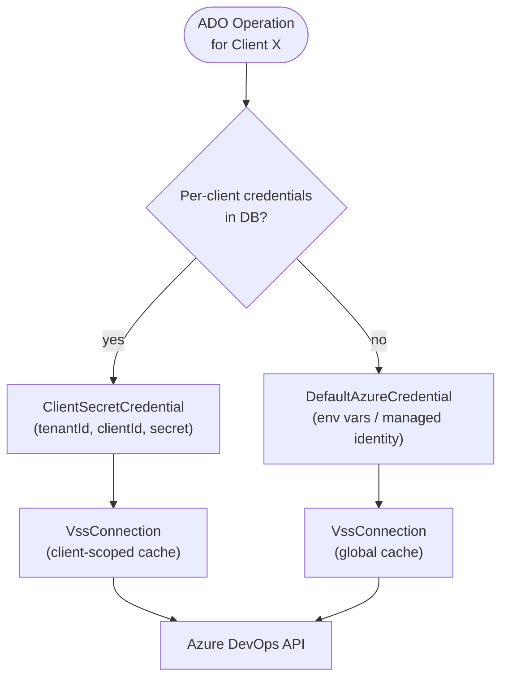

# Getting Started — Meister DEV's ProPR Backend

Meister DEV's ProPR is an ASP.NET Core 10 backend that accepts Azure DevOps pull request review
requests, fetches the changed files using a backend-controlled Azure identity, runs an AI review
via the **Microsoft Agent Framework** (`Microsoft.Extensions.AI`) with per-file agentic tool
calling, and posts the findings back as PR thread comments.

Each API client can supply its own Azure service principal credentials so that all ADO operations
run under that client's identity — or fall back to the global backend identity. Clients can also
configure dedicated AI connections to use different models or endpoints.

## Table of Contents

- [Prerequisites](#prerequisites)
- [Quick Start (Docker)](#quick-start-docker)
- [Running Locally (dotnet)](#running-locally-dotnet)
- [Azure Setup](#azure-setup)
- [Environment Variables](#environment-variables)
- [Admin Authentication](#admin-authentication)
- [Per-Client ADO Credentials](#per-client-ado-credentials)
- [Per-Client AI Connections](#per-client-ai-connections)
- [Client Management API](#client-management-api)
- [ProCursor Source Management](#procursor-source-management)
- [ProCursor Token Usage Reporting](#procursor-token-usage-reporting)
- [File Exclusion Rules](#file-exclusion-rules)
- [Prompt Overrides](#prompt-overrides)
- [Finding Dismissals](#finding-dismissals)
- [Admin UI](#admin-ui)
- [API Usage](#api-usage)
- [Observability](#observability)
- [Running the Tests](#running-the-tests)

---

## Prerequisites

| Requirement                                       | Version             |
|---------------------------------------------------|---------------------|
| [.NET SDK](https://dotnet.microsoft.com/download) | 10.0.103 or later   |
| Azure subscription                                | —                   |
| Azure OpenAI **or** Azure AI Foundry resource     | —                   |
| Azure DevOps organisation                         | —                   |
| PostgreSQL 17 (or Docker)                         | 17.x                |
| Docker (optional, for container runs)             | any recent version  |

> **SDK version policy:** `global.json` pins `10.0.103` as the minimum SDK and sets
> `rollForward: latestFeature`, which allows any `10.0.x` feature-band SDK to satisfy the
> requirement. If you have a newer `10.0.x` SDK installed (e.g. `10.0.200`), it will be used
> automatically. Builds are not guaranteed with SDK major versions other than 10.

---

## Quick Start (Docker)

The fastest way to run Meister DEV's ProPR locally is `docker compose`, which starts the API and a
PostgreSQL 17 container together.

### Step 1 — Create a `.env` file

Create `.env` at the repository root (same folder as your compose file):

```env
# --- Admin user bootstrap (seeds first admin on startup) ---
MEISTER_BOOTSTRAP_ADMIN_USER=admin
MEISTER_BOOTSTRAP_ADMIN_PASSWORD=<strong-password-here>
MEISTER_JWT_SECRET=<random-string-at-least-32-chars>

# --- Global Azure identity (DefaultAzureCredential env-var chain) ---
# Used for ADO operations when a client has no per-client credentials configured.
AZURE_CLIENT_ID=<global-service-principal-appId>
AZURE_TENANT_ID=<azure-tenant-id>
AZURE_CLIENT_SECRET=<global-service-principal-secret>

# --- Database ---
# The docker-compose.yml wires this automatically; override only if using an external DB.
# DB_CONNECTION_STRING=Host=...

# --- PR crawler ---
# PR_CRAWL_INTERVAL_SECONDS=60

# --- Mention scanner ---
# MENTION_CRAWL_INTERVAL_SECONDS=60

# --- Observability (optional) ---
# OTLP_ENDPOINT=http://localhost:4317
```

> **AI connections** are configured per-client via the admin UI after first login — they are
> no longer global env vars.
>
> **Client keys have been removed.** Create clients via `POST /api/clients`; review triggers now
> use a client-scoped route plus `X-User-Pat` and `X-Ado-Token`.

### Step 2 — Start the stack

```bash
docker compose up --build
```

The admin UI is available on `https://localhost:5443/` and the public API is available on
`https://localhost:5443/api/...` when you use the default docker-compose stack.
The container runs as a non-root user and performs its own health check every 30 seconds.

The compose stack also mounts a named volume at `/app/.data-protection-keys` and sets
`MEISTER_DATA_PROTECTION_KEYS_PATH` automatically. Preserve that volume across restarts and
redeployments; otherwise the backend will lose the key material required to decrypt stored client
ADO secrets and AI connection API keys.

### Step 3 — Log in to the admin API and UI

On first startup the server seeds an admin account from the bootstrap env vars. Exchange
your credentials for a JWT:

```bash
curl -k -X POST https://localhost:5443/api/auth/login \
  -H "Content-Type: application/json" \
  -d '{"username": "admin", "password": "<strong-password-here>"}'
```

Response:

```json
{
  "accessToken": "eyJ...",
  "refreshToken": "VmF...",
  "expiresIn": 900,
  "tokenType": "Bearer"
}
```

Store the `accessToken` and pass it as `Authorization: Bearer <token>` on all subsequent
admin calls. The Admin UI at `https://localhost:5443/` handles this automatically. Tokens
expire after 15 minutes; use `POST /api/auth/refresh` with the refresh token to obtain a new one.

### Step 4 — Register your first client

```bash
# Use the accessToken from the login step
curl -k -X POST https://localhost:5443/api/clients \
  -H "Content-Type: application/json" \
  -H "Authorization: Bearer <accessToken>" \
  -d '{"displayName": "My First Client"}'
```

Note the returned `id` (a UUID) — you will need it in subsequent steps.

### Step 5 — (Optional) Set per-client ADO credentials

If you want a client to authenticate against Azure DevOps using its **own** service principal
rather than the global backend identity, store the credentials:

```bash
# <client-id> is the UUID from Step 4
curl -k -X PUT https://localhost:5443/api/clients/<client-id>/ado-credentials \
  -H "Content-Type: application/json" \
  -H "Authorization: Bearer <accessToken>" \
  -d '{
    "tenantId": "<azure-tenant-id>",
    "clientId": "<service-principal-appId>",
    "secret":   "<service-principal-secret>"
  }'
```

The secret is stored in the database and never returned in API responses.
Legacy plaintext secret rows from older deployments are upgraded automatically during startup
before the app begins processing jobs.

To remove per-client credentials and revert to the global identity:

```bash
curl -k -X DELETE https://localhost:5443/api/clients/<client-id>/ado-credentials \
  -H "Authorization: Bearer <accessToken>"
```

### Step 6 — Resolve and store the reviewer identity

Look up the Azure DevOps identity that should own reviewed pull requests for this client:

```bash
curl -k "https://localhost:5443/api/identities/resolve?orgUrl=https://dev.azure.com/my-org&displayName=My%20Service%20Principal" \
  -H "Authorization: Bearer <accessToken>"
```

The response contains one or more VSS identity GUIDs. Store the correct identity on the client:

```bash
curl -k -X PUT https://localhost:5443/api/clients/<client-id>/reviewer-identity \
  -H "Content-Type: application/json" \
  -H "Authorization: Bearer <accessToken>" \
  -d '{
    "reviewerId": "<resolved-vss-identity-guid>"
  }'
```

### Step 7 — Register an allowed Azure DevOps organization

Guided admin flows work against client-scoped organization scopes. Add the Azure DevOps
organization that this client is allowed to use:

```bash
curl -k -X POST https://localhost:5443/api/clients/<client-id>/ado-organization-scopes \
  -H "Content-Type: application/json" \
  -H "Authorization: Bearer <accessToken>" \
  -d '{
    "organizationUrl": "https://dev.azure.com/my-org",
    "displayName": "My Org"
  }'
```

Note the returned scope `id` as `<scope-id>`. Guided discovery, ProCursor source creation, and
crawl configuration now use this identifier instead of relying on free-text organization URLs.

### Step 8 — Use guided discovery to resolve projects and sources

Once the scope is registered, resolve the available projects, repositories or wikis, and branch
options from the backend:

```bash
curl -k "https://localhost:5443/api/admin/clients/<client-id>/ado/discovery/projects?organizationScopeId=<scope-id>" \
  -H "Authorization: Bearer <accessToken>"

curl -k "https://localhost:5443/api/admin/clients/<client-id>/ado/discovery/sources?organizationScopeId=<scope-id>&projectId=my-project&sourceKind=repository" \
  -H "Authorization: Bearer <accessToken>"

curl -k "https://localhost:5443/api/admin/clients/<client-id>/ado/discovery/branches?organizationScopeId=<scope-id>&projectId=my-project&sourceKind=repository&canonicalSourceProvider=azureDevOps&canonicalSourceValue=repo-1" \
  -H "Authorization: Bearer <accessToken>"
```

The admin UI calls the same endpoints behind its cascading dropdowns. If the selected
organization scope is missing, disabled, or stale, these endpoints fail before the admin can save
an invalid source or crawler configuration.

### Step 9 — Create a guided ProCursor source

Use the discovered organization scope, canonical source reference, and branch value to register a
ProCursor source:

```bash
curl -k -X POST https://localhost:5443/api/admin/clients/<client-id>/procursor/sources \
  -H "Authorization: Bearer <accessToken>" \
  -H "Content-Type: application/json" \
  -d '{
    "displayName": "Platform Docs",
    "sourceKind": "repository",
    "organizationScopeId": "<scope-id>",
    "projectId": "my-project",
    "canonicalSourceRef": {
      "provider": "azureDevOps",
      "value": "repo-1"
    },
    "sourceDisplayName": "platform-docs",
    "defaultBranch": "main",
    "rootPath": "/docs",
    "symbolMode": "auto",
    "trackedBranches": [
      {
        "branchName": "main",
        "refreshTriggerMode": "branchUpdate",
        "miniIndexEnabled": true
      }
    ]
  }'
```

Use `sourceKind: "adoWiki"` to create a guided wiki source. Legacy callers can still send
`organizationUrl` and `repositoryId`, but the guided `organizationScopeId` plus
`canonicalSourceRef` path is the supported admin flow and gets save-time drift validation.

### Step 10 — Add a guided crawl configuration with source scope

Resolve repository filters for the selected project, then create the crawl configuration using the
guided canonical filter payload and optional ProCursor source subset:

```bash
curl -k "https://localhost:5443/api/admin/clients/<client-id>/ado/discovery/crawl-filters?organizationScopeId=<scope-id>&projectId=my-project" \
  -H "Authorization: Bearer <accessToken>"

curl -k -X POST https://localhost:5443/api/admin/crawl-configurations \
  -H "Content-Type: application/json" \
  -H "Authorization: Bearer <accessToken>" \
  -d '{
    "clientId": "<client-id>",
    "organizationScopeId": "<scope-id>",
    "projectId": "my-project",
    "crawlIntervalSeconds": 60,
    "repoFilters": [
      {
        "displayName": "platform-docs",
        "canonicalSourceRef": {
          "provider": "azureDevOps",
          "value": "repo-1"
        },
        "targetBranchPatterns": ["main"]
      }
    ],
    "proCursorSourceScopeMode": "selectedSources",
    "proCursorSourceIds": ["<source-id>"]
  }'
```

Set `proCursorSourceScopeMode` to `allClientSources` to retain the compatibility behavior. When
`selectedSources` is used, the chosen source IDs are snapshotted onto queued review jobs so later
admin edits do not change already-queued work.

The backend will begin polling for open PRs assigned to that reviewer and submit reviews
automatically.

---

## Running Locally (dotnet)

```bash
# Clone and enter the repo
git clone <repo-url>
cd meister-propr

# Set required config via user secrets
dotnet user-secrets set "DB_CONNECTION_STRING" "Host=localhost;Database=meisterpropr;Username=postgres;Password=devpassword" --project src/MeisterProPR.Api
dotnet user-secrets set "MEISTER_JWT_SECRET"               "dev-jwt-secret-at-least-32-chars-ok!!" --project src/MeisterProPR.Api
dotnet user-secrets set "MEISTER_BOOTSTRAP_ADMIN_USER"     "admin"                    --project src/MeisterProPR.Api
dotnet user-secrets set "MEISTER_BOOTSTRAP_ADMIN_PASSWORD" "AdminPass1!"              --project src/MeisterProPR.Api

# Global service principal for DefaultAzureCredential (if not using Azure CLI / VS auth)
dotnet user-secrets set "AZURE_CLIENT_ID"     "<appId>"    --project src/MeisterProPR.Api
dotnet user-secrets set "AZURE_TENANT_ID"     "<tenant>"   --project src/MeisterProPR.Api
dotnet user-secrets set "AZURE_CLIENT_SECRET" "<password>" --project src/MeisterProPR.Api

# Run
ASPNETCORE_ENVIRONMENT=Development dotnet run --project src/MeisterProPR.Api
```

> **AI connections and reviewer identity** are configured after first login — no additional
> shared review-trigger secrets are required to start the API.

The API starts on `https://localhost:5443` (HTTPS) and `http://localhost:5080` (HTTP).

Verify it is healthy:

```bash
curl -k https://localhost:5443/healthz
```

Expected response:

```json
{"status":"Healthy","results":{"worker":{"status":"Healthy","description":"Worker is running."}}}
```

In `Development` mode, Swagger UI is available at `https://localhost:5443/swagger`.

---

## Azure Setup

### 1 — AI endpoint

The backend stores AI connections per client in PostgreSQL. Each client needs an endpoint URL,
one or more models, and one active model before reviews or crawls can run.

**Option A — Azure OpenAI**

1. Create an **Azure OpenAI** resource in the Azure portal.
2. Deploy a model that supports the Responses API (e.g. `gpt-4o`, `o4-mini`).
3. The endpoint looks like `https://<resource-name>.openai.azure.com/`.
4. When you register the client AI connection, add the model names you want available and then
  activate one of them for the client.

**Option B — Azure AI Foundry**

1. Open your AI Foundry project in the portal.
2. Copy the **project endpoint** shown on the overview page, e.g.
   `https://<resource>.services.ai.azure.com/api/projects/<project>`.
3. Strip the `/api/projects/<project>` suffix and use the resource root endpoint
  `https://<resource>.services.ai.azure.com/` when creating the client AI connection.
4. Activate the desired model name (for example `gpt-4o`) on that client connection.

---

### 2 — Create an Azure service principal (Entra ID app registration)

The backend needs an Azure identity to authenticate against Azure DevOps. You can create a
dedicated service principal (recommended) or reuse an existing one.

**In the Azure portal (Entra ID → App registrations):**

1. Click **New registration**.
2. Give it a name, e.g. `meister-propr-backend`.
3. Leave **Redirect URI** blank and click **Register**.
4. Note the **Application (client) ID** and **Directory (tenant) ID** from the overview page.
5. Go to **Certificates & secrets → Client secrets → New client secret**.
6. Give it a description, choose an expiry, and click **Add**.
7. **Copy the secret value immediately** — it is only shown once.
8. Add the principal to the organization in Azure DevOps.

---

### 3 — Grant the service principal access in Azure DevOps

The service principal must be a member of each Azure DevOps project it will review PRs for.

1. In Azure DevOps, go to **Project settings → Permissions** (or **Teams**) for your project.
2. Click **Add** and search for the service principal name or its client ID.
3. Assign it at least the **Contributor** role so it can read PRs and post comment threads.

Repeat for every project whose PRs the backend will review.

> If you use **per-client credentials** (see [Per-client ADO credentials](#per-client-ado-credentials)
> below), each client's service principal must be granted access independently.

---

### 4 — Create a PostgreSQL database

The backend stores clients, crawl configurations, and review jobs in PostgreSQL.

**Docker (quickest for local dev):**

```bash
docker run -d \
  --name meister-propr-pg \
  -e POSTGRES_PASSWORD=devpassword \
  -e POSTGRES_DB=meisterpropr \
  -p 5432:5432 \
  postgres:17-alpine
```

Connection string: `Host=localhost;Database=meisterpropr;Username=postgres;Password=devpassword`

EF Core runs migrations automatically on startup — no manual schema setup is needed.

---

## Environment Variables

### Required

| Variable                           | Description                                                                       |
|------------------------------------|-----------------------------------------------------------------------------------|
| `DB_CONNECTION_STRING`             | PostgreSQL connection string. Required for all persistent state.                  |
| `MEISTER_DATA_PROTECTION_KEYS_PATH`| File-system path used for the ASP.NET Core Data Protection key ring. The default compose stack mounts `/app/.data-protection-keys` to durable storage. |
| `MEISTER_JWT_SECRET`               | HS256 signing key for JWT tokens — minimum 32 characters, cryptographically random |
| `MEISTER_BOOTSTRAP_ADMIN_USER`     | Username for the admin account seeded on first startup                            |
| `MEISTER_BOOTSTRAP_ADMIN_PASSWORD` | Password for the admin account seeded on first startup                            |

The application **will not start** if `MEISTER_JWT_SECRET` is absent or shorter than 32 characters, or if no admin user exists and the bootstrap variables are not set.

### Optional

| Variable                    | Description                                                                         |
|-----------------------------|-------------------------------------------------------------------------------------|
| `PR_CRAWL_INTERVAL_SECONDS`      | Polling interval in seconds for the PR crawler background worker (default `60`, minimum `10`). |
| `MENTION_CRAWL_INTERVAL_SECONDS` | Polling interval in seconds for the mention-scan background worker (default `60`, minimum `10`). |
| `AI_EVALUATOR_ENDPOINT`          | Optional endpoint for the instruction-relevance evaluator.                          |
| `AI_EVALUATOR_DEPLOYMENT`        | Model name for the optional evaluator endpoint.                                     |
| `AI_API_KEY`                     | Optional API key used with `AI_EVALUATOR_ENDPOINT`. Client review connections store their own API keys per client. |
| `PROCURSOR_MAX_INDEX_CONCURRENCY` | Maximum number of concurrent durable ProCursor refresh jobs (default `2`).         |
| `PROCURSOR_MAX_QUERY_RESULTS`     | Maximum number of knowledge or symbol results returned by ProCursor (default `5`). |
| `PROCURSOR_MAX_SOURCES_PER_QUERY` | Maximum number of enabled knowledge sources scanned for one ProCursor query (default `20`). |
| `PROCURSOR_CHUNK_TARGET_LINES`    | Target chunk size for indexed source text (default `120`).                         |
| `PROCURSOR_MINI_INDEX_TTL_MINUTES` | Lifetime of review-target ProCursor overlays in minutes (default `30`).           |
| `PROCURSOR_REFRESH_POLL_SECONDS`  | Polling interval for the ProCursor index worker (default `30`).                    |
| `PROCURSOR_TEMP_WORKSPACE_RETENTION_MINUTES` | How long stale ProCursor temp workspaces are kept before cleanup (default `120`). |
| `PROCURSOR_EMBEDDING_DIMENSIONS`  | Expected embedding vector width for ProCursor snapshots (default `1536`).          |
| `PROCURSOR_TOKEN_USAGE_ROLLUP_POLL_SECONDS` | Polling interval for the ProCursor token-usage rollup worker (default `900`). |
| `PROCURSOR_TOKEN_USAGE_EVENT_RETENTION_DAYS` | How long raw ProCursor token usage events are kept before purge (default `365`). |
| `PROCURSOR_TOKEN_USAGE_ROLLUP_RETENTION_DAYS` | How long aggregated ProCursor rollups are kept before purge (default `730`). |
| `AZURE_CLIENT_ID`           | Global service principal app ID (`DefaultAzureCredential` env-var chain)           |
| `AZURE_TENANT_ID`           | Azure AD tenant ID                                                                  |
| `AZURE_CLIENT_SECRET`       | Global service principal secret (local dev — **never commit**)                     |
| `CORS_ORIGINS`              | Extra comma-separated allowed CORS origins                                          |
| `OTLP_ENDPOINT`             | OTLP collector URL for traces, e.g. `http://localhost:4317`                        |
| `ASPNETCORE_ENVIRONMENT`    | `Development` enables Swagger UI; defaults to `Production`                         |

**Built-in CORS origins** (always allowed): `http://localhost:3000`, `https://localhost:3000`,
`https://dev.azure.com`, `*.visualstudio.com`.

### Development-only bypasses

> [!WARNING]
> Set these via `dotnet user-secrets` only. **Never set them in production.**

| Variable                    | Effect                                                                              |
|-----------------------------|-------------------------------------------------------------------------------------|
| `ADO_SKIP_TOKEN_VALIDATION` | `true` — accept any non-empty `X-Ado-Token` without calling the VSS endpoint       |
| `ADO_STUB_PR`               | `true` — use a fake PR and skip ADO comment posting; real AI endpoint still called  |

---

## Admin Authentication

In DB mode, admin access is protected by per-user accounts rather than a shared key.

### User accounts

The first admin account is seeded automatically on startup from the bootstrap env vars:

```bash
MEISTER_BOOTSTRAP_ADMIN_USER=admin
MEISTER_BOOTSTRAP_ADMIN_PASSWORD=<strong-password>
MEISTER_JWT_SECRET=<random-32+-char-string>
```

Additional users are managed via the `/admin/users` endpoints (requires an Admin JWT).

### Login

```bash
curl -X POST https://localhost:5443/auth/login \
  -H "Content-Type: application/json" \
  -d '{"username": "admin", "password": "<password>"}'
# → { "accessToken": "eyJ...", "refreshToken": "VmF...", "expiresIn": 900 }
```

The `accessToken` is a 15-minute JWT. Pass it as `Authorization: Bearer <token>` on admin
requests. Use `POST /auth/refresh` with the 7-day `refreshToken` to get a new access token
without re-entering credentials.

### Personal Access Tokens (PATs)

For long-running scripts or CI pipelines, generate a named PAT:

```bash
curl -X POST https://localhost:5443/users/me/pats \
  -H "Authorization: Bearer <accessToken>" \
  -H "Content-Type: application/json" \
  -d '{"label": "CI pipeline"}'
# → { "id": "...", "label": "CI pipeline", "token": "mpr_abc123..." }
```

The `token` value is returned **once only**. Pass it as `X-User-Pat: mpr_abc123...` on
subsequent requests. PATs can be revoked via `DELETE /users/me/pats/{id}`.

### Client key rotation

Client API keys are stored as BCrypt hashes. To rotate a key (Admin only):

```bash
curl -X POST https://localhost:5443/admin/clients/<client-id>/rotate-key \
  -H "Authorization: Bearer <accessToken>"
# → { "newKey": "mpr_...", "oldKeyExpiresAt": "2026-04-02T..." }
```

The old key continues to work for 7 days to allow a smooth rollover. The new plaintext key
is returned **once only** — store it securely.

### User management endpoints

| Method   | Path                                   | Description                                        |
|----------|----------------------------------------|----------------------------------------------------|
| `POST`   | `/auth/login`                          | Exchange username + password for JWT + refresh token |
| `POST`   | `/auth/refresh`                        | Refresh an access token                            |
| `GET`    | `/admin/users`                         | List all users                                     |
| `POST`   | `/admin/users`                         | Create a user                                      |
| `DELETE` | `/admin/users/{id}`                    | Disable user + revoke all tokens and PATs          |
| `POST`   | `/admin/users/{id}/clients`            | Assign a client role to a user                     |
| `DELETE` | `/admin/users/{id}/clients/{clientId}` | Remove a client role assignment                    |
| `POST`   | `/users/me/pats`                       | Generate a PAT (plaintext returned once)           |
| `GET`    | `/users/me/pats`                       | List own PATs                                      |
| `DELETE` | `/users/me/pats/{id}`                  | Revoke a PAT                                       |

---

## Per-Client ADO Credentials

By default all ADO operations use the **global backend identity** configured via
`AZURE_CLIENT_ID` / `AZURE_TENANT_ID` / `AZURE_CLIENT_SECRET` (or a managed identity in
production). This works well when all clients belong to the same Azure DevOps organisation and
the same service principal has been granted access.

When clients belong to **different organisations or tenants**, or when you want isolation between
clients, each client can have its own Azure service principal:

1. **Create a service principal** in Entra ID for each client (see
   [Azure Setup — step 2](#2--create-an-azure-service-principal-entra-id-app-registration)).
2. **Grant it access** to the relevant Azure DevOps projects (see
   [Azure Setup — step 3](#3--grant-the-service-principal-access-in-azure-devops)).
3. **Store the credentials** via `PUT /clients/{id}/ado-credentials` (see
   [Step 5](#step-5--optional-set-per-client-ado-credentials) above).

The `GET /clients` and `GET /clients/{id}` responses include `hasAdoCredentials`,
`adoTenantId`, and `adoClientId` — the secret is never returned.

**How the backend resolves the credential for each ADO call:**



  ### Guided organization scopes and discovery

  Per-client credentials answer which identity can talk to Azure DevOps. Organization scopes answer
  which Azure DevOps organization URLs administrators are allowed to choose inside the guided admin
  flows.

  Guided ProCursor and crawl-config onboarding now follows this model:

  1. Store credentials once per client with `PUT /clients/{id}/ado-credentials`.
  2. Register one or more allowed organizations with `POST /clients/{id}/ado-organization-scopes`.
  3. Resolve projects, repositories, wikis, branches, and crawl filters through the
    `/admin/clients/{id}/ado/discovery/*` endpoints.
  4. Save ProCursor sources and crawl configurations using `organizationScopeId` plus canonical
    source references instead of free-text repository identifiers.

  If the selected organization scope is missing or disabled, or if the chosen repository, wiki, or
  branch no longer exists, the backend now rejects the save request with an actionable admin error
  instead of letting the issue surface later in a worker cycle.

---

## Per-Client AI Connections

Each client must have an AI connection configured via the admin UI or API before reviews can run.
There is no longer a global `AI_ENDPOINT` / `AI_DEPLOYMENT` env var — all AI configuration is
per-client in the database.

> **Operator migration guide**: If you are upgrading from a previous version that used
> `AI_ENDPOINT` and `AI_DEPLOYMENT` environment variables, configure a per-client AI connection
> via the admin UI (or `POST /clients/{id}/ai-connections` + `POST .../activate`) for each
> client **before** removing the legacy env vars. Once all clients have an active AI connection,
> remove `AI_ENDPOINT`, `AI_DEPLOYMENT`, and `MEISTER_CLIENT_KEYS`
> from your `.env` / compose environment configuration. Keep `AI_API_KEY` only if you also use
> `AI_EVALUATOR_ENDPOINT`.
>
> **Note:** `MEISTER_ADMIN_KEY` and the `X-Admin-Key` header have been removed and are not
> supported by the runtime. Use Admin JWTs (`Authorization: Bearer <token>`) or admin
> Personal Access Tokens (`X-User-Pat`) instead.

You can register one or more named AI connections per client and activate the one to use. This
lets you use different models for different clients — for example a cost-efficient model for
high-volume clients and a reasoning model for critical reviews.

### Register an AI connection

```bash
curl -k -X POST https://localhost:5443/clients/<client-id>/ai-connections \
  -H "Authorization: Bearer <accessToken>" \
  -H "Content-Type: application/json" \
  -d '{
    "displayName": "gpt-4o production",
    "endpointUrl": "https://myresource.openai.azure.com/",
    "models": ["gpt-4o", "gpt-4o-mini"],
    "apiKey": "<optional-api-key>"
  }'
```

Omit `apiKey` to use `DefaultAzureCredential` for the connection. API keys are stored encrypted
and are never returned in GET responses.

### Activate a connection

Only one AI connection can be active per client at a time. Activating a connection sets the
model used for all future reviews for that client:

```bash
curl -k -X POST https://localhost:5443/clients/<client-id>/ai-connections/<connection-id>/activate \
  -H "Authorization: Bearer <accessToken>" \
  -H "Content-Type: application/json" \
  -d '{ "model": "gpt-4o" }'
```

To leave the client without an active AI connection, deactivate the connection:

```bash
curl -k -X POST https://localhost:5443/clients/<client-id>/ai-connections/<connection-id>/deactivate \
  -H "Authorization: Bearer <accessToken>"
```

### ProCursor pricing and embedding metadata

ProCursor token reporting uses the capability metadata stored on each AI connection model at the
moment an event is captured. For embedding-capable connections, configure at least the tokenizer,
max input tokens, and embedding dimensions. If you also provide `inputCostPer1MUsd` and
`outputCostPer1MUsd`, the backend stores an estimated USD cost on each captured ProCursor usage
event so rebuilds can recompute rollups without re-reading live pricing.

Example PATCH payload for an embedding connection:

```bash
curl -k -X PATCH https://localhost:5443/clients/<client-id>/ai-connections/<connection-id> \
  -H "Authorization: Bearer <accessToken>" \
  -H "Content-Type: application/json" \
  -d '{
    "displayName": "Embedding Pool",
    "models": ["text-embedding-3-small"],
    "modelCategory": "embedding",
    "modelCapabilities": [
      {
        "modelName": "text-embedding-3-small",
        "tokenizerName": "cl100k_base",
        "maxInputTokens": 8192,
        "embeddingDimensions": 1536,
        "inputCostPer1MUsd": 0.02,
        "outputCostPer1MUsd": 0
      }
    ]
  }'
```

### Discover available models

```bash
curl -k -X POST https://localhost:5443/clients/<client-id>/ai-connections/discover-models \
  -H "Authorization: Bearer <accessToken>" \
  -H "Content-Type: application/json" \
  -d '{ "endpointUrl": "https://myresource.openai.azure.com/", "apiKey": "<optional>" }'
```

### AI connection endpoints

| Method   | Path                                                             | Description                                 |
|----------|------------------------------------------------------------------|---------------------------------------------|
| `GET`    | `/clients/{id}/ai-connections`                                   | List all AI connections for a client        |
| `POST`   | `/clients/{id}/ai-connections`                                   | Register a new AI connection                |
| `PATCH`  | `/clients/{id}/ai-connections/{connectionId}`                    | Update display name, URL, models, or API key |
| `DELETE` | `/clients/{id}/ai-connections/{connectionId}`                    | Remove an AI connection                     |
| `POST`   | `/clients/{id}/ai-connections/{connectionId}/activate`           | Activate a connection with a specific model |
| `POST`   | `/clients/{id}/ai-connections/{connectionId}/deactivate`         | Deactivate the current connection           |
| `POST`   | `/clients/{id}/ai-connections/discover-models`                   | Probe an endpoint and list available models |

---

## Client Management API

All client management endpoints require an Admin JWT (`Authorization: Bearer <token>`) or
an admin `X-User-Pat` header. The older `X-Admin-Key` header has been removed and is no longer
accepted by the running server.

| Method   | Path                                                                  | Description                                 |
|----------|-----------------------------------------------------------------------|---------------------------------------------|
| `POST`   | `/clients`                                                            | Register a new client                       |
| `GET`    | `/clients`                                                            | List all clients                            |
| `GET`    | `/clients/{id}`                                                       | Get a single client                         |
| `PATCH`  | `/clients/{id}`                                                       | Enable or disable a client                  |
| `DELETE` | `/clients/{id}`                                                       | Delete a client                             |
| `PUT`    | `/clients/{id}/ado-credentials`                                       | Set (or replace) per-client ADO credentials |
| `DELETE` | `/clients/{id}/ado-credentials`                                       | Clear per-client ADO credentials            |
| `GET`    | `/clients/{id}/ado-organization-scopes`                               | List allowed Azure DevOps organizations     |
| `POST`   | `/clients/{id}/ado-organization-scopes`                               | Add an allowed Azure DevOps organization    |
| `PATCH`  | `/clients/{id}/ado-organization-scopes/{scopeId}`                     | Rename, retarget, or enable/disable a scope |
| `DELETE` | `/clients/{id}/ado-organization-scopes/{scopeId}`                     | Remove an allowed Azure DevOps organization |
| `PUT`    | `/clients/{id}/reviewer-identity`                                     | Set the Azure DevOps reviewer identity      |
| `GET`    | `/identities/resolve?orgUrl=...&displayName=...`                      | Resolve Azure DevOps identity GUIDs         |
| `GET`    | `/admin/clients/{id}/ado/discovery/projects?organizationScopeId=...`  | List projects for one allowed organization  |
| `GET`    | `/admin/clients/{id}/ado/discovery/sources?...`                       | List repositories or wikis for one project  |
| `GET`    | `/admin/clients/{id}/ado/discovery/branches?...`                      | List branches for one discovered source     |
| `GET`    | `/admin/clients/{id}/ado/discovery/crawl-filters?...`                 | List guided crawler filter options          |
| `GET`    | `/admin/crawl-configurations`                                         | List accessible crawl configurations        |
| `POST`   | `/admin/crawl-configurations`                                         | Add a crawl configuration                   |
| `PATCH`  | `/admin/crawl-configurations/{cfgId}`                                 | Update a crawl configuration                |
| `DELETE` | `/admin/crawl-configurations/{cfgId}`                                 | Remove a crawl configuration                |
| `GET`    | `/clients/{id}/prompt-overrides`                                      | List prompt overrides for a client          |
| `POST`   | `/clients/{id}/prompt-overrides`                                      | Create a prompt override                    |
| `PUT`    | `/clients/{id}/prompt-overrides/{overrideId}`                         | Replace a prompt override                   |
| `DELETE` | `/clients/{id}/prompt-overrides/{overrideId}`                         | Delete a prompt override                    |
| `GET`    | `/clients/{id}/finding-dismissals`                                    | List finding dismissals for a client        |
| `POST`   | `/clients/{id}/finding-dismissals`                                    | Create a finding dismissal                  |
| `PATCH`  | `/clients/{id}/finding-dismissals/{dismissalId}`                      | Update dismissal label                      |
| `DELETE` | `/clients/{id}/finding-dismissals/{dismissalId}`                      | Delete a finding dismissal                  |
| `GET`    | `/admin/clients/{id}/procursor/sources`                               | List configured ProCursor sources           |
| `POST`   | `/admin/clients/{id}/procursor/sources`                               | Create a ProCursor repository or wiki source |
| `POST`   | `/admin/clients/{id}/procursor/sources/{sourceId}/refresh`            | Queue a durable ProCursor refresh           |
| `GET`    | `/admin/clients/{id}/procursor/sources/{sourceId}/branches`           | List tracked branches and freshness         |
| `POST`   | `/admin/clients/{id}/procursor/sources/{sourceId}/branches`           | Add a tracked branch                        |
| `PUT`    | `/admin/clients/{id}/procursor/sources/{sourceId}/branches/{branchId}` | Update one tracked branch                 |
| `DELETE` | `/admin/clients/{id}/procursor/sources/{sourceId}/branches/{branchId}` | Remove one tracked branch                 |

---

## ProCursor Source Management

ProCursor is configured per client. Each source belongs to one client, indexes a git-backed Azure
DevOps repository or git-backed wiki, and tracks one or more branches that can refresh manually or
on branch-head movement. The recommended admin flow is now guided: choose a client-scoped
organization scope, resolve a canonical repository or wiki from discovery endpoints, and save the
source with `organizationScopeId` plus `canonicalSourceRef`.

### 1 — Create a source

```bash
curl -k -X POST https://localhost:5443/api/admin/clients/<client-id>/procursor/sources \
  -H "Authorization: Bearer <accessToken>" \
  -H "Content-Type: application/json" \
  -d '{
    "displayName": "Platform Docs",
    "sourceKind": "repository",
    "organizationScopeId": "<scope-id>",
    "projectId": "my-project",
    "canonicalSourceRef": {
      "provider": "azureDevOps",
      "value": "repo-1"
    },
    "sourceDisplayName": "platform-docs",
    "defaultBranch": "main",
    "rootPath": "/docs",
    "symbolMode": "auto",
    "trackedBranches": [
      {
        "branchName": "main",
        "refreshTriggerMode": "branchUpdate",
        "miniIndexEnabled": true
      }
    ]
  }'
```

Use `sourceKind: "adoWiki"` when the backing repository is an Azure DevOps git-based wiki. Set
`symbolMode: "text_only"` for sources where symbol extraction is not needed. Legacy callers may
still send `organizationUrl` and `repositoryId`, but guided saves are preferred because the
backend revalidates the selected organization scope, source, and branch before persisting them.

### 2 — Trigger the initial refresh

```bash
curl -k -X POST https://localhost:5443/admin/clients/<client-id>/procursor/sources/<source-id>/refresh \
  -H "Authorization: Bearer <accessToken>" \
  -H "Content-Type: application/json" \
  -d '{ "jobKind": "refresh" }'
```

The response returns the durable job metadata. ProCursor deduplicates active jobs per source,
tracked branch, and requested commit so repeated refresh requests do not stampede the worker.

### 3 — Check freshness and tracked branches

```bash
curl -k https://localhost:5443/admin/clients/<client-id>/procursor/sources \
  -H "Authorization: Bearer <accessToken>"

curl -k https://localhost:5443/admin/clients/<client-id>/procursor/sources/<source-id>/branches \
  -H "Authorization: Bearer <accessToken>"
```

The source response includes the latest snapshot, commit SHA, and freshness status. Branch responses
include `lastSeenCommitSha`, `lastIndexedCommitSha`, and branch-level freshness so operators can see
whether the latest observed branch head has already been indexed.

The same source list is reused by guided crawl configurations. When a crawl configuration switches
to `selectedSources`, the chosen ProCursor source IDs are shown in the admin UI and copied onto
queued review jobs so later admin edits do not retroactively change in-flight work.

### 4 — Verify worker health

```bash
curl -k https://localhost:5443/healthz
```

The health payload now includes `procursor-index-worker`, which reports whether the ProCursor worker
is running, when it last started and completed a cycle, and how many jobs are active.

---

## ProCursor Token Usage Reporting

ProCursor token reporting is read-only analytics built from the dedicated `procursor_token_usage_events`
and `procursor_token_usage_rollups` tables. Provider-reported usage is preferred when the AI client
returns it. When usage metadata is unavailable, the backend falls back to the configured tokenizer
and marks the event as estimated so the UI can explain the gap clearly.

### Rollup cadence and retention

- `PROCURSOR_TOKEN_USAGE_ROLLUP_POLL_SECONDS` controls how often the rollup worker refreshes daily
  and monthly buckets.
- `PROCURSOR_TOKEN_USAGE_EVENT_RETENTION_DAYS` controls when raw event rows are purged.
- `PROCURSOR_TOKEN_USAGE_ROLLUP_RETENTION_DAYS` controls when aggregated rollups are purged.

The `/healthz` payload now includes `procursor-token-usage-rollup-worker`, which reports whether the
rollup worker is running, its most recent cycle timestamps, and when retention last ran.

### Check rollup freshness

```bash
curl -k https://localhost:5443/admin/clients/<client-id>/procursor/token-usage/freshness \
  -H "Authorization: Bearer <accessToken>"
```

Use this endpoint when you need to confirm whether a dashboard response is being served entirely
from rollups or whether recent activity is being gap-filled from event rows.

### Rebuild a selected interval

```bash
curl -k -X POST https://localhost:5443/admin/clients/<client-id>/procursor/token-usage/rebuild \
  -H "Authorization: Bearer <accessToken>" \
  -H "Content-Type: application/json" \
  -d '{
    "from": "2026-04-01",
    "to": "2026-04-30",
    "includeMonthly": true
  }'
```

Rebuilds recompute rollups from captured event history only. They do not reconstruct usage that
predates instrumentation.

### UI rollout

The client-wide analytics tab and source-level usage drill-down are behind the Vite flag
`VITE_FEATURE_PROCURSOR_TOKEN_USAGE_REPORTING`.

- Set `VITE_FEATURE_PROCURSOR_TOKEN_USAGE_REPORTING=true` for controlled environments where the
  reporting surface should be visible.
- Omit the variable or set it to `false` to keep the new UI hidden while backend capture and
  rollups continue to run.

For local admin-ui development:

```bash
cd admin-ui
$env:VITE_FEATURE_PROCURSOR_TOKEN_USAGE_REPORTING = 'true'
npm run dev
```

---

## File Exclusion Rules

Meister DEV's ProPR can skip specific files from AI review entirely — no tokens are spent on them
and they are recorded in the job audit trail as `Excluded` with zero input/output tokens.

### Built-in default patterns

When no per-repo exclusion file is present, the following built-in patterns are applied
automatically:

| Pattern | Matches |
|---------|---------|
| `**/Migrations/*.Designer.cs` | EF Core migration designer snapshots |
| `**/Migrations/*ModelSnapshot.cs` | EF Core model snapshot files |

These cover the most common generated files that provide no actionable review signal.

### Per-repository exclusion file

To customise exclusion patterns for a repository, create `.meister-propr/exclude` on the target
branch. The backend reads this file from the branch that the PR targets, so no deployment
changes are needed — push an update to the file and the next review honours it automatically.

**File format** — one glob pattern per line, gitignore-style:

```
# Lines starting with # are comments and are ignored.
# Blank lines are also ignored.

# Skip all auto-generated gRPC stubs
src/Generated/**

# Skip OpenAPI client wrappers
**/ApiClient.Generated.cs

# Skip EF Core migrations entirely (overrides built-in partial match)
**/Migrations/**
```

Patterns use [gitignore glob syntax](https://git-scm.com/docs/gitignore#_pattern_format): `*`
matches within a path segment, `**` matches across segments, and patterns are
case-insensitive.

### Empty exclusion file

If `.meister-propr/exclude` exists but is empty (or contains only comments), **no exclusions
are applied** — not even the built-in defaults. This lets you opt out of the defaults for a
specific repository.

### Excluded files in review results

Each excluded file appears in the review job result with:

- `isExcluded: true`
- `exclusionReason`: the pattern that matched (e.g. `**/Migrations/*.Designer.cs`)
- Zero input and output tokens recorded in the protocol

The overall review summary and comment threads are generated from the non-excluded files only.

---

## Prompt Overrides

Prompt overrides let you replace any of the hardcoded AI review prompt segments on a
per-client or per-crawl-config basis. When the review pipeline assembles prompts it checks for
an active override and substitutes it in place of the global default.

### Valid prompt keys

| Key | What it controls |
|-----|-----------------|
| `SystemPrompt` | Core reviewer persona and JSON output schema |
| `AgenticLoopGuidance` | Rules governing tool calls, certainty thresholds, and suggestion blocks |
| `SynthesisSystemPrompt` | Prompt for the cross-file narrative summary pass |
| `QualityFilterSystemPrompt` | Prompt for the cross-file quality-filter pass |
| `PerFileContextPrompt` | Per-file framing message sent to the AI at the start of each file review |

### Scope

An override can be scoped to an entire **client** (`clientScope`) or to a specific
**crawl configuration** (`crawlConfigScope`). Crawl-config scope takes precedence over
client scope during lookup.

### Create an override

```bash
curl -k -X POST https://localhost:5443/clients/<client-id>/prompt-overrides \
  -H "Authorization: Bearer <accessToken>" \
  -H "Content-Type: application/json" \
  -d '{
    "scope": "clientScope",
    "crawlConfigId": null,
    "promptKey": "AgenticLoopGuidance",
    "overrideText": "Your custom guidance here..."
  }'
```

For `crawlConfigScope`, set `"scope": "crawlConfigScope"` and provide the `crawlConfigId` UUID.

### Replace or delete an override

```bash
# Replace
curl -k -X PUT https://localhost:5443/clients/<client-id>/prompt-overrides/<override-id> \
  -H "Authorization: Bearer <accessToken>" \
  -H "Content-Type: application/json" \
  -d '{ "overrideText": "Updated guidance..." }'

# Delete (reverts to global default)
curl -k -X DELETE https://localhost:5443/clients/<client-id>/prompt-overrides/<override-id> \
  -H "Authorization: Bearer <accessToken>"
```

Only one override per `(clientId, crawlConfigId, promptKey)` combination is allowed — a
`409 Conflict` is returned if you try to create a duplicate.

---

## Finding Dismissals

When the AI repeatedly reports a finding that your team has decided to accept or ignore, you
can dismiss it. The normalized pattern text is injected into the AI system prompt as an
exclusion rule — the reviewer will not re-report it on future reviews for that client.

### Dismiss a finding

```bash
curl -k -X POST https://localhost:5443/clients/<client-id>/finding-dismissals \
  -H "Authorization: Bearer <accessToken>" \
  -H "Content-Type: application/json" \
  -d '{
    "originalMessage": "Consider adding null checks before accessing this property.",
    "label": "Accepted — nullable reference types enabled project-wide"
  }'
```

`label` is optional but helpful for admin UI clarity. `originalMessage` is the exact finding
text from the AI review. It is normalised (lowercased, punctuation stripped, truncated to
200 chars) into a `patternText` that is matched against future findings.

### Update the label or delete a dismissal

```bash
# Update label
curl -k -X PATCH https://localhost:5443/clients/<client-id>/finding-dismissals/<dismissal-id> \
  -H "Authorization: Bearer <accessToken>" \
  -H "Content-Type: application/json" \
  -d '{ "label": "Updated note" }'

# Delete (finding will reappear in future reviews)
curl -k -X DELETE https://localhost:5443/clients/<client-id>/finding-dismissals/<dismissal-id> \
  -H "Authorization: Bearer <accessToken>"
```

---

## Admin UI

A web-based admin interface is included in the `admin-ui/` directory. It is a Vue 3 SPA served
separately from the API and connects to it at runtime.

**Features:**

- Review job dashboard with status, token usage, and file-level results
- Per-file comment browser with severity filtering and inline dismiss actions
- Crawl configuration management
- Prompt override management
- Finding dismissal management
- Client and user administration

**Running the Admin UI locally:**

```bash
cd admin-ui
npm install
npm run dev
```

The dev server starts on `http://localhost:5173` by default and proxies API calls to
`https://localhost:5443`. Set `VITE_API_BASE_URL` to point at a different API host.

**Docker:** The `docker-compose.yml` includes the Admin UI as a separate service served by
nginx on port `3000`.

---

## API Usage

Submitting a review requires both a user credential and an Azure DevOps caller token:

- `X-User-Pat`: a PAT issued by a user who has `ClientAdministrator` access for the target client
- `X-Ado-Token`: a valid ADO PAT or browser-extension session token used only for caller identity verification

The status endpoint uses only `X-Ado-Token` (and optionally `X-Ado-Org-Url` for browser-extension session tokens).

### Submit a review

```bash
# organizationUrl, projectId, repositoryId, pullRequestId, iterationId are all required
curl -k -X POST https://localhost:5443/api/clients/<client-id>/reviewing/jobs \
  -H "X-User-Pat: <client-administrator-pat>" \
  -H "X-Ado-Token: <your-ado-pat>" \
  -H "Content-Type: application/json" \
  -d '{
    "organizationUrl": "https://dev.azure.com/my-org",
    "projectId": "my-project",
    "repositoryId": "my-repo",
    "pullRequestId": 42,
    "iterationId": 1
  }'
```

Response `202 Accepted`:

```json
{ "jobId": "3fa85f64-5717-4562-b3fc-2c963f66afa6", "status": "pending" }
```

Submitting the same PR and iteration while a job is still active returns `409 Conflict` with the
existing job ID and its current status.

### Poll for the result

```bash
# Replace the UUID with the jobId from the 202 response
curl -k https://localhost:5443/api/reviewing/jobs/3fa85f64-5717-4562-b3fc-2c963f66afa6/status \
  -H "X-Ado-Token: <your-ado-pat>"
```

While processing, `status` is `"pending"` or `"processing"`. When done:

```json
{
  "jobId": "3fa85f64-5717-4562-b3fc-2c963f66afa6",
  "status": "completed",
  "submittedAt": "2026-03-09T10:00:00Z",
  "completedAt": "2026-03-09T10:00:45Z",
  "result": {
    "summary": "Overall the PR looks good. One potential issue found.",
    "comments": [
      {
        "filePath": "src/MyService.cs",
        "lineNumber": 42,
        "severity": "warning",
        "message": "Consider extracting this logic into a separate method."
      }
    ]
  }
}
```

---

## Observability

| Signal             | How to access                                                            |
|--------------------|--------------------------------------------------------------------------|
| Structured logs    | Written to stdout (JSON in non-Development environments)                 |
| Health check       | `GET /healthz` — reports worker liveness                                 |
| Prometheus metrics | `GET /metrics` — job counters and timing                                 |
| OTLP traces        | Set `OTLP_ENDPOINT` to point at a collector (e.g. Jaeger, Grafana Alloy) |

---

## Running the Tests

```bash
dotnet test
```

496 tests across four projects should pass without additional setup. The API integration tests
use `WebApplicationFactory` with fake credentials and in-memory stubs. Infrastructure
integration tests spin up a real PostgreSQL 17 container automatically via Testcontainers
(Docker or Podman required).

DB-mode tests that exercise the full HTTP stack are grouped in the `PostgresApiIntegration`
collection. They require the `DB_CONNECTION_STRING` to be set or the Testcontainers Docker
socket to be available — they are skipped automatically in pure in-memory mode.
